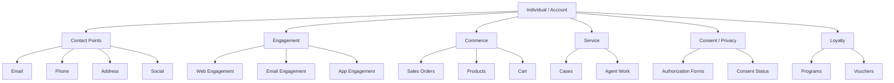

# DMO Categories

<Snippet file="/snippets/note-rebranding.mdx" />

The Customer 360 Data Model contains over 300 standard Data Model Objects (DMOs) organized into logical categories. These standardized objects enable data harmonization across multiple sources and provide a common schema for identity resolution, segmentation, and activation.

## Category Overview

## Core Entity Categories

### Who (Individuals & Accounts)

The foundation of the data model — objects that represent people and organizations.

| DMO | Description |
|-----|-------------|
| **Individual** | A person (customer, prospect, lead) |
| **Account** | An organization or business entity |
| **Account Contact** | An individual with a role in an account |
| **Unified Individual** | The golden record from identity resolution |
| **Unified Link Individual** | Links source records to unified profiles |
| **Lead** | A prospective customer |
| **Applicant** | An individual requesting something (loan, admission) |

### Contact Points

How individuals can be reached — all channels of communication.

| DMO | Description |
|-----|-------------|
| **Contact Point Email** | An email address |
| **Contact Point Phone** | A phone number |
| **Contact Point Address** | A mailing/physical address |
| **Contact Point Social** | A social media handle |
| **Contact Point App** | A mobile app identifier |
| **Contact Point Digital ID** | A digital identity (device ID, cookie, etc.) |

### Engagement

Customer interactions across channels — website visits, email opens, app usage.

| DMO | Description |
|-----|-------------|
| **Website Engagement** | Web page views, clicks, interactions |
| **Email Engagement** | Email opens, clicks, bounces |
| **Message Engagement** | SMS/push notification interactions |
| **App Engagement** | Mobile app usage events |
| **Flow Run** | Salesforce Flow execution records |
| **Device** | Known devices associated with individuals |

### Commerce

Transactional data — orders, products, carts, promotions.

| DMO | Description |
|-----|-------------|
| **Sales Order** | A completed purchase order |
| **Sales Order Product** | Line items within an order |
| **Product** | A product in the catalog |
| **Product Category** | Product taxonomy |
| **Product Catalog** | A collection of products |
| **Cart** | Shopping cart data |
| **Cart Product** | Items in a shopping cart |
| **Brand** | Product brand |
| **Promotion** | Marketing promotion or discount |

### Service

Customer support interactions — cases, agent assignments, service levels.

| DMO | Description |
|-----|-------------|
| **Case** | A support case record |
| **Case Update** | Changes made to a case over time |
| **Agent Service Presence** | Agent availability status |
| **Agent Work** | Routed work assignments |
| **Agent Work Skill** | Skills used for work routing |
| **Asset Service Level Objective** | SLA definitions |
| **Survey** | Customer feedback surveys |
| **Survey Response** | Individual survey answers |

### Consent & Privacy

Consent preferences, authorization forms, and privacy management.

| DMO | Description |
|-----|-------------|
| **Authorization Form** | Terms, conditions, consent forms |
| **Authorization Form Consent** | When/where/how consent was captured |
| **Authorization Form Text** | Multi-language consent text |
| **Authorization Form Data Use** | Consented data use purposes |
| **Contact Point Consent** | Consent for specific contact points |
| **Engagement Channel Type Consent** | Channel-level consent (email, SMS, etc.) |
| **Communication Subscription Consent** | Subscription preferences |
| **Consent Status** | Consent status values (Opted In, Opted Out) |
| **Data Use Purpose** | Why data is being used (marketing, billing) |
| **Privacy Consent Log** | Audit trail of consent changes |

### Loyalty

Loyalty programs, membership, rewards, and vouchers.

| DMO | Description |
|-----|-------------|
| **Loyalty Program** | A loyalty program definition |
| **Loyalty Program Member** | An individual's membership |
| **Loyalty Member Currency** | Points, miles, or currency balances |
| **Loyalty Member Tier** | Current tier status |
| **Loyalty Tier** | Tier definitions (Gold, Silver, etc.) |
| **Benefit Type** | Types of benefits available |
| **Benefit Action** | Actions triggered on benefit assignment |
| **Voucher** | Issued vouchers and coupons |
| **Voucher Definition** | Voucher templates and rules |

### Financial Services

Industry-specific objects for banking, insurance, and financial services.

| DMO | Description |
|-----|-------------|
| **Card Account** | Credit/debit card accounts |
| **Financial Account** | Bank accounts, investment accounts |
| **Claim** | Insurance claims |
| **Insurance Policy** | Policy details |
| **Loan Application** | Loan application records |

## Object Naming Conventions

| Convention | Pattern | Example |
|-----------|---------|---------|
| Standard DMO field | `ssot__FieldName__c` | `ssot__FirstName__c` |
| DMO object suffix | `ObjectName__dlm` | `UnifiedIndividual__dlm` |
| DLO object suffix | `ObjectName__dlm` | `MyData__dlm` |
| Calculated Insight | `InsightName__cio` | `CustomerLTV__cio` |
| Custom fields | `FieldName__c` | `LifetimeValue__c` |

## Starter Data Bundles

Starter data bundles are Salesforce-defined data stream definitions that automatically map source objects to DMOs:

| Bundle | Source | Auto-Mapped DMOs |
|--------|--------|-----------------|
| **Sales Cloud** | CRM Accounts, Contacts, Leads, Opportunities | Individual, Account, Lead, Sales Order, Contact Points |
| **Service Cloud** | CRM Cases, Agent Work | Individual, Case, Case Update, Agent Work |
| **Commerce Cloud** | Orders, Products, Carts | Sales Order, Product, Cart, Individual |
| **Marketing Cloud Engagement** | Contacts, Email Sends | Individual, Contact Point Email, Email Engagement |
| **Marketing Cloud Personalization** | Web interactions | Website Engagement, Individual |
| **Loyalty Management** | Programs, Members, Tiers | Loyalty Program Member, Loyalty Member Tier |

## Data Model Gallery

For complete ERD diagrams showing relationships between DMOs, visit the [Data Model Gallery](https://developer.salesforce.com/docs/platform/data-models/guide/data-cloud-category.html).

## Related Resources

- [Standard DMOs Reference](/data-models/index) — Complete list of all standard DMOs
- [Identity Resolution](/apis/connect-api/identity-resolution) — How DMOs participate in identity resolution
- [Data Streams API](/apis/connect-api/data-streams) — Configure data stream mappings
- Salesforce Docs: [DMO and Mapping Guide](https://developer.salesforce.com/docs/data/data-cloud-dmo-mapping/guide/c360dm-model-data.html)
- Salesforce Docs: [Data Model Gallery](https://developer.salesforce.com/docs/platform/data-models/guide/data-cloud-overview.html)
