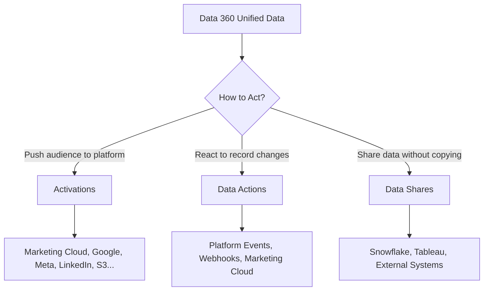

# Activations & Data Sharing

<Snippet file="/snippets/note-rebranding.mdx" />

Activations push segment audiences from Data 360 to external platforms — marketing tools, advertising networks, cloud storage, or CRM systems — so you can take action on your unified customer data. Data shares provide zero-copy access to derived data without moving it.

## Activation vs Data Actions vs Data Shares

Data 360 offers three ways to act on data. Each serves a different purpose:

| Feature | What It Does | Trigger | Best For |
|---|---|---|---|
| **Activations** | Sends segment membership to an external platform | Scheduled or on-demand | Campaign targeting, audience sync, ad platform uploads |
| **Data Actions** | Monitors DMO/CIO changes and sends events in real-time | Record change | Triggered emails, webhook notifications, real-time flows |
| **Data Shares** | Provides zero-copy read access to Data 360 data for external systems | On-demand (query-time) | BI tools, partner data access, analytics without data movement |

## Supported Activation Targets

| Category | Platforms | Capabilities |
|---|---|---|
| **Marketing** | Marketing Cloud Engagement | Journey entry, contact updates, audience sync |
| **Advertising** | Google Ads, Meta (Facebook/Instagram), LinkedIn, Amazon Ads | Audience upload, lookalike seeding, campaign targeting |
| **Cloud Storage** | Amazon S3, SFTP | File-based audience export (CSV) |
| **CRM** | Salesforce Core (Sales Cloud, Service Cloud) | Campaign member sync, lead/contact updates |
| **Commerce** | Commerce Cloud | Audience-based personalization |
| **External** | Custom external platforms via External Activation Platform | Any platform with an API (via custom webhook integration) |

## Creating an Activation

<Steps>
  <Step title="Set Up an Activation Target">
    Navigate to **Activation Targets** in Data 360 Setup. Click **New** and select the platform type (e.g., Marketing Cloud, Google Ads). Configure authentication and connection details.
  </Step>
  <Step title="Create the Activation">
    Go to the **Activations** tab and click **New Activation**. Select the published segment and the activation target.
  </Step>
  <Step title="Map Attributes">
    Map Data 360 attributes (from DMOs) to the destination platform's fields. For example, map `Contact Point Email` to the ad platform's email field for audience matching.
  </Step>
  <Step title="Configure Sync Settings">
    Choose the sync type and schedule (see Sync Types below).
  </Step>
  <Step title="Activate">
    Review and activate. Data 360 begins syncing segment membership to the target platform on the configured schedule.
  </Step>
</Steps>

## Sync Types

| Sync Type | Behavior | Use Case |
|---|---|---|
| **Full Sync** | Sends the complete segment membership every time | Small segments, platforms requiring full refresh |
| **Incremental** | Sends only additions and removals since the last sync | Large segments, frequent syncs, reducing API calls |
| **Additions Only** | Sends only new members added to the segment | Journey entry triggers, onboarding flows |
| **Removals Only** | Sends only members removed from the segment | Suppression lists, opt-out processing |

## Activation Scheduling

| Schedule | Frequency | Use Case |
|---|---|---|
| **On Segment Refresh** | Every time the segment refreshes | Keep destination in sync with latest membership |
| **Daily** | Once per day at a specified time | Batch campaigns, daily audience updates |
| **Weekly** | Once per week on a specified day | Recurring campaigns, low-frequency updates |
| **On-Demand** | Manual trigger | Ad-hoc campaigns, testing |

## Advertising Platform Activations

For ad platforms (Google, Meta, LinkedIn, Amazon), activations upload audience lists that can be used for:

- **Custom audiences** — Target existing customers with specific ads
- **Lookalike/similar audiences** — Use uploaded segments as seed lists to find new customers
- **Suppression** — Exclude existing customers from acquisition campaigns

### Platform-Specific Requirements

| Platform | ID Types Supported | Sync Method | Notes |
|---|---|---|---|
| **Google Ads** | Email, Phone, Mobile Ad ID | Hashed upload (SHA-256) | Customer Match required |
| **Meta** | Email, Phone, Mobile Ad ID, External ID | Hashed upload (SHA-256) | Custom Audiences API |
| **LinkedIn** | Email, Company Name | Hashed upload | Matched Audiences |
| **Amazon Ads** | Email, Phone, Mobile Ad ID | Hashed upload | Amazon Marketing Cloud integration available |

## Data Shares

Data shares provide **zero-copy access** to Data 360 data for external systems. Instead of exporting data, you grant read-only query access.

### When to Use Data Shares

- BI tools need access to unified customer data without ETL
- Partner systems need access to segment membership
- You want to share derived data (calculated insights, unified profiles) without data movement
- Compliance requirements prohibit data duplication

### Supported Data Share Targets

| Target | Access Method |
|---|---|
| **Snowflake** | Zero-copy data sharing |
| **Tableau** | Direct connector or JDBC |
| **External Systems** | Data Cloud APIs or JDBC driver |

## Monitoring Activations

### Sync History

Each activation maintains a sync history showing:

| Field | Description |
|---|---|
| **Sync Time** | When the sync executed |
| **Records Sent** | Number of records synced |
| **Records Added** | New members sent |
| **Records Removed** | Members removed from destination |
| **Status** | Success, Partial Failure, or Failed |
| **Error Details** | Error messages for failed syncs |

### Common Issues

<AccordionGroup>
  <Accordion title="Sync shows 0 records sent">
    The segment may be empty, still publishing, or paused. Verify the segment is published and has members. Check that the activation mapping is correctly configured.
  </Accordion>

  <Accordion title="Partial failures on ad platform syncs">
    Ad platforms may reject records with invalid email formats, unsupported phone formats, or missing required fields. Check the error details and ensure data quality on the mapped attributes.
  </Accordion>

  <Accordion title="Destination platform shows fewer records than expected">
    Ad platforms match uploaded records against their user base. A 30-60% match rate is typical. Low match rates may indicate data quality issues in the mapped identifier fields.
  </Accordion>
</AccordionGroup>

## Best Practices

- **Map the right identifiers** — For ad platform activations, map email and phone at minimum. Include Mobile Ad IDs when available for higher match rates.
- **Use incremental syncs for large segments** — Full syncs on large segments are slow and may hit platform rate limits. Incremental syncs are more efficient and reliable.
- **Test with small segments first** — Before activating a large campaign audience, create a small test segment and verify the sync works end-to-end.
- **Monitor match rates** — Track what percentage of your activated segment is matched by the destination platform. Low match rates may signal data quality issues.
- **Respect privacy and consent** — Only activate segments that include consent-verified profiles. Use consent DMOs and contact point consent to filter appropriately.
- **Coordinate refresh and sync schedules** — Ensure your segment refresh completes before the activation sync runs. Syncing before refresh completion may send stale data.

## Related Resources

- [Activations API](/apis/connect-api/activations) — Manage activations programmatically
- [Data Actions](/developer-guide/data-actions) — React to real-time data changes
- [Segmentation](/developer-guide/segmentation) — Create segments for activation
- [Webhook Data Actions](/integrations/webhook-data-actions) — Configure external webhook targets
- Salesforce Help: [Act on Data](https://help.salesforce.com/s/articleView?id=sf.c360_a_act_on_data.htm&type=5)
- Salesforce Help: [Create an Activation Target](https://help.salesforce.com/s/articleView?id=sf.c360_a_create_external_activation_platform_activation_target.htm&type=5)
- Salesforce Help: [Marketing Cloud Activation](https://help.salesforce.com/s/articleView?id=sf.c360_a_create_marketing_cloud_activation.htm&type=5)
