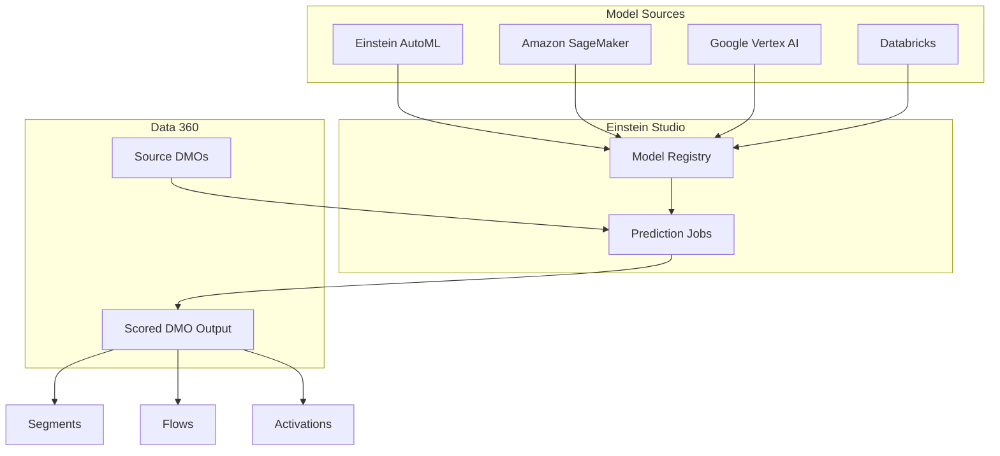

# AI & Machine Learning Integration

<Note>
As of October 14, 2025, Data Cloud has been rebranded to **Data 360**. During this transition, you may see references to Data Cloud in our application and documentation.
</Note>

Data 360 integrates AI and machine learning capabilities through Einstein Studio, enabling you to build predictive models with point-and-click tools, bring your own models (BYOM) from external platforms, and run prediction jobs that score records at scale.

## Overview



## Einstein Studio

Einstein Studio is the central hub for managing AI models in Data 360. It supports both Salesforce-built models and models imported from external machine learning platforms.

### Capabilities

| Capability | Description |
|-----------|-------------|
| **AutoML Model Building** | Point-and-click predictive model creation using Einstein's automated ML |
| **Bring Your Own Model (BYOM)** | Import models from SageMaker, Vertex AI, or Databricks |
| **Prediction Jobs** | Score DMO records using trained models at scale |
| **Model Evaluation** | View model performance metrics (AUC, accuracy, precision, recall) |
| **Versioning** | Manage multiple model versions and compare performance |

## Building a Predictive Model

Einstein allows you to create predictive models directly within Data 360 using an automated, no-code approach.

<Steps>
  <Step title="Open Einstein Studio">
    Navigate to **Einstein Studio** in Data 360 Setup.
  </Step>
  <Step title="Create a New Model">
    Click **New Model** and select **Build in Salesforce**.
  </Step>
  <Step title="Select the Prediction Target">
    Choose the DMO field you want to predict (e.g., likelihood to churn, propensity to purchase).
  </Step>
  <Step title="Select Training Data">
    Choose the source DMO and the fields to use as training features.
  </Step>
  <Step title="Configure Algorithm">
    Einstein can auto-select the best algorithm, or you can manually choose:
    - **Binary Classification** — Predict yes/no outcomes (churn, conversion)
    - **Regression** — Predict numeric values (lifetime value, spend)
    - **Multi-class Classification** — Predict categories (segment, product preference)
  </Step>
  <Step title="Train and Evaluate">
    Run the training job and review model metrics:
    - **AUC Score** — Area Under the Curve (higher is better, 0.5 = random)
    - **Accuracy** — Percentage of correct predictions
    - **Feature Importance** — Which fields have the most predictive power
  </Step>
</Steps>

## Bring Your Own Model (BYOM)

Import models trained on external platforms to score Data 360 records. Supported platforms:

| Platform | Connection Method | Model Formats |
|----------|------------------|---------------|
| **Amazon SageMaker** | AWS IAM role / access key | SageMaker endpoints |
| **Google Vertex AI** | Google Cloud service account | Vertex AI endpoints |
| **Databricks** | Databricks personal access token | MLflow models |

### Registering an External Model

<Steps>
  <Step title="Create a Connected App">
    Configure authentication credentials for your external ML platform.
  </Step>
  <Step title="Register the Model">
    In Einstein Studio, click **New Model** > **Connect to External Model**. Provide the model endpoint URL and authentication details.
  </Step>
  <Step title="Define the Schema">
    Map Data 360 DMO fields to the model's expected input features and specify the output fields.
  </Step>
  <Step title="Test the Connection">
    Send sample records to verify the model returns predictions correctly.
  </Step>
</Steps>

### Example: SageMaker Model Configuration

```json
{
  "modelName": "CustomerChurnPredictor",
  "platform": "AMAZON_SAGEMAKER",
  "endpoint": "https://runtime.sagemaker.us-west-2.amazonaws.com/endpoints/churn-model-v2/invocations",
  "authentication": {
    "type": "AWS_IAM",
    "roleArn": "arn:aws:iam::123456789012:role/SageMakerDataCloudRole"
  },
  "inputSchema": {
    "features": [
      {"name": "total_purchases", "type": "NUMERIC", "dmoField": "TotalOrders__c"},
      {"name": "days_since_last_purchase", "type": "NUMERIC", "dmoField": "DaysSinceLastPurchase__c"},
      {"name": "lifetime_value", "type": "NUMERIC", "dmoField": "LifetimeValue__c"},
      {"name": "support_tickets", "type": "NUMERIC", "dmoField": "SupportTicketCount__c"}
    ]
  },
  "outputSchema": {
    "predictions": [
      {"name": "churn_probability", "type": "NUMERIC"},
      {"name": "churn_label", "type": "STRING"}
    ]
  }
}
```

## Prediction Jobs

Prediction jobs take records from a source DMO, run each record through a predictive model, and store the results in a new DMO.

### Prediction Job Modes

| Mode | Description | Use Case |
|------|-------------|----------|
| **Batch** | Scores all qualifying records on a schedule | Nightly churn scoring, weekly LTV recalculation |
| **Streaming** | Scores records as input data changes | Real-time lead scoring, dynamic recommendations |

### Running a Prediction Job

<Steps>
  <Step title="Select the Model">
    Choose a trained model from Einstein Studio.
  </Step>
  <Step title="Configure the Source">
    Select the source DMO and optional filter criteria for which records to score.
  </Step>
  <Step title="Map Input Fields">
    Map DMO fields to the model's expected input features.
  </Step>
  <Step title="Configure Output">
    Specify the target DMO where prediction results will be stored.
  </Step>
  <Step title="Set Schedule">
    For batch: set a recurring schedule. For streaming: enable continuous scoring.
  </Step>
</Steps>

### Using Predictions in Flows

Prediction job output is stored in a DMO, making it available for:

- **Segmentation** — Create segments based on prediction scores (e.g., "High Churn Risk" segment)
- **Data Cloud-Triggered Flows** — Trigger flows when prediction scores change
- **Activations** — Activate scored segments to advertising or marketing platforms
- **Reports** — Analyze prediction distributions and model effectiveness

```java
// Apex: Query prediction results from Data 360
String query = 'SELECT IndividualId__c, ChurnProbability__c, ChurnLabel__c ' +
               'FROM ChurnPredictionResults__dlm ' +
               'WHERE ChurnProbability__c > 0.8';

ConnectApi.CdpQueryOutput result = ConnectApi.CdpQuery.queryAnsiSql(query);
```

## Model Evaluation Metrics

| Metric | Description | Good Value |
|--------|-------------|------------|
| **AUC** | Area Under ROC Curve — overall discrimination ability | > 0.7 |
| **Accuracy** | Percentage of correct predictions | > 0.8 |
| **Precision** | Of predicted positives, how many were correct | Depends on use case |
| **Recall** | Of actual positives, how many were identified | Depends on use case |
| **F1 Score** | Harmonic mean of precision and recall | > 0.7 |

## Best Practices

<AccordionGroup>
  <Accordion title="Model Development">
    - Start with Einstein AutoML for rapid prototyping before investing in custom models
    - Use feature importance analysis to identify the most predictive fields
    - Retrain models periodically as customer behavior patterns change
    - Monitor model drift by comparing prediction distributions over time
  </Accordion>

  <Accordion title="Prediction Jobs">
    - Use batch mode for large-scale scoring where real-time isn't required
    - Use streaming mode for time-sensitive use cases (lead scoring, fraud detection)
    - Filter source records to score only relevant populations
    - Schedule batch jobs during off-peak hours to minimize platform impact
  </Accordion>

  <Accordion title="BYOM Integration">
    - Ensure model endpoints have sufficient capacity for the volume of records being scored
    - Implement error handling for model endpoint timeouts or failures
    - Test model integration with sample data before running production prediction jobs
    - Monitor external model costs — each prediction job generates API calls to your ML platform
  </Accordion>
</AccordionGroup>

## Related Resources

- [Calculated Insights API](/apis/query-api/calculated-insights-api) — Query derived metrics
- [Segments API](/apis/connect-api/segments) — Create segments from prediction scores
- [Flows & Automation](/developer-guide/flows-automation) — Trigger flows from prediction changes
- Salesforce Help: [Einstein Predictive AI](https://help.salesforce.com/s/articleView?id=data.c360_a_ai_predictive.htm&type=5)
- Salesforce Blog: [How to Build a Predictive AI Model](https://developer.salesforce.com/blogs/2024/07/how-to-build-a-predictive-ai-model-in-data-cloud)
- Salesforce Blog: [Bring Your Own AI Models](https://developer.salesforce.com/blogs/2023/08/bring-your-own-ai-models-to-salesforce-with-einstein-studio)
