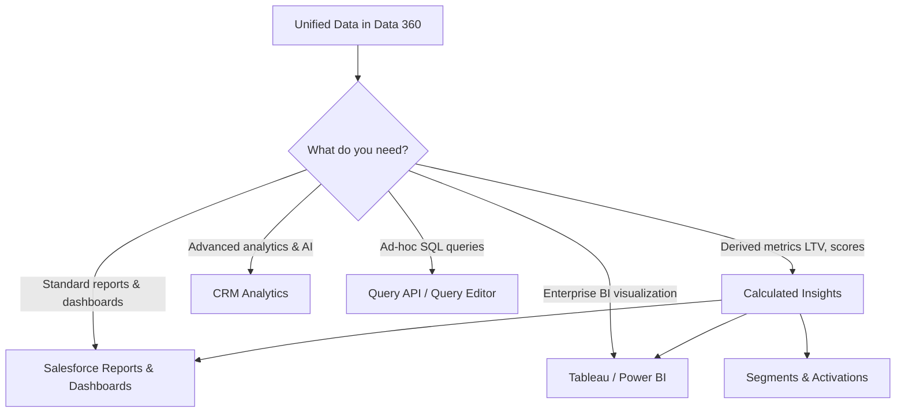

# Analytics & Reporting

<Snippet file="/snippets/note-rebranding.mdx" />

Data 360 provides multiple ways to analyze your unified customer data — from native Salesforce reports and dashboards to calculated insights, CRM Analytics integration, and connectivity with enterprise BI tools like Tableau and Power BI.

## Analytics Options Overview



## Reports & Dashboards

Data 360 supports **native Salesforce reports and dashboards** for visualizing unified customer data at scale. These work the same way as standard Salesforce reports, but pull from Data 360 data model objects (DMOs) and calculated insights.

### What You Can Report On

| Data Source | Report Type | Examples |
|---|---|---|
| **DMOs** | Record-level data | Individual profiles, sales orders, engagement records |
| **Calculated Insights** | Aggregated metrics | Lifetime value distribution, engagement score trends |
| **Segments** | Membership data | Segment size over time, overlap between segments |
| **Identity Resolution** | Unification metrics | Match rates, cluster sizes, source contribution |

### Creating a Data 360 Report

<Steps>
  <Step title="Create a New Report">
    In Salesforce, go to **Reports > New Report**. Select a Data 360 report type (available after enabling Data 360 reporting).
  </Step>
  <Step title="Select Data Objects">
    Choose the DMOs or calculated insight objects to report on. You can join related objects.
  </Step>
  <Step title="Add Filters & Groupings">
    Apply filters, group by fields, and add summary formulas. Standard Salesforce report builder functionality applies.
  </Step>
  <Step title="Save & Add to Dashboard">
    Save the report and add it to a dashboard for visual monitoring.
  </Step>
</Steps>

## Calculated Insights

Calculated insights are **derived metrics** computed from your unified data and stored as Calculated Insight Objects (CIOs). They aggregate underlying data into actionable values that can be used in segments, reports, and activations.

### Common Calculated Insights

| Metric | Calculation | Use Case |
|---|---|---|
| **Customer Lifetime Value (LTV)** | Sum of all purchase amounts per customer | Segment by value tier, prioritize high-value retention |
| **Purchase Frequency** | Count of orders in a time window | Identify frequent vs lapsed shoppers |
| **Average Order Value** | Total revenue / order count per customer | Segment by spending behavior |
| **Days Since Last Purchase** | Current date - last order date | Identify at-risk customers for re-engagement |
| **Engagement Score** | Weighted sum of email opens, clicks, site visits | Segment by engagement level |
| **Customer Satisfaction (CSAT)** | Average survey response per customer | Route low-CSAT customers for proactive outreach |

### Batch vs Streaming Insights

| Type | Processing | Refresh | Best For |
|---|---|---|---|
| **Batch** | SQL-based, scheduled | Hourly, daily, or on-demand | Complex aggregations, historical calculations |
| **Streaming** | Continuous, near real-time | ~3 minutes | Simple counters, running totals, latest values |

### Creating Calculated Insights

Calculated insights are defined using SQL that aggregates data from DMOs:

```sql icon=database
-- Customer lifetime value calculation
SELECT
    up.ssot__Id__c AS IndividualId,
    COUNT(DISTINCT so.ssot__Id__c) AS TotalOrders,
    SUM(so.ssot__GrandTotalAmount__c) AS LifetimeValue,
    AVG(so.ssot__GrandTotalAmount__c) AS AvgOrderValue,
    MAX(so.ssot__OrderDate__c) AS LastPurchaseDate
FROM
    UnifiedIndividual__dlm up
    JOIN ssot__SalesOrder__dlm so
        ON up.ssot__Id__c = so.ssot__IndividualId__c
GROUP BY
    up.ssot__Id__c
```

Once created, the resulting CIO is available as a segment criteria source, a report data source, and an attribute for activations.

## Segment Intelligence

Segment Intelligence provides analytics specifically about your segments:

- **Segment size trends** — Track how segment membership changes over time
- **Segment overlap** — Identify which segments share members (useful for avoiding message fatigue)
- **Segment composition** — Break down segment members by attributes (geography, engagement level, value tier)
- **Activation performance** — Track how activated segments perform in destination platforms

## CRM Analytics Integration

CRM Analytics (formerly Tableau CRM / Einstein Analytics) provides advanced analytics capabilities within Salesforce, including AI-powered insights, predictive models, and interactive dashboards.

### Connecting Data 360 to CRM Analytics

Data 360 data can be surfaced in CRM Analytics through:

| Method | Description |
|---|---|
| **Direct connection** | CRM Analytics queries Data 360 DMOs and CIOs directly |
| **Dataflow sync** | Schedule data syncs from Data 360 into CRM Analytics datasets |
| **Recipes** | Transform and combine Data 360 data with other sources in CRM Analytics |

### Use Cases

- Build predictive models on unified customer data
- Create AI-powered dashboards with automated insights
- Embed analytics in Salesforce pages with Lightning components

## BI Tool Connectivity

Data 360 connects with enterprise BI tools for visualization and analysis beyond Salesforce.

### Connection Methods

| Tool | Connection | Guide |
|---|---|---|
| **Tableau Desktop / Server** | Native Data Cloud Tableau Connector | [Tableau & Analytics](/developer-guide/tableau-analytics) |
| **Power BI** | JDBC Connector | [JDBC Configuration](/sdks/jdbc/configuration) |
| **DBeaver / Other SQL Tools** | JDBC Connector | [JDBC Examples](/sdks/jdbc/examples) |
| **Python / Jupyter** | Python SDK | [Python Queries](/sdks/python-sdk/queries) |
| **Custom Applications** | Query API (REST) | [Query Services](/apis/query-api/query-services) |

### JDBC Connector for BI

The Data 360 JDBC driver enables any JDBC-compatible tool to query Data 360 data using standard SQL:

```
jdbc:salesforce-data-cloud://login.salesforce.com;
  user=your_username;
  password=your_password;
  token=your_security_token;
```

See the [JDBC Connector](/sdks/jdbc) guide for setup, authentication, and configuration details.

## Query Methods for Analytics

| Method | Interface | Best For |
|---|---|---|
| **Query Editor** | Data 360 UI | Ad-hoc exploration, quick data checks |
| **Query API** | REST API (SQL) | Programmatic access, application integration |
| **Profile API** | REST API | Individual profile lookups |
| **SOQL** | Apex / API | Querying within Salesforce platform context |
| **JDBC** | SQL client | BI tools, data extraction |
| **Python SDK** | Python | Data science workflows, notebooks |

## Best Practices

- **Create calculated insights for common metrics** — Don't rebuild LTV or engagement score calculations in every report. Compute them once as CIOs and reuse across segments, reports, and activations.
- **Use segment intelligence before activating** — Check segment overlap and composition to avoid message fatigue and ensure audiences are properly differentiated.
- **Choose the right query method** — Use the Query Editor for ad-hoc exploration, the JDBC connector for BI tools, and the Query API for application integration. They all access the same data.
- **Monitor dashboard performance** — Data 360 queries operate on large data volumes. Use filters and aggregations to keep dashboard load times reasonable.
- **Combine sources in CRM Analytics** — Use CRM Analytics dataflows and recipes to join Data 360 data with other Salesforce data (cases, opportunities) for cross-cloud analytics.

## Related Resources

- [Tableau & Analytics](/developer-guide/tableau-analytics) — Detailed Tableau integration guide
- [Calculated Insights API](/apis/query-api/calculated-insights-api) — Create and manage calculated insights programmatically
- [Query Services](/apis/query-api/query-services) — REST API for SQL queries
- [SQL Reference](/apis/query-api/sql-reference) — Complete SQL syntax for Data 360 queries
- [Python SDK Queries](/sdks/python-sdk/queries) — Query Data 360 from Python
- [JDBC Connector](/sdks/jdbc) — Connect BI tools via JDBC
- Salesforce Help: [Analyze Data from Data 360](https://help.salesforce.com/s/articleView?id=data.c360_a_business_intelligence_analytics.htm&type=5)
- Salesforce Help: [Data Cloud and Tableau Use Cases](https://help.salesforce.com/s/articleView?id=sf.c360_a_dc_for_tableau_use_cases.htm&type=5)
- Salesforce Help: [Data Cloud Reports and Dashboards](https://help.salesforce.com/s/articleView?id=release-notes.rn_dc_reports_dashboards.htm&type=5)
