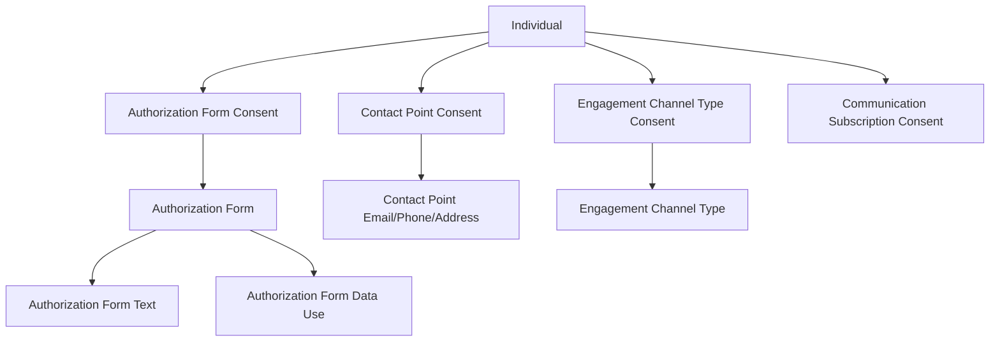

# Consent & Data Governance

<Note>
As of October 14, 2025, Data Cloud has been rebranded to **Data 360**. During this transition, you may see references to Data Cloud in our application and documentation.
</Note>

Data 360 provides a comprehensive consent and data governance framework that enables you to respect customer privacy preferences, comply with regulations like GDPR and CCPA, and maintain data quality and classification standards across your unified customer data.

## Consent Data Model

Data 360 models consent using a hierarchy of DMOs that capture consent at different levels of granularity:



### Consent DMOs

| DMO | Purpose | Example |
|-----|---------|---------|
| **Authorization Form** | Terms, conditions, contracts, consent forms | Privacy policy v2.1 |
| **Authorization Form Consent** | Records where, when, and how consent was captured | User accepted privacy policy on 2024-01-15 via web form |
| **Authorization Form Text** | Authorization form text with language/locale variants | English, Spanish, French versions |
| **Authorization Form Data Use** | Data uses consented to in a form | Marketing communications, analytics |
| **Contact Point Consent** | Consent for a specific contact point (email, phone, etc.) | Opted in for marketing emails to john@example.com |
| **Engagement Channel Type Consent** | Consent for communication channels | Opted in for SMS, opted out of push notifications |
| **Communication Subscription Consent** | Subscription-level preferences | Subscribed to weekly newsletter, unsubscribed from promotions |
| **Consent Status** | Consent status values | Opted In, Opted Out, Pending |
| **Data Use Purpose** | Contact purposes | Marketing, Billing, Support, Analytics |
| **Privacy Consent Log** | Audit log of consent changes | Consent changed from Opted In to Opted Out on 2024-06-01 |

## Consent in the Web & Mobile SDKs

The Salesforce Interactions SDK respects consent by design:

- **No data transmission without consent** — The SDK does not store or transmit any collected data until explicit consent is granted
- **Immediate revocation** — When consent is revoked, the SDK immediately stops emitting events
- **Consent events** — Capture consent changes as events for downstream processing

```javascript
// Web SDK: Set consent status
SalesforceInteractions.consent.setConsentStatus(
  SalesforceInteractions.consent.ConsentStatus.OptIn
);

// Web SDK: Revoke consent
SalesforceInteractions.consent.setConsentStatus(
  SalesforceInteractions.consent.ConsentStatus.OptOut
);
```

See [Web SDK Consent](/sdks/web-sdk/consent) for the full SDK consent API reference.

## Data Subject Rights

Data 360 supports compliance with data subject rights under GDPR, CCPA, and similar regulations through Salesforce Privacy Center.

### Supported Rights

| Right | Description | Implementation |
|-------|-------------|---------------|
| **Right to Be Forgotten (RTBF)** | Delete personal data when no longer needed or consent is withdrawn | RTBF Policy in Privacy Center |
| **Data Portability (DSAR)** | Provide personal data in structured, machine-readable format | Portability Policy generates JSON exports |
| **Right to Opt-Out** | Cease personal data sales or sharing | Consent status update across unified profile |
| **Right to Access** | Inform what data is held about a person | Profile Explorer + Portability export |

### Right to Be Forgotten (RTBF) Workflow

<Steps>
  <Step title="Receive Request">
    Log the request via the Privacy Request object (tracks status, timeline, requestor).
  </Step>
  <Step title="Verify Identity">
    Confirm the requestor's identity before processing. Check for legal or litigation holds.
  </Step>
  <Step title="Execute RTBF Policy">
    Run the RTBF policy in Privacy Center. The policy locates all records linked to the individual across DMOs and either deletes or masks the data.
  </Step>
  <Step title="Respond">
    Notify the requestor of completion. Maintain audit trail of the action taken.
  </Step>
</Steps>

### Data Portability

Portability policies generate machine-readable exports (JSON) containing all data associated with an individual:

- Define the parent object (Individual, Contact, Person Account)
- Include related child objects across DMOs
- Generated files are accessible for **60 days** via Privacy Center

## Data Governance

### Data Classification & Tagging

Tag DMO fields with sensitivity classifications to enforce governance policies:

| Classification | Description | Examples |
|---------------|-------------|---------|
| **PII** | Personally Identifiable Information | Name, email, phone, SSN |
| **Confidential** | Business-sensitive data | Revenue, internal scores |
| **Public** | Non-sensitive data | Product categories, region |
| **Restricted** | Highly sensitive with legal requirements | Health data, financial records |

### Data Masking

Apply dynamic data masking to sensitive fields based on user permissions:

- **Full masking** — Replace field value with asterisks (e.g., `j***@example.com`)
- **Partial masking** — Show last N characters (e.g., `***-***-1234`)
- **Permission-based** — Masking rules vary by permission set or data space

### Credit Usage Tracking

Monitor Data 360 credit consumption to maintain governance over costs:

- Track credits by operation type (ingestion, query, activation, AI inference)
- Set up usage alerts and thresholds
- Review usage trends in Data 360 Setup > Usage

See [Limits & Guidelines](/reference/limits) for credit costs per operation.

## Consent-Aware Segmentation

Build segments that automatically respect consent preferences:

```sql
-- Segment: Marketable customers (opted in for email)
SELECT ui.ssot__Id__c
FROM UnifiedIndividual__dlm ui
JOIN ssot__ContactPointConsent__dlm cpc
    ON ui.ssot__Id__c = cpc.ssot__PartyId__c
JOIN ssot__ContactPointEmail__dlm cpe
    ON cpc.ssot__ContactPointId__c = cpe.ssot__Id__c
WHERE cpc.ssot__ConsentStatusId__c = 'OptedIn'
    AND cpc.ssot__DataUsePurposeId__c = 'Marketing'
    AND cpc.ssot__EffectiveToDate__c > CURRENT_DATE
```

## Consent-Aware Activations

When activating segments to external platforms, Data 360 can automatically:

- **Exclude opted-out individuals** from activation payloads
- **Filter by consent purpose** to ensure data is only used for consented purposes
- **Honor channel preferences** — only activate to channels the individual has consented to
- **Apply suppression lists** — exclude individuals with pending RTBF requests

## Best Practices

<AccordionGroup>
  <Accordion title="Consent Collection">
    - Capture consent with full context: when, where, how, and what purpose
    - Store the specific version of the authorization form the user consented to
    - Support multiple languages/locales for consent forms via Authorization Form Text DMO
    - Track double opt-in for email marketing where legally required
  </Accordion>

  <Accordion title="Compliance">
    - Implement automated RTBF processing with scheduled Privacy Center jobs
    - Maintain audit trails for all consent changes using Privacy Consent Log DMO
    - Test RTBF and portability policies in sandbox before production
    - Review and update data retention policies regularly
    - Set up Privacy Holds for records under legal or audit obligations
  </Accordion>

  <Accordion title="Governance">
    - Classify all PII fields during DMO setup, not retroactively
    - Enable data masking for non-admin users accessing sensitive profiles
    - Monitor credit usage to prevent unexpected cost overruns
    - Document data lineage from source through transformation to activation
  </Accordion>
</AccordionGroup>

## Related Resources

- [Web SDK Consent](/sdks/web-sdk/consent) — SDK consent management API
- [Security & Permissions](/developer-guide/security-permissions) — Access control and data spaces
- [Identity Resolution](/apis/connect-api/identity-resolution) — How consent propagates through unified profiles
- Salesforce Help: [Consent Management](https://help.salesforce.com/s/articleView?id=data.c360_a_consent_management.htm&type=5)
- Salesforce Help: [Ethics, Privacy, and Consent](https://help.salesforce.com/s/articleView?id=sf.c360_a_consumer_rights.htm&type=5)
- Salesforce Docs: [Privacy Consent Log DMO](https://developer.salesforce.com/docs/data/data-cloud-dmo-mapping/guide/c360dm-privacy-consent-log-dmo.html)
