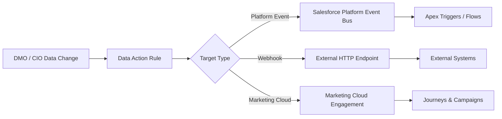

# Data Actions

<Snippet file="/snippets/note-rebranding.mdx" />

Data actions allow you to monitor data changes in data model objects (DMOs) and calculated insight objects (CIOs), then automatically send change data events to configured targets. This enables real-time responses to customer data changes across your technology stack.

## How Data Actions Work



## Data Action Targets

Before creating a data action, you must configure at least one target that specifies where change events are delivered.

### Supported Target Types

| Target Type | Description | Use Case |
|------------|-------------|----------|
| **Salesforce Platform Event** | Publishes events to the Salesforce event bus | Trigger Apex, flows, or external subscribers via CometD/Pub/Sub API |
| **Webhook** | Sends HTTP POST to an external endpoint | Notify third-party systems, trigger external workflows |
| **Marketing Cloud Engagement** | Sends data to Marketing Cloud | Trigger journeys, update contact data |

### Creating a Data Action Target

<Steps>
  <Step title="Navigate to Data Action Targets">
    In Data 360 Setup, go to **Data Action Targets** and click **New**.
  </Step>
  <Step title="Select Target Type">
    Choose **Platform Event**, **Webhook**, or **Marketing Cloud**.
  </Step>
  <Step title="Configure the Target">
    - **Platform Event**: Select the platform event object
    - **Webhook**: Enter the URL and generate the secret key for payload verification
    - **Marketing Cloud**: Configure the Marketing Cloud connection
  </Step>
  <Step title="Save and Activate">
    Save the target configuration and verify the connection.
  </Step>
</Steps>

## Webhook Targets

Webhook targets send HTTP POST requests to external endpoints when data changes occur. Salesforce protects message integrity using a generated secret key for payload signature verification.

### Webhook Configuration

| Setting | Description |
|---------|-------------|
| **URL** | The HTTPS endpoint to receive webhook payloads |
| **Secret Key** | Auto-generated key for payload signature verification |
| **Authentication** | OAuth 2.0 or API key-based authentication |

### Payload Signature Verification

Each webhook payload includes a signature in the HTTP header that you can use to verify the request originated from Salesforce:

```python icon=python
import hmac
import hashlib

def verify_webhook_signature(payload, signature, secret_key):
    """Verify the webhook payload signature from Data 360."""
    computed = hmac.new(
        secret_key.encode('utf-8'),
        payload.encode('utf-8'),
        hashlib.sha256
    ).hexdigest()
    return hmac.compare_digest(computed, signature)

# In your webhook handler
@app.route('/webhook/data-action', methods=['POST'])
def handle_data_action():
    payload = request.get_data(as_text=True)
    signature = request.headers.get('X-Signature')

    if not verify_webhook_signature(payload, signature, SECRET_KEY):
        return 'Unauthorized', 401

    data = request.get_json()
    # Process the data change event
    process_event(data)
    return 'OK', 200
```

### Webhook Payload Structure

```json icon=brackets-curly
{
  "actionName": "HighValueCustomerAlert",
  "objectName": "UnifiedIndividual__dlm",
  "changeType": "UPDATE",
  "timestamp": "2024-06-15T14:30:00Z",
  "records": [
    {
      "id": "001abc123",
      "changedFields": {
        "LifetimeValue__c": {
          "oldValue": 4500.00,
          "newValue": 10200.00
        },
        "Segment__c": {
          "oldValue": "Medium Value",
          "newValue": "High Value"
        }
      }
    }
  ]
}
```

## Creating a Data Action

<Steps>
  <Step title="Navigate to Data Actions">
    Go to **Data Actions** in Data 360 Setup and click **New**.
  </Step>
  <Step title="Select the Source Object">
    Choose the DMO or calculated insight object to monitor for changes.
  </Step>
  <Step title="Define Filter Criteria">
    Optionally set conditions for when the action should fire (e.g., only when `LifetimeValue > 5000`).
  </Step>
  <Step title="Select Fields to Monitor">
    Choose which fields trigger the action when their values change.
  </Step>
  <Step title="Choose Target">
    Select one or more data action targets to receive the change events.
  </Step>
  <Step title="Activate">
    Enable the data action. It begins monitoring for changes immediately.
  </Step>
</Steps>

## Platform Event Integration

When using a Salesforce Platform Event target, data changes are published to the event bus where they can be consumed by:

- **Apex Triggers** — Write after-insert triggers on the platform event to execute custom logic
- **Flows** — Use platform event-triggered flows for declarative automation
- **External Subscribers** — Subscribe via CometD, Pub/Sub API, or gRPC for external consumption

### Example: Apex Trigger on Data Action Event

```java icon=java
trigger DataActionHandler on CustomerChangeEvent__e (after insert) {
    List<Task> tasksToCreate = new List<Task>();

    for (CustomerChangeEvent__e event : Trigger.New) {
        if (event.ChangeType__c == 'HIGH_VALUE_TRANSITION') {
            tasksToCreate.add(new Task(
                Subject = 'Follow up with high-value customer',
                Description = 'Customer ' + event.CustomerId__c +
                    ' transitioned to high-value segment',
                Priority = 'High',
                ActivityDate = Date.today().addDays(1)
            ));
        }
    }

    if (!tasksToCreate.isEmpty()) {
        insert tasksToCreate;
    }
}
```

## Data Action vs. Data Cloud-Triggered Flows

| Feature | Data Actions | DC-Triggered Flows |
|---------|-------------|-------------------|
| **Trigger** | DMO/CIO field changes | DMO data changes |
| **Targets** | Platform Event, Webhook, Marketing Cloud | Any flow action |
| **Latency** | Near real-time | Near real-time |
| **Complexity** | Simple event routing | Complex multi-step logic |
| **External delivery** | Native (webhook) | Requires flow HTTP callout |
| **Best for** | Event distribution to multiple systems | Complex orchestration within Salesforce |

## Best Practices

<AccordionGroup>
  <Accordion title="Target Configuration">
    - Use HTTPS endpoints for all webhook targets
    - Always verify payload signatures on your webhook receiver
    - Implement idempotent webhook handlers (events may be delivered more than once)
    - Set up monitoring and alerting for failed deliveries
  </Accordion>

  <Accordion title="Action Design">
    - Be selective with monitored fields — monitoring too many fields generates excessive events
    - Use filter criteria to reduce noise and focus on meaningful changes
    - Consider the downstream impact of high-frequency data actions
    - Test data actions with small data volumes before deploying to production
  </Accordion>

  <Accordion title="Error Handling">
    - Webhook targets should return 2xx status codes promptly
    - Implement retry logic on your webhook receiver for transient failures
    - Monitor data action execution logs for delivery failures
    - Set up fallback mechanisms for critical data actions
  </Accordion>
</AccordionGroup>

## Related Resources

- [Flows & Automation](/developer-guide/flows-automation) — Data Cloud-triggered flows
- [Platform Events](/developer-guide/platform-events) — Platform event integration patterns
- [Activations API](/apis/connect-api/activations) — Segment activation to external platforms
- Salesforce Help: [Data Actions](https://help.salesforce.com/s/articleView?id=sf.c360_a_data_actions_CDP.htm&type=5)
- Salesforce Help: [Data Action Targets](https://help.salesforce.com/s/articleView?id=data.c360_a_data_action_target_in_customer_data_platform.htm&type=5)
