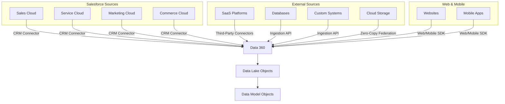

# Connect & Ingest Data

<Snippet file="/snippets/note-rebranding.mdx" />

Data 360 can ingest data from Salesforce products, external systems, and partner platforms. This guide provides an overview of every ingestion method, helps you choose the right one, and walks through the core concepts of data streams and starter bundles.

## Ingestion Methods Overview

## Ingestion Methods Comparison

| Method | Latency | Max Volume | Setup | Best For |
|---|---|---|---|---|
| **Salesforce CRM Connector** | Near real-time | Automatic sync | Built-in, minimal config | Salesforce org objects (contacts, cases, opportunities) |
| **Third-Party Connectors** | Scheduled (min–hours) | Connector-dependent | Configuration in UI | SaaS platforms — 270+ connectors available |
| **Ingestion API (Streaming)** | ~3 minutes | Incremental updates | API + schema file | Real-time event feeds from external systems |
| **Ingestion API (Bulk)** | Batch processing | Up to 150 MB/request | API + schema file | Periodic CSV data loads |
| **Web SDK** | Real-time | Event-based | JavaScript snippet | Website behavioral data (page views, clicks, forms) |
| **Mobile SDK** | Real-time | Event-based | SDK integration | Mobile app events and user interactions |
| **Zero-Copy Federation** | On-demand (query-time) | Unlimited (no copy) | Partner connection setup | Snowflake, Databricks, BigQuery, Redshift |
| **MuleSoft** | Configurable | Configurable | MuleSoft Anypoint | Complex ETL pipelines, legacy system integration |

## Choosing the Right Method

<AccordionGroup>
  <Accordion title="Your data is in a Salesforce org">
    Use the **Salesforce CRM Connector**. It's built-in, requires minimal configuration, and supports starter data bundles that auto-map source objects to DMOs. This is the fastest path to getting data into Data 360.
  </Accordion>

  <Accordion title="Your data is in a supported SaaS platform">
    Check the **third-party connector** catalog first. Data 360 supports over 270 connectors for platforms like Google Analytics, Amazon S3, Azure, Snowflake, SAP, and more. Connectors handle authentication, scheduling, and schema mapping through the UI.
  </Accordion>

  <Accordion title="Your data is in a custom or unsupported system">
    Use the **Ingestion API**. You define the schema in an OpenAPI (YAML) file, configure a connector in Data 360, and push data via REST API. Supports both streaming (incremental) and bulk (CSV) patterns on the same data stream.
  </Accordion>

  <Accordion title="You need website or mobile app behavioral data">
    Use the **Web SDK** (JavaScript) or **Mobile SDK**. These capture events like page views, clicks, form submissions, and custom interactions in real-time and send them directly to Data 360.
  </Accordion>

  <Accordion title="Your data lives in a data warehouse and you don't want to copy it">
    Use **Zero-Copy Federation**. Data 360 queries your data in place via read-only federated access. Supported platforms include Snowflake, Databricks, Google BigQuery, and Amazon Redshift. This preserves your existing data model and BI investments.
  </Accordion>

  <Accordion title="You need complex ETL or multi-system orchestration">
    Use **MuleSoft** with the Data Cloud Connector. MuleSoft Anypoint Platform provides integration flows, transformations, and error handling for complex data pipelines connecting legacy systems, APIs, and databases.
  </Accordion>
</AccordionGroup>

## Data Streams

A **data stream** is the pipeline that carries data from a source into Data 360. Every ingestion method creates one or more data streams.

### Data Stream Components

| Component | Description |
|---|---|
| **Source** | The connector or API endpoint providing data |
| **Schema** | The structure of incoming data (fields, types, relationships) |
| **Target DMO** | The Data Model Object that receives the mapped data |
| **Refresh Schedule** | How often data syncs (real-time, scheduled, or on-demand) |

### Creating a Data Stream

<Steps>
  <Step title="Configure a Connector">
    In Data 360 Setup, navigate to your connector type (CRM, Third-Party, or Ingestion API) and configure the connection.
  </Step>
  <Step title="Select Source Objects">
    Choose which objects or data sets to ingest from the source system.
  </Step>
  <Step title="Deploy the Data Stream">
    Review the schema and deploy. For Salesforce CRM sources, starter data bundles auto-map fields to standard DMOs.
  </Step>
  <Step title="Verify Data Flow">
    After deployment, check the data stream status in Data 360 Home. Verify that records are flowing into the target Data Lake Objects (DLOs).
  </Step>
</Steps>

## Starter Data Bundles

Starter data bundles are Salesforce-defined data stream definitions that include pre-built mappings from source objects to Data 360 DMOs. They significantly reduce setup time for Salesforce CRM data.

### How Starter Bundles Work

1. When you create a data stream from a Salesforce CRM connector, available starter bundles are listed
2. Select a bundle to deploy — it automatically maps source object fields to the corresponding DMO
3. You can customize the mapping after deployment (add fields, change mappings, exclude objects)

### Common Starter Bundles

| Bundle | Source Objects | Target DMOs |
|---|---|---|
| **Sales Cloud** | Contact, Account, Opportunity, Lead | Individual, Account, Opportunity, Lead |
| **Service Cloud** | Case, Contact, Account | Case, Individual, Account |
| **Commerce Cloud** | Customer, Order, Product | Individual, Sales Order, Goods Product |
| **Marketing Cloud** | Subscriber, Email Send, Email Open | Individual, Email Message, Email Engagement |

## Best Practices

- **Prioritize identity data** — Ensure sources containing customer identifiers (email, phone, IDs) are ingested first so identity resolution can begin
- **Plan your schema before ingesting** — Review the target DMO fields and plan your mapping before creating data streams, especially for Ingestion API sources
- **Monitor data stream health** — Regularly check data stream status for errors, volume anomalies, or sync delays
- **Use streaming for real-time, bulk for backfills** — The Ingestion API supports both patterns on the same data stream. Use streaming for ongoing incremental updates and bulk for initial historical data loads
- **Avoid over-ingesting** — Only bring in data you plan to use for segmentation, insights, or activation. Unnecessary data increases cost and complexity

## Related Resources

- [Data Ingestion API](/apis/connect-api/data-ingestion) — Streaming and bulk API endpoint reference
- [Data Streams API](/apis/connect-api/data-streams) — Manage data stream configurations programmatically
- [Integration Guide](/integrations) — Connector setup and configuration guides
- [Web SDK Setup](/integrations/web-sdk-setup) — Capture website behavioral data
- [Zero-Copy Federation](/integrations/zero-copy-federation) — Federated query setup for data warehouses
- [Third-Party Connectors](/integrations/third-party-connectors) — Configuring external connectors
- Salesforce Help: [Connect Data](https://help.salesforce.com/s/articleView?id=data.c360_a_data_ingestion.htm&type=5)
- Salesforce Developer: [Ingestion API](https://developer.salesforce.com/docs/data/data-cloud-int/guide/c360-a-ingestion-api.html)
