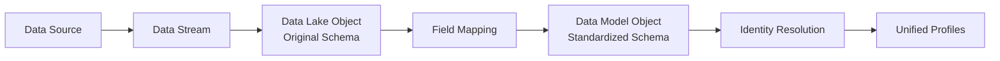
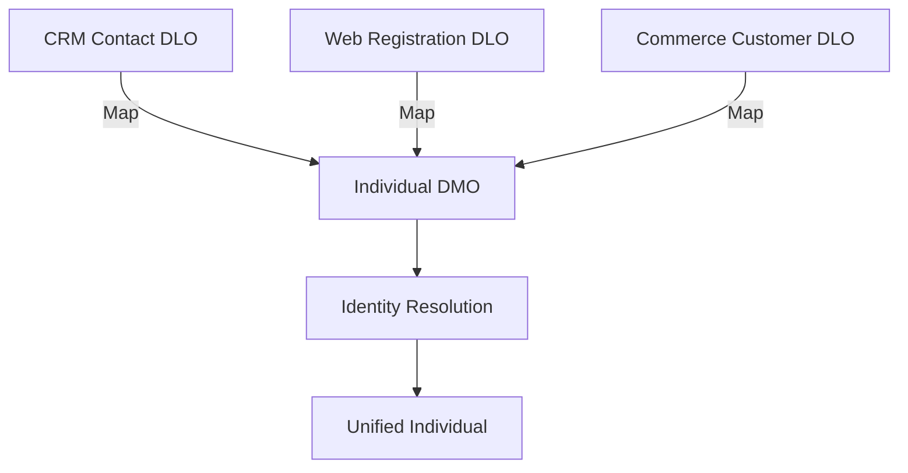

# Data Mapping & Harmonization

<Note>
As of October 14, 2025, Data Cloud has been rebranded to **Data 360**. During this transition, you may see references to Data Cloud in our application and documentation.
</Note>

After data is ingested into Data 360, it lands in Data Lake Objects (DLOs) in its original schema. The data mapping process transforms this raw data into standardized Data Model Objects (DMOs) in the Customer 360 Data Model, enabling identity resolution, segmentation, and cross-source analysis.

## Data Flow

## Key Concepts

| Concept | Description |
|---------|-------------|
| **Data Lake Object (DLO)** | Raw ingested data in its original schema. Each data stream creates a DLO. Uses `__dlm` suffix. |
| **Data Model Object (DMO)** | Standardized object in the Customer 360 Data Model. Data from DLOs is mapped to DMOs. Uses `__dlm` suffix. |
| **Field Mapping** | Configuration that maps a DLO field to a DMO field (e.g., source `customer_email` → DMO `ssot__Email__c`). |
| **Starter Data Bundle** | Pre-built mapping templates that auto-map Salesforce source objects to standard DMOs. |
| **Data Harmonization** | The overall process of mapping, transforming, and unifying data from multiple sources into a common model. |

## Mapping Process

### Step 1: Review Ingested Data

After a data stream runs, review the DLO in **Data Explorer**:

1. Navigate to **Data 360 > Data Explorer**
2. Find the DLO created by your data stream
3. Review the fields, data types, and sample values
4. Identify which fields map to standard DMO fields

### Step 2: Choose Target DMOs

Map each DLO to one or more standard or custom DMOs:

| Source Data | Target DMO | Category |
|------------|-----------|----------|
| Customer records | **Individual** | Who |
| Email addresses | **Contact Point Email** | Contact Points |
| Phone numbers | **Contact Point Phone** | Contact Points |
| Company/org data | **Account** | Who |
| Purchase records | **Sales Order** / **Sales Order Product** | Commerce |
| Support tickets | **Case** | Service |
| Web page views | **Website Engagement** | Engagement |
| Consent records | **Contact Point Consent** | Privacy |

### Step 3: Configure Field Mappings

<Steps>
  <Step title="Navigate to Data Model">
    Go to **Data 360 > Data Model** and select the target DMO.
  </Step>
  <Step title="Add Mapping">
    Click **Add Mapping** or **Edit Mapping** to open the field mapping interface.
  </Step>
  <Step title="Map Fields">
    For each DMO field, select the corresponding DLO field:
    - **Required fields**: Primary key, record modified date
    - **Identity fields**: Email, phone, name (needed for identity resolution)
    - **Business fields**: Any additional fields relevant to your use cases
  </Step>
  <Step title="Configure Key Fields">
    Set these critical mappings:
    - **Primary Key** — Unique identifier from the source system
    - **Record Modified Date** — Timestamp field indicating when the source record changed
    - **Individual/Organization Unit** — Relationship field linking to the Individual or Account DMO
  </Step>
  <Step title="Save and Deploy">
    Save the mapping. Data begins flowing from DLO to DMO on the next refresh.
  </Step>
</Steps>

### Mapping Configuration

| Field Type | Required | Purpose |
|-----------|----------|---------|
| **Primary Key** | Yes | Unique record identifier from source |
| **Record Modified Date** | Yes | Timestamp for incremental processing |
| **Individual/Org Unit** | Yes (for related DMOs) | Links record to a person or account |
| **Contact Point fields** | Recommended | Email, phone, address for identity resolution |
| **Custom fields** | Optional | Business-specific data |

## Starter Data Bundles

Starter data bundles are pre-built mapping templates that automatically map Salesforce source objects to standard DMOs. They eliminate manual mapping for common Salesforce data.

| Bundle | Source | Auto-Mapped DMOs |
|--------|--------|-----------------|
| **Sales Cloud** | Accounts, Contacts, Leads, Opportunities | Individual, Account, Lead, Contact Points |
| **Service Cloud** | Cases, Agent Work | Individual, Case, Case Update, Agent Work |
| **Commerce Cloud** | Orders, Products, Carts | Sales Order, Product, Cart, Individual |
| **Marketing Cloud Engagement** | Contacts, Email Sends | Individual, Contact Point Email, Email Engagement |
| **Loyalty Management** | Programs, Members | Loyalty Program Member, Loyalty Member Tier |

### Using a Starter Bundle

<Steps>
  <Step title="Create a Data Stream">
    When creating a Salesforce CRM data stream, select the starter data bundle option.
  </Step>
  <Step title="Review Auto-Mappings">
    The bundle pre-configures field mappings from CRM objects to DMOs. Review and adjust as needed.
  </Step>
  <Step title="Deploy">
    Deploy the data stream. Mappings are applied automatically during ingestion.
  </Step>
</Steps>

## Data Harmonization

When multiple data sources contain information about the same entities (e.g., customers), data harmonization ensures a consistent, unified view.

### How It Works

1. **Multiple DLOs** map to the **same DMO** (e.g., both CRM contacts and web registrations map to Individual)
2. **Identity resolution** matches records from different sources that refer to the same person
3. **Reconciliation rules** determine which values win when sources conflict (e.g., CRM email vs. web form email)

### Reconciliation Strategies

| Strategy | When to Use | Example |
|----------|-------------|---------|
| **Most Recent** | Volatile fields that change often | Last known email address |
| **Source Priority** | When one system is authoritative | CRM name over web form name |
| **Most Frequent** | When consensus across sources matters | Most commonly used phone number |

## Custom DMOs

When your data doesn't fit standard DMOs, create custom data model objects:

1. In **Data 360 > Data Model**, click **New Custom Object**
2. Define the object name, fields, and data types
3. Configure relationships to other DMOs (especially Individual for person data)
4. Map DLO fields to the new custom DMO fields

<Note>
Custom DMOs support segmentation and calculated insights but may not be available for all platform features (e.g., some starter data bundles only work with standard DMOs).
</Note>

## Inline Transformations

Apply simple transformations during the mapping process:

| Transformation | Example | Use Case |
|---------------|---------|----------|
| **Proper case** | `john doe` → `John Doe` | Name standardization |
| **Trim whitespace** | `  email@test.com  ` → `email@test.com` | Data cleanup |
| **Concatenation** | `First` + ` ` + `Last` → `Full Name` | Field combination |
| **Default value** | `NULL` → `Unknown` | Handle missing data |

For complex transformations (joins, aggregations), use [Data Transforms](/developer-guide/data-transforms).

## Best Practices

<AccordionGroup>
  <Accordion title="Mapping">
    - Map to standard DMOs whenever possible — they unlock the most features
    - Always map email and phone fields to Contact Point DMOs for identity resolution
    - Set accurate record modified dates — incorrect timestamps cause incremental processing issues
    - Review auto-mappings from starter bundles before deploying
  </Accordion>

  <Accordion title="Data Quality">
    - Clean data at the source when possible, or use inline formulas during mapping
    - Standardize email formatting (lowercase, trimmed) before mapping to Contact Point Email
    - Verify primary keys are truly unique per source — duplicates cause mapping errors
    - Monitor Data Explorer after mapping for unexpected NULL values or data type mismatches
  </Accordion>

  <Accordion title="Multi-Source Harmonization">
    - Document which sources map to each DMO for team clarity
    - Test identity resolution with a subset of data before running against full volumes
    - Review reconciliation results in Profile Explorer to verify the right values are winning
    - Plan for conflicting data — decide reconciliation strategy per field before going live
  </Accordion>
</AccordionGroup>

## Related Resources

- [DMO Categories](/data-models/categories) — Standard DMO category reference
- [Standard DMOs](/data-models/index) — Complete list of standard DMOs
- [Data Transforms](/developer-guide/data-transforms) — Complex data transformations
- [Identity Resolution Best Practices](/developer-guide/identity-resolution-best-practices) — Match and reconciliation configuration
- [Data Streams API](/apis/connect-api/data-streams) — Manage data streams programmatically
- Salesforce Help: [Map Data Model Objects](https://help.salesforce.com/s/articleView?id=data.c360_a_map_custom_data_model_objects.htm&type=5)
- Salesforce Help: [Data Objects in Data Cloud](https://help.salesforce.com/s/articleView?id=sf.c360_a_data_lake_objects.htm&type=5)
- Salesforce Docs: [DMO and Mapping Guide](https://developer.salesforce.com/docs/data/data-cloud-dmo-mapping/guide/c360dm-model-data.html)
