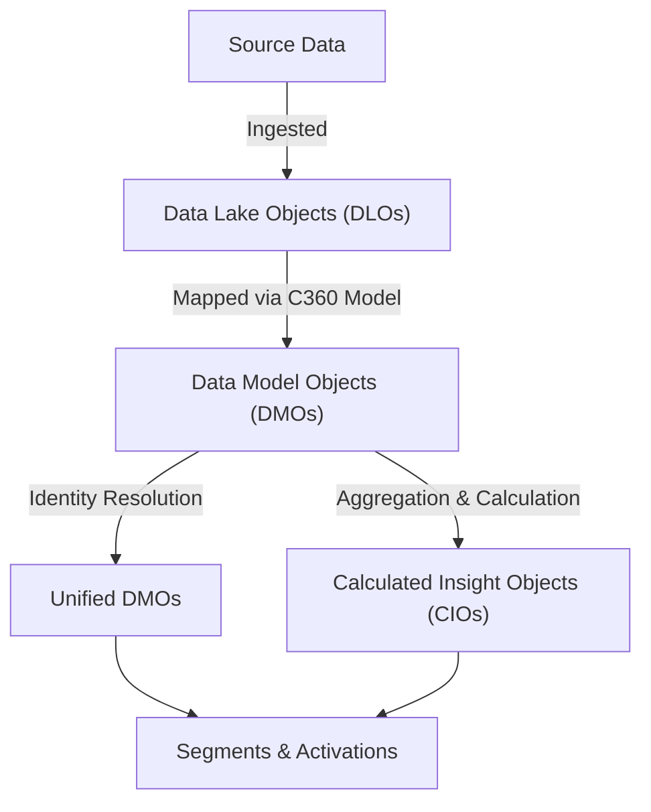

# Data Modeling & Harmonization

<Snippet file="/snippets/note-rebranding.mdx" />

Data modeling is the process of mapping your raw ingested data into a standardized schema that Data 360 can unify, segment, and activate. This guide covers the object model concepts, the Customer 360 data model, and the mapping workflow.

## The Data 360 Object Model

Data 360 uses four types of data objects, each serving a different purpose in the data pipeline:

### Object Type Reference

| Object Type | Abbreviation | Description | Created By |
|---|---|---|---|
| **Data Lake Object** | DLO | Raw data stored in its original schema as ingested from source systems | Automatically created when data streams are deployed |
| **Data Model Object** | DMO | Harmonized data mapped to the Customer 360 data model schema. Can be standard or custom. | Created via data mapping (DLO → DMO) |
| **Unified DMO** | Unified DMO | Consolidated records after identity resolution merges duplicate profiles across sources | Created by identity resolution rulesets |
| **Calculated Insight Object** | CIO | Derived metrics aggregated from underlying data (e.g., lifetime value, engagement score, CSAT) | Created via calculated insights (batch or streaming) |

## The Customer 360 Data Model

Data 360 includes a pre-loaded data model with **over 300 industry-agnostic standard objects**. This is the **Customer 360 (C360) Data Model** — a common schema that standardizes how customer data is represented regardless of its source.

### Why Use the Standard Model?

- **Interoperability** — Segments, calculated insights, activations, and Einstein features work best with standard DMOs
- **Faster setup** — Starter data bundles auto-map Salesforce source objects to standard DMOs
- **Cross-cloud compatibility** — Standard DMOs are recognized across Marketing Cloud, Service Cloud, and other Salesforce products
- **Reduced maintenance** — Salesforce maintains and updates standard DMOs with each release

### DMO Categories

Standard DMOs are organized into functional categories:

| Category | Key DMOs | Purpose |
|---|---|---|
| **Profile** | Individual, Account, Lead, Party | Core identity objects representing people and organizations |
| **Contact Points** | Contact Point Email, Phone, Address, App, Social, Digital ID | Communication channels and identifiers |
| **Commerce** | Sales Order, Sales Order Product, Shopping Cart Engagement, Product Browse Engagement | Purchase and shopping behavior |
| **Products** | Goods Product, Master Product, Product Catalog, Product Category | Product and catalog information |
| **Engagement** | Website Engagement, Email Engagement, Message Engagement, Device Application Engagement | Customer interaction data |
| **Service** | Case, Case Update, Agent Work | Support and service data |
| **Marketing** | Market Segment, Market Journey Activity, Email Message, Email Template | Campaign and messaging data |
| **Loyalty** | Loyalty Program, Loyalty Program Member, Loyalty Ledger, Loyalty Tier | Loyalty program data |
| **Financial** | Financial Account, Deposit Account, Loan Account, Investment Account | Financial services data |
| **Consent** | Authorization Form Consent, Contact Point Consent, Consent Action, Consent Status | Privacy and consent management |
| **Surveys** | Survey, Survey Question, Survey Response, Survey Invitation | Customer feedback data |

For the complete DMO reference, see the [Data Model Objects](/data-models) catalog.

## Mapping Workflow: DLO to DMO

Mapping is the process of connecting source data fields (in DLOs) to target data model fields (in DMOs).

### How Mapping Works

<Steps>
  <Step title="Ingest Data">
    Data from your sources arrives in Data Lake Objects (DLOs), preserving its original schema and field names.
  </Step>
  <Step title="Choose Target DMO">
    Select the standard or custom DMO that best represents the data. For example, customer records map to **Individual**, email addresses map to **Contact Point Email**.
  </Step>
  <Step title="Map Fields">
    Map source fields to target DMO fields. For each source field, select the corresponding DMO field. Data 360 validates data types and required fields during mapping.
  </Step>
  <Step title="Apply Inline Formulas (Optional)">
    Use inline formula transformations during mapping to clean data at ingestion time — for example, `PROPER(FirstName)` to capitalize names or `LOWER(TRIM(Email))` to normalize email addresses.
  </Step>
  <Step title="Deploy and Verify">
    Deploy the mapping and verify that records appear correctly in the target DMO. Check field values, record counts, and data quality.
  </Step>
</Steps>

### Starter Data Bundles

For Salesforce CRM sources, **starter data bundles** provide pre-built field mappings that auto-map source objects to standard DMOs when a data stream is deployed. This eliminates the need for manual field-by-field mapping.

After deployment, you can customize the starter bundle mapping:
- Add additional source fields to the mapping
- Change target DMO fields
- Exclude objects you don't need
- Apply inline formula transformations

## Standard vs Custom DMOs

| Aspect | Standard DMOs | Custom DMOs |
|---|---|---|
| **Naming** | Pre-defined (e.g., `Individual`, `Sales Order`) | Custom suffix (`__c`, e.g., `Subscription__c`) |
| **Schema** | Pre-defined fields, extensible with custom fields | Fully custom schema |
| **Feature Support** | Full support for segments, insights, activations, Einstein | May require additional configuration |
| **Maintenance** | Maintained by Salesforce | Maintained by your team |
| **When to Use** | Your data maps to an existing standard entity | No standard DMO matches your data structure |

<Warning>
Always check if a standard DMO exists before creating a custom one. Custom DMOs may not be automatically supported by all platform features. You can extend standard DMOs with custom fields if the base object fits but lacks specific fields you need.
</Warning>

## Data Types & Date Formats

When mapping fields, ensure your source data types are compatible with the target DMO field types:

| DMO Field Type | Description | Source Format Examples |
|---|---|---|
| **Text** | String values | Any string |
| **Number** | Integer or decimal | `42`, `3.14`, `1000` |
| **Date** | Date without time | `YYYY-MM-DD` (e.g., `2025-01-15`) |
| **DateTime** | Date with timestamp | `YYYY-MM-DDTHH:MM:SSZ` (ISO 8601) |
| **Boolean** | True/false | `true`, `false`, `1`, `0` |
| **Email** | Email address | Standard email format |
| **Phone** | Phone number | E.164 format preferred (e.g., `+14155551234`) |
| **URL** | Web address | Full URL with protocol |

## Harmonization Best Practices

- **Map to the most specific DMO** — Use `Contact Point Email` for email addresses rather than storing them as text fields on `Individual`
- **Maintain referential integrity** — Ensure relationship fields (e.g., `IndividualId` on `Sales Order`) are populated so records can be linked after identity resolution
- **Normalize at ingestion** — Use inline formulas to standardize data formats (lowercase emails, proper case names, strip phone formatting) before mapping
- **Start with core objects** — Map Individual, Contact Points, and your primary engagement DMOs first. Add secondary objects as needed.
- **Document your mappings** — Keep a record of which source fields map to which DMO fields, especially for complex multi-source implementations

## Related Resources

- [Data Model Objects](/data-models) — Complete DMO catalog with field descriptions
- [DMO Categories](/data-models/categories) — Browse DMOs by functional category
- [Data Transforms](/developer-guide/data-transforms) — Transform data after mapping with batch, streaming, and formula transforms
- [Connect & Ingest Data](/developer-guide/data-ingestion-guide) — Choose and configure ingestion methods
- Salesforce Help: [Customer 360 Data Model](https://help.salesforce.com/s/articleView?id=data.c360_a_c360datamodel.htm&type=5)
- Salesforce Help: [Data Object Concepts and Schema](https://help.salesforce.com/s/articleView?id=sf.c360_a_schema_setup_concepts.htm&type=5)
- Salesforce Developer: [DMO and Mapping Guide](https://developer.salesforce.com/docs/data/data-cloud-dmo-mapping/guide/c360dm-model-data.html)
- Salesforce Developer: [Data Model Gallery](https://developer.salesforce.com/docs/platform/data-models/guide/data-cloud-category.html)
