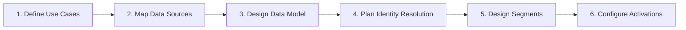
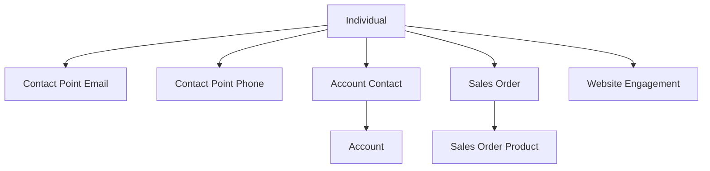

# Plan Your Data Strategy

<Note>
As of October 14, 2025, Data Cloud has been rebranded to **Data 360**. During this transition, you may see references to Data Cloud in our application and documentation.
</Note>

A successful Data 360 implementation starts with a clear data strategy. This guide helps you plan which data to ingest, how to model it, and how to phase your rollout.

## Implementation Framework

## Step 1: Define Use Cases

Start with business outcomes, not data:

| Category | Examples | Features Needed |
|----------|---------|----------------|
| **Customer 360** | Unified profile across channels | Identity resolution, Profile Explorer |
| **Segmentation** | Targeted campaigns | Segments, calculated insights, activations |
| **Predictive Analytics** | Churn prediction, LTV | Einstein Studio, calculated insights |
| **Real-Time Engagement** | Triggered notifications | DC-triggered flows, data actions |
| **Analytics & BI** | Cross-channel dashboards | Tableau, DC Reports, JDBC |
| **AI Grounding (RAG)** | Knowledge retrieval for Agentforce | Unstructured data, vector search |

Prioritize by **business impact**, **data readiness**, and **complexity**. Start simple.

## Step 2: Map Data Sources

| Source Type | Examples | Connector | Start Here? |
|------------|---------|-----------|-------------|
| **Salesforce CRM** | Accounts, Contacts, Cases | CRM Connector | Yes |
| **Marketing** | Email interactions, campaigns | MC Engagement | Yes |
| **Commerce** | Orders, products, carts | Commerce / Ingestion API | Phase 2 |
| **Website** | Page views, clicks | Web SDK | Phase 2 |
| **Mobile** | App events | Mobile SDK | Phase 2 |
| **External DBs** | Warehouses, lakes | Ingestion API / Zero-copy | Varies |

For each source, assess: **volume**, **velocity**, **quality**, **identity fields**, and **business value**.

## Step 3: Design Your Data Model

- **Start with standard DMOs** — 300+ pre-built objects. They unlock identity resolution and cross-cloud features.
- **Map to the closest fit** — Standard DMOs unlock more features than custom objects even if mapping isn't perfect.
- **Plan for identity resolution** — At least one source must map to Individual with contact point data.
- **Don't over-model** — Start with Phase 1 data. Expand later.

See [DMO Categories](/data-models/categories) and [Data Mapping](/developer-guide/data-mapping).

## Step 4: Plan Identity Resolution

| Decision | Options | Recommendation |
|----------|---------|---------------|
| **Match fields** | Email, phone, name, device ID | Start with email + phone |
| **Match type** | Exact, fuzzy, normalized | Exact for contact points, fuzzy for names |
| **Reconciliation** | Most recent, source priority | Most recent for volatile fields |

Common patterns: **B2C** = email + phone, most recent. **B2B** = email + company, CRM as primary source. See [Identity Resolution Best Practices](/developer-guide/identity-resolution-best-practices).

## Step 5: Phase Your Rollout

| Phase | Scope | Goal |
|-------|-------|------|
| **1: Foundation** | CRM + 1 external source, IR, basic segments | Unified profiles, first activation |
| **2: Expansion** | More sources, calculated insights, advanced segments | Analytics, scoring |
| **3: Optimization** | AI/ML, unstructured data, real-time flows | Personalization, RAG |

## Architecture Decisions

| Decision | Guidance |
|----------|---------|
| **Batch vs. streaming** | Streaming for real-time (web events); batch for everything else |
| **Zero-copy vs. ingestion** | Zero-copy for reference data; ingest data needing unification |
| **Data freshness** | Most streams: 1–24h; streaming ingestion: ~3 min |

## Related Resources

- [Data Mapping](/developer-guide/data-mapping) — DLO-to-DMO mapping process
- [DMO Categories](/data-models/categories) — Standard DMO reference
- [Limits & Guidelines](/reference/limits) — Storage and processing limits
- Salesforce Help: [Plan Your Data Strategy](https://help.salesforce.com/s/articleView?id=data.c360_a_plan_data_strategy.htm&type=5)
- Salesforce Help: [Architecture Strategy](https://help.salesforce.com/s/articleView?id=data.c360_a_data_cloud_architecture_strategy.htm&type=5)
- Salesforce Help: [Implementation Guides](https://help.salesforce.com/s/articleView?id=data.c360_a_imp_guides.htm&type=5)
