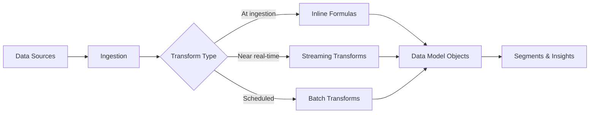

# Data Transforms

<Snippet file="/snippets/note-rebranding.mdx" />

Data 360 provides three types of data transformations to process, enrich, and reshape data as it moves through the platform. Use transforms to clean, combine, and derive new data from your ingested sources before segmentation and activation.

## Transform Types

| Type | Processing | Format | Use Case |
|------|-----------|--------|----------|
| **Batch** | Scheduled or on-demand | SQL-based | Complex joins, aggregations, historical reprocessing |
| **Streaming** | Near real-time (~3 min) | Visual builder | Lightweight enrichment as data arrives |
| **Inline Formula** | At ingestion time | Formula expressions | Simple field-level transformations (trim, concatenate, case conversion) |



## Batch Data Transforms

Batch transforms use SQL to process large volumes of data on a schedule or on-demand basis. They're ideal for complex data operations that involve joins across multiple data model objects (DMOs), aggregations, and historical data reprocessing.

### Creating a Batch Transform

<Steps>
  <Step title="Navigate to Data Transforms">
    In Data 360 Setup, go to **Data Transforms** and click **New**.
  </Step>
  <Step title="Choose Transform Type">
    Select **Batch Transform** and provide a name and description.
  </Step>
  <Step title="Define the SQL Query">
    Write a SQL query that defines how source data should be transformed. You can join multiple DMOs, apply functions, and create derived fields.
  </Step>
  <Step title="Map Output Fields">
    Map the query output to target DMO fields or create a new calculated insight object.
  </Step>
  <Step title="Schedule Execution">
    Set the execution schedule (hourly, daily, weekly) or run on-demand.
  </Step>
</Steps>

### Batch Transform SQL Example

```sql
-- Combine purchase data with customer profiles to calculate lifetime value
SELECT
    up.ssot__Id__c AS UnifiedProfileId,
    COUNT(DISTINCT so.ssot__Id__c) AS TotalOrders,
    SUM(so.ssot__GrandTotalAmount__c) AS LifetimeValue,
    AVG(so.ssot__GrandTotalAmount__c) AS AvgOrderValue,
    MAX(so.ssot__OrderDate__c) AS LastPurchaseDate,
    DATEDIFF(
        CURRENT_DATE,
        MAX(so.ssot__OrderDate__c)
    ) AS DaysSinceLastPurchase
FROM
    UnifiedIndividual__dlm up
    JOIN ssot__SalesOrder__dlm so
        ON up.ssot__Id__c = so.ssot__IndividualId__c
GROUP BY
    up.ssot__Id__c
```

### Supported Batch Transformations

| Transformation | Description | Example |
|---------------|-------------|---------|
| **Filter** | Remove rows that don't match criteria | Filter orders > $100 |
| **Formula** | Create computed columns | `UPPER(FirstName) \|\| ' ' \|\| UPPER(LastName)` |
| **Join** | Combine data from multiple DMOs | Join orders with customer profiles |
| **Aggregate** | Summarize data with GROUP BY | Sum of purchases per customer |
| **Lookup** | Enrich with reference data | Add product category from catalog |
| **Deduplicate** | Remove duplicate rows | Distinct email addresses |

### Batch Transform Formulas

Batch transforms support formula expressions for field-level computations:

| Category | Functions |
|----------|-----------|
| **String** | `UPPER`, `LOWER`, `TRIM`, `LTRIM`, `RTRIM`, `SUBSTRING`, `CONCAT`, `LENGTH`, `REPLACE`, `LPAD`, `RPAD` |
| **Numeric** | `ABS`, `CEIL`, `FLOOR`, `ROUND`, `MOD`, `POWER`, `SQRT` |
| **Date/Time** | `CURRENT_DATE`, `CURRENT_TIMESTAMP`, `DATEDIFF`, `DATEADD`, `DATE_TRUNC`, `EXTRACT` |
| **Conditional** | `CASE WHEN`, `COALESCE`, `NULLIF`, `IIF` |
| **Conversion** | `CAST`, `TO_DATE`, `TO_TIMESTAMP`, `TO_NUMBER` |

## Streaming Data Transforms

Streaming transforms process data in near real-time as it arrives through data streams, with data processed approximately every 3 minutes. They use a visual, no-code builder for defining transformation logic.

### Setting Up a Streaming Transform

<Steps>
  <Step title="Select Source">
    Choose the incoming data stream or data lake object (DLO) to transform.
  </Step>
  <Step title="Define Transformations">
    Use the visual builder to add transformation steps: filter, formula, or lookup operations.
  </Step>
  <Step title="Map to Target">
    Map the transformed output to a target DMO.
  </Step>
  <Step title="Activate">
    Enable the streaming transform. It begins processing new data automatically.
  </Step>
</Steps>

### Streaming Transform Functions

| Category | Supported Functions |
|----------|-------------------|
| **String** | `UPPER`, `LOWER`, `TRIM`, `CONCAT`, `SUBSTRING`, `LENGTH`, `REPLACE`, `PROPER` |
| **Math** | `ABS`, `CEIL`, `FLOOR`, `ROUND`, `MOD` |
| **Date** | `NOW`, `TODAY`, `DATEVALUE`, `DATETIMEVALUE`, `YEAR`, `MONTH`, `DAY` |
| **Logical** | `IF`, `CASE`, `ISBLANK`, `ISNULL`, `NOT`, `AND`, `OR` |
| **Conversion** | `TEXT`, `VALUE`, `DATEVALUE` |

### Streaming Transform Operators

| Operator | Description |
|----------|-------------|
| `=`, `!=` | Equality / inequality |
| `<`, `>`, `<=`, `>=` | Comparison |
| `+`, `-`, `*`, `/` | Arithmetic |
| `&` | String concatenation |
| `LIKE` | Pattern matching |
| `IN` | Set membership |
| `IS NULL`, `IS NOT NULL` | Null checks |

## Inline Formula Transforms

Inline formulas apply simple transformations at ingestion time, directly within the data stream mapping configuration. They're best for lightweight field-level operations that don't require joins or aggregations.

### Common Inline Formulas

```
-- Proper case a name field
PROPER(FirstName)

-- Trim whitespace
TRIM(Email)

-- Concatenate fields
CONCAT(FirstName, ' ', LastName)

-- Standardize phone format
REPLACE(REPLACE(REPLACE(Phone, '(', ''), ')', ''), '-', '')

-- Default value for nulls
COALESCE(PreferredChannel, 'Email')
```

### Inline Formula Use Cases

| Use Case | Formula | Description |
|----------|---------|-------------|
| Name standardization | `PROPER(TRIM(name))` | Clean and capitalize names |
| Email normalization | `LOWER(TRIM(email))` | Lowercase and trim emails |
| Phone cleanup | `REGEXP_REPLACE(phone, '[^0-9]', '')` | Strip non-numeric characters |
| Date parsing | `TO_DATE(date_string, 'YYYY-MM-DD')` | Parse date strings |
| Null handling | `COALESCE(field, 'Unknown')` | Replace nulls with defaults |
| Field derivation | `CONCAT(city, ', ', state)` | Combine fields |

## Choosing the Right Transform

<AccordionGroup>
  <Accordion title="Use Batch Transforms when...">
    - You need to join data across multiple DMOs
    - Complex aggregations are required (GROUP BY, window functions)
    - Historical data needs reprocessing
    - You need full SQL expressiveness
    - Processing can run on a schedule (not real-time)
  </Accordion>

  <Accordion title="Use Streaming Transforms when...">
    - Data needs to be enriched as it arrives in near real-time
    - Transformations are relatively simple (filter, formula, lookup)
    - No complex joins or aggregations are needed
    - Low-latency processing is important for downstream consumers
  </Accordion>

  <Accordion title="Use Inline Formulas when...">
    - Only field-level transformations are needed
    - No external data lookups are required
    - The transformation is simple (case conversion, trim, concatenate)
    - You want to clean data at the point of ingestion
  </Accordion>
</AccordionGroup>

## Best Practices

- **Layer your transforms** — Use inline formulas for basic cleanup, streaming for enrichment, and batch for complex derivations
- **Monitor execution** — Check transform job history for failures and processing times
- **Optimize batch SQL** — Use filters early in your query to reduce the data volume processed
- **Test with small datasets** — Validate transform logic on sample data before running against full volumes
- **Consider ordering** — Streaming transforms run on incoming data; batch transforms can reference data from streaming transforms that have already processed

## Related Resources

- [Calculated Insights API](/apis/query-api/calculated-insights-api) — Query derived metrics
- [SQL Reference](/apis/query-api/sql-reference) — Full SQL syntax reference
- [Data Streams API](/apis/connect-api/data-streams) — Manage data stream configurations
- Salesforce Help: [Batch Data Transforms](https://help.salesforce.com/s/articleView?id=sf.c360_a_batch_transform_overview.htm&type=5)
- Salesforce Help: [Streaming Data Transforms](https://help.salesforce.com/s/articleView?id=sf.c360_a_streaming_transform_setup.htm&type=5)
