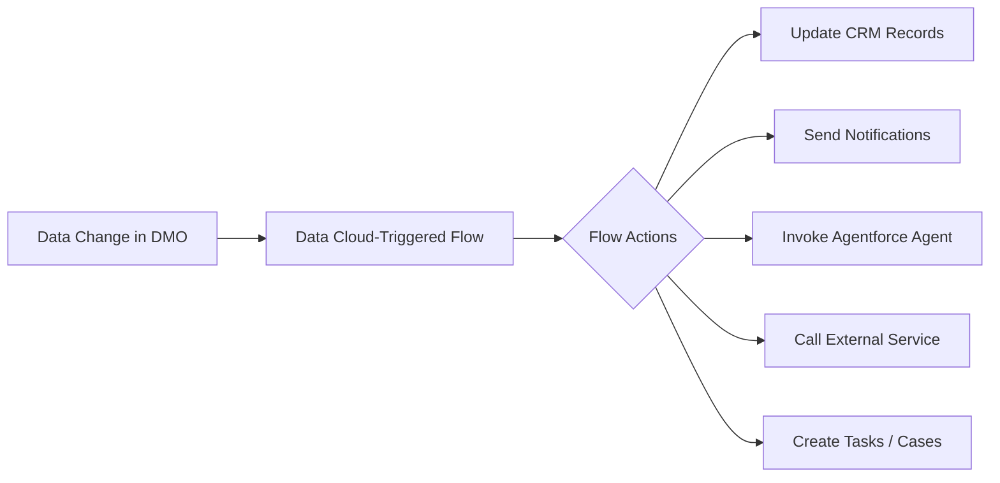

# Flows & Automation

<Note>
As of October 14, 2025, Data Cloud has been rebranded to **Data 360**. During this transition, you may see references to Data Cloud in our application and documentation.
</Note>

Data Cloud-triggered flows enable you to automate business processes in response to near real-time data changes in Data 360. Using an event-driven architecture, these flows react to data changes as they happen rather than running on a schedule.

## How Data Cloud-Triggered Flows Work



Data Cloud-triggered flows:

- **React to data changes** in data model objects (DMOs) and calculated insight objects (CIOs)
- **Process in near real-time** as data is ingested and unified
- **Support all standard flow actions** — record operations, notifications, HTTP callouts, Apex invocable actions
- **Can invoke Agentforce agents** for complex, autonomous task handling

## Creating a Data Cloud-Triggered Flow

<Steps>
  <Step title="Open Flow Builder">
    Navigate to **Setup > Flows** and click **New Flow**.
  </Step>
  <Step title="Select Flow Type">
    Choose **Data Cloud-Triggered Flow**.
  </Step>
  <Step title="Configure the Trigger">
    - **Select the DMO** to monitor for data changes
    - **Set entry conditions** to filter which records trigger the flow (e.g., `LifetimeValue__c > 5000`)
    - **Choose trigger timing** — when a record is created, updated, or both
  </Step>
  <Step title="Build Flow Logic">
    Add flow elements: decisions, assignments, record operations, invocable actions, HTTP callouts.
  </Step>
  <Step title="Activate">
    Save and activate the flow. It begins processing data changes immediately.
  </Step>
</Steps>

## Trigger Configuration

| Setting | Description |
|---------|-------------|
| **Object** | The DMO or CIO to monitor |
| **Trigger Event** | Record created, updated, or created/updated |
| **Entry Conditions** | Filter criteria that must be met for the flow to run |
| **Batch Size** | Number of records processed per flow execution (default: 200) |

### Supported Trigger Objects

- Standard and custom Data Model Objects (DMOs)
- Calculated Insight Objects (CIOs)
- Unified Individual objects

## Common Automation Patterns

### Pattern 1: High-Value Customer Alert

When a customer's lifetime value crosses a threshold, create a follow-up task for their account owner:

```
Trigger: UnifiedIndividual__dlm (Updated)
Condition: LifetimeValue__c > 10000 AND LifetimeValue__c_Prior < 10000

Actions:
  1. Get Account Owner from CRM
  2. Create Task: "High-value customer follow-up"
  3. Send Email Notification to Account Owner
```

### Pattern 2: Real-Time Lead Scoring Response

When a lead's engagement score changes, update CRM and potentially invoke an Agentforce agent:

```
Trigger: EngagementScore__dlm (Updated)
Condition: Score__c >= 80

Actions:
  1. Decision: Is this a known lead in CRM?
    - Yes: Update Lead.Rating = 'Hot'
    - No: Create new Lead record
  2. If Score >= 95: Invoke Agentforce Sales Agent
```

### Pattern 3: Churn Prevention Workflow

When a prediction model flags a customer as high churn risk:

```
Trigger: ChurnPrediction__dlm (Created/Updated)
Condition: ChurnProbability__c > 0.8

Actions:
  1. Look up customer's recent support cases
  2. Decision: Open cases exist?
    - Yes: Escalate case priority to "High"
    - No: Create proactive outreach case
  3. Send Slack notification to Customer Success team
```

## Invocable Actions

Invocable actions extend flows with custom logic. Developers can create custom invocable actions using Apex that can then be used in Data Cloud-triggered flows.

### Creating an Invocable Action

```java
public class DataCloudActions {

    @InvocableMethod(
        label='Enrich Customer Profile'
        description='Calls external API to enrich customer data'
    )
    public static List<EnrichmentResult> enrichProfile(
        List<EnrichmentRequest> requests
    ) {
        List<EnrichmentResult> results = new List<EnrichmentResult>();

        for (EnrichmentRequest req : requests) {
            // Call external enrichment API
            HttpResponse response = callEnrichmentAPI(req.customerId);
            EnrichmentResult result = new EnrichmentResult();
            result.enrichedData = response.getBody();
            results.add(result);
        }

        return results;
    }

    public class EnrichmentRequest {
        @InvocableVariable(required=true)
        public String customerId;

        @InvocableVariable
        public String enrichmentType;
    }

    public class EnrichmentResult {
        @InvocableVariable
        public String enrichedData;
    }
}
```

## Agentforce Integration

Data Cloud-triggered flows can invoke Agentforce agents to handle complex, multi-step tasks autonomously.

### Invoking an Agent from a Flow

1. Add an **Invocable Action** element to your flow
2. Select the Agentforce agent invocable action
3. Pass context data from the DMO trigger to the agent
4. The agent executes its topics and actions autonomously

### Agent-to-Agent Communication

Flows enable limited agent-to-agent communication by chaining invocable agent actions:

```
Flow Trigger → Agent A (Research) → Flow Decision → Agent B (Action)
```

## Debugging Data Cloud-Triggered Flows

### Debug Logs

Enable debug logging for Data Cloud-triggered flows in Setup:

1. Navigate to **Setup > Debug Logs**
2. Add a trace flag for the Data Cloud-triggered flow
3. Review execution details including trigger events, variable values, and action results

### Testing

Run tests for Data Cloud-triggered flows using the Flow test framework:

1. In Flow Builder, click **Debug** or **Run Test**
2. Provide sample DMO record data
3. Review the execution path and action results
4. Verify conditions, decisions, and action outcomes

## Flow vs. Data Action: Which to Use?

| Criteria | Data Cloud-Triggered Flow | Data Action |
|----------|--------------------------|-------------|
| **Logic complexity** | Multi-step, conditional branching | Simple event routing |
| **Targets** | Any flow action (CRM, HTTP, Apex, agents) | Platform Event, Webhook, Marketing Cloud only |
| **Decision logic** | Full flow builder (decisions, loops, assignments) | Filter criteria only |
| **External calls** | HTTP callout action in flow | Native webhook delivery |
| **Agent invocation** | Supported via invocable action | Not supported |
| **Best for** | Complex orchestration | Event distribution |

## Activation-Triggered Flows

Activation-triggered flows are a distinct flow type that automates data delivery **after** a segment is activated. Unlike Data Cloud-triggered flows (which fire on DMO data changes), activation-triggered flows fire when segment data is sent to an activation target.

### Use Cases

- **Post-activation data enrichment** — Enrich activated records before delivery to the target
- **Notification workflows** — Notify teams when a segment activation completes
- **Conditional delivery** — Apply additional filtering or routing logic after activation
- **Audit logging** — Log activation events for compliance tracking

### Creating an Activation-Triggered Flow

<Steps>
  <Step title="Open Flow Builder">
    Navigate to **Setup > Flows** and click **New Flow**.
  </Step>
  <Step title="Select Flow Type">
    Choose **Activation-Triggered Flow**.
  </Step>
  <Step title="Configure Trigger">
    Select the activation target and segment that should trigger the flow.
  </Step>
  <Step title="Build Logic">
    Add flow elements to process the activated data — transform, enrich, route, or log.
  </Step>
  <Step title="Activate">
    Save and activate. The flow runs each time the specified activation fires.
  </Step>
</Steps>

See Salesforce Help: [Automate Data Delivery with Activation-Triggered Flows](https://help.salesforce.com/s/articleView?id=platform.automate_flow_build_create_activation_triggered_flow.htm&type=5).

## Best Practices

<AccordionGroup>
  <Accordion title="Flow Design">
    - Keep flows focused — one flow per business process, not one flow for everything
    - Use entry conditions to filter irrelevant triggers early
    - Add fault paths to handle errors gracefully
    - Document flow logic with description fields on each element
  </Accordion>

  <Accordion title="Performance">
    - Minimize the number of record lookups and DML operations per flow execution
    - Use batch processing where possible for high-volume triggers
    - Avoid recursive flows — ensure flow actions don't trigger the same flow
    - Test with realistic data volumes before activating in production
  </Accordion>

  <Accordion title="Testing">
    - Test flows in a sandbox environment before promoting to production
    - Use the Flow test framework to validate all decision branches
    - Create test cases for edge conditions (null values, boundary conditions)
    - Monitor flow execution metrics after activation
  </Accordion>
</AccordionGroup>

## Related Resources

- [Data Actions](/developer-guide/data-actions) — Simple event routing for data changes
- [Apex Integration](/developer-guide/apex-integration) — Custom invocable actions and Apex triggers
- [Platform Events](/developer-guide/platform-events) — Event-driven architecture patterns
- Salesforce Help: [Trigger Flows with Data 360 Data](https://help.salesforce.com/s/articleView?id=platform.flow_concepts_trigger_data_cloud.htm&type=5)
- Salesforce Help: [Automate Flows in Data Cloud](https://help.salesforce.com/s/articleView?id=sf.c360_a_orchestrate_a_workflow_in_customer_data_platform.htm&type=5)
- Salesforce Blog: [Data Cloud-Triggered Flows and Invocable Actions](https://developer.salesforce.com/blogs/2024/08/automate-your-workflow-with-data-cloud-triggered-flows-and-invocable-actions)
