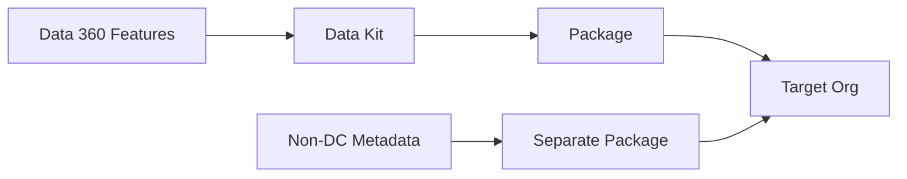

# Packages & Data Kits

<Note>
As of October 14, 2025, Data Cloud has been rebranded to **Data 360**. During this transition, you may see references to Data Cloud in our application and documentation.
</Note>

Data kits are the mechanism for packaging, deploying, and distributing Data 360 metadata across environments. Every Data 360 feature you want to move between orgs — data streams, calculated insights, identity resolution rulesets, data transforms — must first be added to a data kit before it can be packaged or deployed.

## Core Concepts

**Packages** are containers for metadata components that make up an app or configuration set. **Data kits** are intermediaries — you add Data 360 metadata to a data kit, then add the data kit to a package.



<Warning>
Starting Winter '25, you **must** create separate packages for Data 360 metadata and non-Data 360 metadata. Mixing both in a single package is no longer allowed. Data 360 metadata cannot be added to unlocked packages.
</Warning>

## Data Kit Types

| Type | Created From | Deploys To | Use Case |
|------|-------------|------------|----------|
| **Standard** | Default data space | Any data space in target org | ISV partners distributing apps via AppExchange |
| **DevOps** | Any data space | Same data space in target org | Customer developers migrating from sandbox to production |

### Standard Data Kits

Standard data kits are for **ISV partners** building Data 360 apps for distribution. After installation, components are locked — subscribers can add entities but can't modify or delete deployed mappings or entities.

### DevOps Data Kits

DevOps data kits are for **customer developers** migrating their own Data 360 configurations from sandbox to production. The data kit must deploy to the same data space (with matching prefix name) in the target org.

## Packageable Components

### Extensibility Readiness Matrix

Not all Data 360 components can be packaged. Use this matrix to determine what's supported:

#### Connectors & Data Streams

| Component | Standard Kit | DevOps Kit |
|-----------|:-----------:|:----------:|
| Amazon S3 | Yes | Yes |
| Amazon Kinesis | Yes | Yes |
| Azure Blob / Event Hubs | Yes | Yes |
| CRM Connector | Yes | Yes |
| Google Cloud Platform / Storage | Yes | Yes |
| Ingestion API | Yes | Yes |
| Mobile SDK | Yes | Yes |
| Snowflake | Yes | Yes |
| Web SDK | Yes | Yes |
| Marketing Cloud Account Engagement | No | No |
| Marketing Cloud Personalization | No | No |

#### Activation Targets

| Component | Standard Kit | DevOps Kit |
|-----------|:-----------:|:----------:|
| Amazon S3 | Yes | Yes |
| SFTP / Azure / GCS | Yes | Yes |
| Marketing Cloud Engagement | Yes | Yes |
| Native Data 360 | Yes | Yes |
| Google Ads / Meta / LinkedIn / Amazon Ads | No | No |
| Commerce Cloud / Loyalty | No | No |
| AppExchange Partners (LiveRamp, Criteo, etc.) | No | No |

#### Data Processing

| Component | Standard Kit | DevOps Kit |
|-----------|:-----------:|:----------:|
| Calculated Insights (SQL) | Yes | Yes |
| Calculated Insights (Builder) | Yes | Yes |
| Calculated Insights (Streaming) | Yes | Yes |
| Data Graphs | Yes | Yes |
| Identity Resolution | Yes | Yes |
| Segments | Yes | Yes |
| Batch Data Transforms | Yes | Yes |
| Streaming Data Transforms | Yes | Yes |

#### Governance & AI

| Component | Standard Kit | DevOps Kit |
|-----------|:-----------:|:----------:|
| Data Governance Tags | No | Yes |
| Related List Enrichments | No | Yes |
| Retrievers (No-code RAG) | No | Yes |
| Predictive AI Models (No-code) | No | Yes |
| BYOM Models | No | No |
| Code Extensions | No | No |

### Metadata Component Types

| Feature | Metadata API Name | Supported Packaging |
|---------|------------------|-------------------|
| Data Kit Definition | `DataPackageKitDefinition` | Unlocked, 2GP, 1GP |
| Data Kit Object | `DataPackageKitObject` | Unlocked, 2GP |
| Data Source | `DataSource` | Unlocked, 2GP |
| Data Source Bundle | `DataSourceBundleDefinition` | Unlocked, 2GP |
| Data Source Object | `DataSourceObject` | Unlocked, 2GP |
| Data Stream Definition | `DataStreamDefinition` | Unlocked, 2GP, 1GP |
| Data Stream Template | `DataStreamTemplate` | Unlocked, 2GP |
| External Data Connector | `ExternalDataConnector` | Unlocked, 2GP |
| Field Source Target Relationship | `FieldSrcTrgtRelationship` | Unlocked, 2GP, 1GP |
| Ingestion API Connector | `DataConnectorIngestApi` | Unlocked, 2GP |
| Calculated Insights | `MktCalculatedInsightsObjectDef` | Unlocked, 1GP |
| Segment Definition | `MarketSegmentDefinition` | Unlocked, 1GP |
| Object Source Target Map | `ObjectSourceTargetMap` | Unlocked, 2GP |
| S3 Connector | `DataConnectorS3` | Unlocked, 2GP |
| Streaming App Connector | `StreamingAppDataConnector` | Unlocked, 2GP |
| Activation Platform | `ActivationPlatform` | Unlocked, 1GP |

For the most current list, check the [Metadata Coverage Report](https://developer.salesforce.com/docs/metadata-coverage) and [Data 360 Metadata Types](https://developer.salesforce.com/docs/atlas.en-us.api_meta.meta/api_meta/meta_data_cloud_types.htm).

## DevOps Data Kit: CLI Deployment Walkthrough

This is the step-by-step workflow for migrating Data 360 metadata from a sandbox org to production using the Salesforce CLI.

### Prerequisites

- Deployment connection created between production and sandbox orgs
- VS Code with Salesforce Extension Pack (Expanded) installed
- Salesforce CLI installed
- Matching data spaces (same prefix name) in both sandbox and production orgs

### Step-by-Step

<Steps>
  <Step title="Create a Salesforce DX Project">
    From the VS Code Command Palette, run **SFDX: Create Project with Manifest**. Configure `sfdx-project.json` with the appropriate login URLs (`https://test.salesforce.com` for sandbox, `https://login.salesforce.com` for production).
  </Step>
  <Step title="Authorize Both Orgs">
    Authorize the sandbox org and production org to work with your project using Salesforce authentication.
  </Step>
  <Step title="Create the DevOps Data Kit">
    In the sandbox Data Cloud Setup, click **Create Data Kit** and select **DevOps** as the data kit type. Add components: data streams, data lake objects, calculated insights, data graphs, segments, identity resolution rulesets, and data transforms.
  </Step>
  <Step title="Review the Publishing Sequence">
    The data kit automatically sequences components based on dependencies. Review and confirm the order.
  </Step>
  <Step title="Download the Manifest">
    Select your data kit and click **Download Manifest**. This generates a `package.xml` file containing all related metadata entities.
  </Step>
  <Step title="Retrieve Metadata">
    Pull the data kit metadata into your project:
    ```bash
    sf project retrieve start --manifest manifest/package.xml
    ```
    New folders appear in your project containing all data kit metadata.
  </Step>
  <Step title="Clean Up Key Qualifier Files">
    **Critical step**: Delete any key qualifier files generated during retrieval. These files can cause deployment failures.
    ```bash
    # Find and remove key qualifier files (Unix/macOS)
    find . -name "*KeyQualifier*" -type f -delete
    ```
  </Step>
  <Step title="Deploy to Production">
    Run the deployment command:
    ```bash
    sf project deploy start --manifest package.xml
    ```
  </Step>
  <Step title="Monitor Deployment">
    Check **Deployment History** in the production org's Data Cloud Setup to track progress.
  </Step>
  <Step title="Reauthorize Connectors">
    After deployment, some connectors will be in an inactive state because sensitive credentials aren't transferred. Navigate to **Data Cloud > Connectors** in the production org and reauthorize each inactive connector.
  </Step>
</Steps>

### Version Control

After retrieving metadata, upload your project to GitHub or another source control system:

```bash
git add .
git commit -m "Add Data 360 data kit metadata for deployment"
git push origin main
```

This enables team collaboration and maintains a deployment history.

## Standard Data Kit: API Deployment

For standard data kits (ISV distribution), use the **Deploy Data Kit Components Flow** via REST API to deploy components sequentially after package installation.

### Triggering the Flow

```bash
curl -X POST "https://{instance}.salesforce.com/services/data/v64.0/actions/custom/flow/Deploy_Data_Kit_Components" \
  -H "Authorization: Bearer {access_token}" \
  -H "Content-Type: application/json" \
  -d '{
    "inputs": [
      {
        "dataKitNameInput": "MyDataKit",
        "dataKitDataSpaceInput": "default",
        "dataKitComponentsInput": [
          {
            "componentType": "DataStreamBundle",
            "componentName": "CRM_Sales_Data"
          },
          {
            "componentType": "CalculatedInsights",
            "componentName": "CustomerLTV"
          }
        ]
      }
    ]
  }'
```

### Supported Component Types for Flow Deployment

| Component Type | Description |
|---------------|-------------|
| `DataStreamBundle` | Data stream configurations |
| `ConnectorFramework` | Connector definitions |
| `IngestAPI` | Ingestion API connectors |
| `StreamingApp` | Streaming app connectors |
| `CalculatedInsights` | Calculated insight definitions |
| `DataLakeObject` | Data lake object configurations |
| `DataGraph` | Data graph definitions |
| `DataTransform` | Data transform configurations |
| `DataStreamB2CCommerce` | B2C Commerce data streams |
| `IdentityResolution` | Identity resolution rulesets |
| `Segment` | Segment definitions |

The flow processes components **sequentially**, waiting for each component to complete before starting the next, ensuring proper dependency ordering.

## Troubleshooting

<AccordionGroup>
  <Accordion title="Missing FieldSrcTrgtRelationship Reference">
    **Symptom**: Deployment fails with a missing `FieldSrcTrgtRelationship` error.

    **Solution**: Locate the XML files mentioned in the error and either:
    - **Option 1**: Use the Org Browser in VS Code to retrieve only the specific missing relationship files
    - **Option 2**: Add the missing `FieldSrcTrgtRelationship` names to your `package.xml`, retrieve them, delete key qualifier files, and reattempt deployment
  </Accordion>

  <Accordion title="Inactive Connectors After Deployment">
    **Symptom**: Deployed connectors show "Inactive" status in the target org.

    **Cause**: Sensitive authorization data (OAuth tokens, API keys) is not transferred during deployment.

    **Solution**: Navigate to **Data Cloud > Connectors** in the target org, identify inactive connectors, and reauthorize each one. Then redeploy the data kit to restore full functionality.
  </Accordion>

  <Accordion title="Key Qualifier File Errors">
    **Symptom**: Deployment fails with unexpected metadata errors related to key qualifiers.

    **Solution**: Before deployment, search for and delete all key qualifier files in your project directory. These files are generated during retrieval but should not be included in the deployment.
  </Accordion>

  <Accordion title="Data Space Mismatch">
    **Symptom**: DevOps data kit deployment fails with a data space error.

    **Cause**: DevOps kits require the target org to have a data space with the same prefix name as the source.

    **Solution**: In the target org's Data Cloud Setup, create a data space with a matching prefix name before deploying.
  </Accordion>
</AccordionGroup>

## Packaging Rules Summary

| Rule | Details |
|------|---------|
| **Separate packages** | Data 360 metadata and non-Data 360 metadata must be in separate packages (Winter '25+) |
| **No unlocked packages** | Data 360 metadata cannot be added to unlocked packages |
| **Data kit required** | All Data 360 metadata must go through a data kit before packaging |
| **Managed packages lock** | Components in managed packages are locked — subscribers cannot modify deployed mappings |
| **Redeployment overwrites** | Redeploying a managed package overwrites any subscriber modifications |
| **SSOT dependency** | If your package includes CRM data streams mapped to standard DMOs, declare the SSOT package as a dependency |

## Related Resources

- [2GP Workflow](/developer-guide/2gp-workflow) — ISV second-generation managed package workflow
- [Sandbox & DevOps](/developer-guide/sandbox-devops) — Sandbox environment setup and CI/CD patterns
- [Development Environments](/developer-guide/environments) — Dev org types and setup
- Salesforce Docs: [Packages and Data Kits](https://developer.salesforce.com/docs/data/data-cloud-dev/guide/packages-data-kits.html)
- Salesforce Docs: [CLI Deployment Walkthrough](https://developer.salesforce.com/docs/data/data-cloud-dev/guide/dc-deploy_data_kit_using_cli.html)
- Salesforce Docs: [Deploy Data Kit Components Flow](https://developer.salesforce.com/docs/data/data-cloud-dev/guide/dc-deploy_data_kit_components.html)
- Salesforce Docs: [Extensibility Readiness Matrix](https://developer.salesforce.com/docs/data/data-cloud-dmo-mapping/guide/c360a-api-isv-readiness-data.html)
- Salesforce Docs: [Metadata Components Cheat Sheet](https://developer.salesforce.com/docs/data/data-cloud-dev/guide/component-cheatsheet.html)
- Salesforce Docs: [Package Data Cloud Metadata](https://developer.salesforce.com/docs/atlas.en-us.pkg2_dev.meta/pkg2_dev/dev2gp_package_data_cloud.htm)
