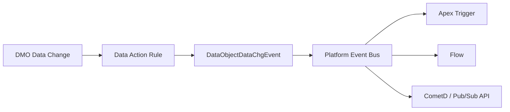

# Platform Events Integration

<Note>
As of October 14, 2025, Data Cloud has been rebranded to **Data 360**. During this transition, you may see references to Data Cloud in our application and documentation.
</Note>

Platform Events enable bidirectional, event-driven communication between Data 360 and the Salesforce Platform. You can ingest Salesforce Platform Events into Data 360 as data streams, and publish data change events from Data 360 back to the event bus.

## Integration Patterns

| Pattern | Direction | Mechanism | Use Case |
|---------|-----------|-----------|----------|
| **Event Ingestion** | Salesforce → Data 360 | EventBus Connector data stream | Bring CRM events into Data 360 for analytics |
| **Data Action → Platform Event** | Data 360 → Salesforce | DataObjectDataChgEvent | Trigger Apex, flows, or external subscribers on data changes |
| **Flow → Platform Event** | Data 360 → Salesforce | DC-triggered flow publishes event | Orchestrate complex event-driven workflows |

## Ingesting Platform Events into Data 360

Create a data stream that ingests Salesforce Platform Events into Data 360 as Data Lake Objects (DLOs).

### Prerequisites

- Platform Events Connector connection set up in Data 360
- Data Cloud Architect role permission
- Platform Events defined in your Salesforce org

### Setup

<Steps>
  <Step title="Navigate to Data Streams">
    In Data 360, go to **Data Streams** and click **New**.
  </Step>
  <Step title="Select the Connector">
    Under **Other Sources**, select the **Salesforce Platform Events** connection source.
  </Step>
  <Step title="Choose Events">
    Select the platform events to monitor. You can add multiple events to the same data stream.
  </Step>
  <Step title="Configure Properties">
    Set the category to **Engagement** and configure:
    - **Event Time Field** — The field that represents when the event occurred (e.g., `EventDate`)
    - **Primary Key** — The `Event Identifier` field for unique record identification
  </Step>
  <Step title="Select Fields">
    Choose specific fields to stream or select all fields.
  </Step>
  <Step title="Configure Refresh">
    - Set **Refresh Mode** to **Incremental** (inserts new records only)
    - Configure the schedule frequency
    - Optionally enable **Refresh Data Stream Immediately**
  </Step>
  <Step title="Deploy">
    Click **Deploy** to activate the data stream.
  </Step>
</Steps>

<Warning>
Only new events generated **after** stream creation are ingested. Pre-existing events are not backfilled.
</Warning>

### Post-Deployment

Once deployed:

1. Access the new DLO via the **Data Explorer** tab
2. Create a **custom DMO** that maps to the event DLO for downstream use
3. Use the DMO in calculated insights, segments, and Data Cloud-triggered flows

## Publishing Events from Data 360

### Via Data Actions

Configure a Data Action with a **Salesforce Platform Event** target to publish `DataObjectDataChgEvent` events when DMO or CIO data changes:



The `DataObjectDataChgEvent` (available in API v53.0+) includes:

| Field | Description |
|-------|-------------|
| `ActionName` | Name of the data action |
| `ActionAPIName` | API name of the data action |
| `ActionId` | Unique identifier |
| `Objects` | Array of changed records with field values |
| `ReplayId` | Event replay identifier |
| `CreatedDate` | Event timestamp |

### Subscribing in Apex

```java
trigger DataCloudChangeHandler on DataObjectDataChgEvent (after insert) {
    List<Task> followUps = new List<Task>();

    for (DataObjectDataChgEvent event : Trigger.New) {
        // Parse the changed objects
        String actionName = event.ActionName;

        if (actionName == 'HighValueCustomerAlert') {
            followUps.add(new Task(
                Subject = 'High-value customer identified in Data 360',
                Description = 'Action: ' + actionName +
                              ' triggered at ' + event.CreatedDate,
                Priority = 'High',
                ActivityDate = Date.today().addDays(1)
            ));
        }
    }

    if (!followUps.isEmpty()) {
        insert followUps;
    }
}
```

### Subscribing in Flows

1. Create a **Platform Event-Triggered Flow**
2. Select `DataObjectDataChgEvent` as the trigger
3. Add conditions to filter by `ActionName` or `ActionAPIName`
4. Build flow logic to process the event (create records, send notifications, invoke actions)

### External Subscribers

External systems can subscribe to Data 360 change events using:

| Method | Protocol | Use Case |
|--------|----------|----------|
| **Pub/Sub API** | gRPC | High-throughput, bidirectional streaming |
| **CometD** | HTTP long-polling | Browser-based or lightweight clients |
| **Event Relay** | AWS EventBridge | Route events to AWS services |

## Change Data Capture (CDC) for DMOs

Data 360 also supports subscribing to metadata changes on data objects through the `DataObjectMetadataChgEvent` platform event:

| Event | Fires When |
|-------|------------|
| `DataObjectDataChgEvent` | Record data changes in monitored DMOs/CIOs |
| `DataObjectMetadataChgEvent` | Schema changes to data objects (field additions, type changes) |

## Event-Driven Architecture Patterns

### Pattern 1: Real-Time CRM Enrichment

```
Platform Event (CRM) → Data 360 DLO → DMO → Identity Resolution →
  Unified Profile → Data Action → Platform Event → CRM Record Update
```

### Pattern 2: Cross-Cloud Event Processing

```
Commerce Cloud Event → Platform Event → Data 360 →
  Calculated Insight → Data Action → Marketing Cloud Journey
```

### Pattern 3: External System Sync

```
Data 360 DMO Change → Data Action → Platform Event →
  Pub/Sub API → External System (ERP, Data Warehouse)
```

## Event Retention

| Feature | Retention |
|---------|-----------|
| Platform Events (standard) | 72 hours |
| Data Action events | 4 days |
| High-Volume Platform Events | 72 hours |

## Best Practices

<AccordionGroup>
  <Accordion title="Ingestion">
    - Use incremental refresh mode for platform event data streams
    - Set appropriate event time fields for accurate temporal ordering
    - Monitor event ingestion latency and throughput
    - Create dedicated DMOs for event data to keep them separate from profile data
  </Accordion>

  <Accordion title="Publishing">
    - Use Data Actions for simple event routing to the platform event bus
    - Use DC-triggered flows when you need decision logic before publishing
    - Include meaningful data in the event payload to reduce subscriber callouts
    - Implement replay logic using `ReplayId` for reliable processing
  </Accordion>

  <Accordion title="Architecture">
    - Avoid circular event patterns (event → ingestion → change → event)
    - Use Pub/Sub API for high-throughput external subscribers
    - Consider event volume and retention limits when designing event-driven workflows
    - Test event-driven flows in sandbox before production deployment
  </Accordion>
</AccordionGroup>

## Related Resources

- [Data Actions](/developer-guide/data-actions) — Configure data action targets
- [Flows & Automation](/developer-guide/flows-automation) — Data Cloud-triggered flows
- [Webhook Data Actions](/integrations/webhook-data-actions) — External webhook integration
- Salesforce Help: [Trigger Flows with Data 360 Data](https://help.salesforce.com/s/articleView?id=platform.flow_concepts_trigger_data_cloud.htm&type=5)
- Salesforce Docs: [Platform Events Developer Guide](https://developer.salesforce.com/docs/atlas.en-us.platform_events.meta/platform_events)
- Salesforce Docs: [Create a Platform Events Data Stream](https://developer.salesforce.com/docs/data/data-cloud-int/guide/c360-a-create-eventbusconnector-data-stream.html)
