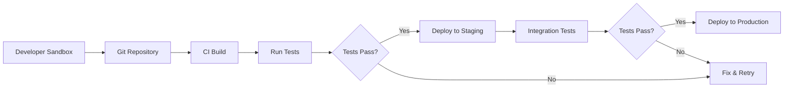

# Sandbox & DevOps

<Snippet file="/snippets/note-rebranding.mdx" />

Data 360 supports sandbox environments for development and testing, along with deployment tools for promoting configurations across orgs. This guide covers sandbox setup, the DevOps Data Kit, and CI/CD patterns.

## Sandbox Environments

Data 360 sandbox support is now **generally available** in Partial Copy and Full sandbox types.

### Supported Sandbox Types

| Sandbox Type | CRM Data | Data 360 Support | Use Case |
|-------------|----------|-----------------|----------|
| **Full** | Complete copy | Yes | Full integration testing, UAT |
| **Partial Copy** | Subset via template | Yes | Development, feature testing |
| **Developer** | No data | Limited | Code development only |
| **Developer Pro** | No data | Limited | Larger code development |

### What's Included

In Partial Copy and Full sandboxes:

- **CRM data** is automatically replicated and immediately available for Data 360
- **Data streams** and connector configurations
- **Identity resolution** rulesets
- **Calculated insights** definitions
- **Segments** and activation targets
- **Data transforms** (batch and streaming)

### Creating a Data 360 Sandbox

<Steps>
  <Step title="Navigate to Sandboxes">
    Go to **Setup > Sandboxes** in your production org.
  </Step>
  <Step title="Create New Sandbox">
    Click **New Sandbox** and select Full or Partial Copy type.
  </Step>
  <Step title="Enable Data 360">
    Data 360 features are automatically included when the sandbox is created from a production org with Data 360 enabled.
  </Step>
  <Step title="Configure Data Streams">
    After sandbox creation, review and reconfigure data stream connections. Some external connectors may need reauthentication.
  </Step>
  <Step title="Validate">
    Verify data ingestion, identity resolution, and segments are working correctly in the sandbox.
  </Step>
</Steps>

### Sandbox Credit Usage

Sandbox environments consume Data 360 credits at **80% of the production rate** (20% discount). Monitor usage in Setup > Data 360 > Usage.

## Data Kits for Deployment

All Data 360 metadata must be packaged through a **data kit** before it can be deployed between environments. Data kits handle dependency ordering automatically — critical because Data 360 components have complex interdependencies (e.g., segments depend on DMOs, which depend on data streams).

For sandbox-to-production deployments, use a **DevOps Data Kit**. For ISV app distribution, use a **Standard Data Kit**.

<Card title="Packages & Data Kits" icon="box" href="/developer-guide/packages-data-kits">
  Complete guide to data kit types, packageable components, extensibility readiness matrix, CLI deployment walkthrough, and troubleshooting.
</Card>

## Deployment Methods

### Change Sets

Traditional Salesforce deployment for point-and-click configuration changes:

```
Sandbox → Outbound Change Set → Upload → Production → Inbound Change Set → Deploy
```

### Salesforce CLI

Command-line deployment for CI/CD pipelines:

```bash icon=terminal
# Retrieve Data 360 metadata from sandbox
sf project retrieve start \
  --metadata DataStream \
  --metadata IdentityResolutionRuleset \
  --metadata CalculatedInsight \
  --metadata Segment \
  --target-org sandbox-org

# Deploy to production
sf project deploy start \
  --source-dir force-app \
  --target-org production-org \
  --test-level RunLocalTests
```

### Metadata API

Programmatic deployment for automated pipelines:

```xml
<!-- package.xml example for Data 360 metadata -->
<?xml version="1.0" encoding="UTF-8"?>
<Package xmlns="http://soap.sforce.com/2006/04/metadata">
    <types>
        <members>*</members>
        <name>DataStream</name>
    </types>
    <types>
        <members>*</members>
        <name>IdentityResolutionRuleset</name>
    </types>
    <types>
        <members>*</members>
        <name>CalculatedInsight</name>
    </types>
    <types>
        <members>*</members>
        <name>Segment</name>
    </types>
    <version>64.0</version>
</Package>
```

## CI/CD Patterns

### Recommended Pipeline



### Pipeline Structure

Split your CI workflow into two main jobs:

1. **Lint & Unit Test** — Format, lint, and test LWC/Apex code using Node.js
2. **Deploy & Integration Test** — Use Salesforce CLI to deploy metadata and run Apex tests in a scratch org or sandbox

### Example GitHub Actions Workflow

```yaml
name: Data 360 CI/CD
on:
  push:
    branches: [main]
  pull_request:
    branches: [main]

jobs:
  lint-and-test:
    runs-on: ubuntu-latest
    steps:
      - uses: actions/checkout@v4
      - uses: actions/setup-node@v4
        with:
          node-version: '20'
      - run: npm ci
      - run: npm run lint
      - run: npm test

  deploy-and-validate:
    needs: lint-and-test
    runs-on: ubuntu-latest
    steps:
      - uses: actions/checkout@v4
      - name: Install Salesforce CLI
        run: npm install -g @salesforce/cli
      - name: Authenticate
        run: sf org login jwt --client-id ${{ secrets.SF_CLIENT_ID }}
              --jwt-key-file server.key
              --username ${{ secrets.SF_USERNAME }}
              --instance-url https://test.salesforce.com
      - name: Deploy
        run: sf project deploy start --source-dir force-app --test-level RunLocalTests
      - name: Validate Data 360 Config
        run: sf project deploy start --source-dir data-cloud-config --check-only
```

## Testing Strategy

| Test Type | Scope | Tools |
|-----------|-------|-------|
| **Unit Tests** | Apex code, LWC components | Apex Test Framework, Jest |
| **Integration Tests** | API connectivity, data flow | Postman, Apex HTTP tests |
| **Data Validation** | Ingestion, transforms, identity resolution | Data Explorer, Query Editor |
| **End-to-End** | Full pipeline from ingestion to activation | Manual + automated segment verification |

### Testing Data 360-Specific Code

```java icon=java
@isTest
private class DataCloudIntegrationTest {

    @isTest
    static void testQueryExecution() {
        // Use SoqlStubProvider for mocking DMO queries (Summer '24+)
        Test.startTest();

        // Test your Data 360 query logic
        // Mock ConnectApi responses for integration tests

        Test.stopTest();
    }
}
```

## Best Practices

<AccordionGroup>
  <Accordion title="Sandbox Management">
    - Refresh sandboxes regularly to keep data and configurations current
    - Reconfigure external connector credentials after each sandbox refresh
    - Use Partial Copy sandboxes for most development work (faster creation, lower cost)
    - Reserve Full sandboxes for pre-production UAT
  </Accordion>

  <Accordion title="Deployment">
    - Always use the DevOps Data Kit for Data 360-specific metadata — it handles dependency ordering
    - Deploy to a staging sandbox before production for final validation
    - Reconfigure credentials and external connections after every deployment
    - Document which components are included in each deployment package
  </Accordion>

  <Accordion title="CI/CD">
    - Store Data 360 metadata in version control alongside Apex and LWC code
    - Use check-only deployments for pull request validation
    - Run Apex tests that exercise CdpQuery and ConnectApi code
    - Monitor deployment logs for Data 360-specific errors
  </Accordion>
</AccordionGroup>

## Related Resources

- [Packages & Data Kits](/developer-guide/packages-data-kits) — Data kit types, packageable components, CLI deployment walkthrough
- [Development Environments](/developer-guide/environments) — Dev environment types and setup
- [2GP Workflow](/developer-guide/2gp-workflow) — ISV packaging for Data 360 apps
- [Apex Integration](/developer-guide/apex-integration) — Testing Data 360 Apex code
- Salesforce Help: [Data 360 in a Sandbox](https://help.salesforce.com/s/articleView?id=data.c360_a_data_cloud_sandbox.htm&type=5)
- Salesforce Help: [Deploy Data 360 Changes](https://help.salesforce.com/s/articleView?id=data.c360_a_data_cloud_sandbox_deploy.htm&type=5)
- Salesforce Blog: [Data Cloud in Sandbox Environments](https://developer.salesforce.com/blogs/2024/07/data-cloud-in-sandbox-environments)
