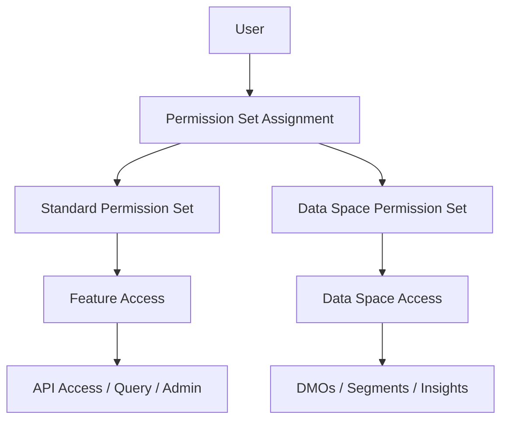

# Security & Permissions

<Snippet file="/snippets/note-rebranding.mdx" />

Data 360 uses a layered security model combining permission sets, data spaces, and feature permissions to control who can access what data and capabilities. This guide covers how to set up and manage access controls for developers and administrators.

## Security Model Overview



## Standard Permission Sets

Data 360 provides standard permission sets that grant access to different capabilities:

| Permission Set | Description | Typical User |
|---------------|-------------|--------------|
| **Data Cloud Admin** | Full administrative access — configure connectors, identity resolution, data transforms, segments, activations | Platform administrators |
| **Data Cloud Data Aware Specialist** | View and query data, create segments and calculated insights | Data analysts, marketers |
| **Data Cloud Marketing Admin** | Manage marketing-specific features — segments, activations, journey integration | Marketing operations |
| **Data Cloud Marketing Manager** | Create and manage segments, view activation results | Marketing managers |
| **Data Cloud Marketing Specialist** | View segments and activation data | Marketing team members |
| **Data Cloud User** | Basic read access to Data 360 data and profiles | General users |

### Assigning Permission Sets

<Steps>
  <Step title="Navigate to Permission Sets">
    Go to **Setup > Permission Sets**.
  </Step>
  <Step title="Select the Permission Set">
    Find the appropriate Data Cloud permission set from the list.
  </Step>
  <Step title="Manage Assignments">
    Click **Manage Assignments** > **Add Assignment** and select the users.
  </Step>
  <Step title="Verify Access">
    Have the user log in and verify they can access the expected Data 360 features.
  </Step>
</Steps>

## Data Spaces

Data spaces partition Data 360 data into logical segments, enabling multi-tenant data access control within a single org. Each data space can have its own DMOs, segments, calculated insights, and activations.

### Data Space Use Cases

| Use Case | Configuration |
|----------|--------------|
| **Regional data isolation** | Separate data spaces for EMEA, APAC, Americas |
| **Business unit separation** | Distinct spaces for Sales, Service, Marketing |
| **Brand isolation** | Separate data spaces for each brand in a portfolio |
| **Partner access** | Dedicated data space for external partner data |

### Configuring Data Spaces

<Steps>
  <Step title="Create a Data Space">
    Navigate to **Data 360 Setup > Data Spaces** and click **New Data Space**.
  </Step>
  <Step title="Assign Data Sources">
    Select which data streams and DMOs belong to this data space.
  </Step>
  <Step title="Create Data Space Permission Set">
    Create a permission set specific to this data space that controls user access.
  </Step>
  <Step title="Assign Users">
    Assign the data space permission set to users who need access.
  </Step>
</Steps>

### Enhanced Security Data Spaces

Enhanced security data spaces provide additional controls:

| Feature | Standard Data Space | Enhanced Security |
|---------|-------------------|-------------------|
| DMO access | Shared across spaces | Isolated per space |
| Segment visibility | Visible to all DC users | Restricted by permission |
| Calculated Insights | Shared | Isolated per space |
| Activation targets | Shared | Restricted by permission |
| API access | Org-wide | Scoped to data space |

## Feature Permissions

Data space permission sets include granular feature permissions:

| Permission | Description |
|-----------|-------------|
| **View Data** | View DMO records and data explorer |
| **Query Data** | Execute SQL queries and API queries |
| **Manage Segments** | Create, edit, and delete segments |
| **Manage Calculated Insights** | Create and modify calculated insights |
| **Manage Identity Resolution** | Configure identity resolution rulesets |
| **Manage Activations** | Create and manage activation targets and activations |
| **Manage Data Streams** | Configure data streams and connectors |
| **Manage Data Transforms** | Create and run data transforms |
| **Manage Data Actions** | Create and manage data actions |
| **Admin Access** | Full administrative control |

## API Security

### Connected App Authentication

All API access to Data 360 requires OAuth 2.0 authentication through a connected app:

```bash
# Request access token
curl -X POST "https://login.salesforce.com/services/oauth2/token" \
  -d "grant_type=client_credentials" \
  -d "client_id={consumer_key}" \
  -d "client_secret={consumer_secret}"
```

### API Permission Requirements

| API | Required Permission Set | Additional Requirements |
|-----|------------------------|------------------------|
| Query API | Data Cloud User (minimum) | Query Data permission |
| Ingestion API | Data Cloud Admin | Connected app with appropriate scopes |
| Connect REST API | Varies by endpoint | Endpoint-specific permissions |
| Metadata API | Data Cloud Admin | Deploy/Retrieve permissions |

### OAuth Scopes for Data 360

| Scope | Description |
|-------|-------------|
| `cdp_query_api` | Execute queries against DMOs |
| `cdp_ingest_api` | Ingest data via the Ingestion API |
| `cdp_profile_api` | Access unified profile data |
| `cdp_segment_api` | Manage segments |
| `cdp_api` | Full Data 360 API access |

## Data Governance

### Field-Level Security

Control visibility of sensitive fields within DMOs:

- **Tagging** — Classify fields by sensitivity level (PII, confidential, public)
- **Masking** — Apply dynamic data masking for sensitive fields based on user permissions
- **Encryption** — Platform encryption applies to Data 360 fields

### Consent-Based Access

Data 360 integrates with Salesforce consent management:

- Respect opt-out preferences in segments and activations
- Honor data deletion requests across unified profiles
- Track consent status through Authorization Form DMOs
- See [Consent & Governance](/developer-guide/consent-governance) for details

### Audit Trail

Monitor Data 360 access and configuration changes:

- **Setup Audit Trail** — Track configuration changes (data streams, segments, identity resolution)
- **Event Monitoring** — Log API access, queries, and data exports
- **Credit Usage Tracking** — Monitor consumption of Data 360 service credits

## Best Practices

<AccordionGroup>
  <Accordion title="Principle of Least Privilege">
    - Assign the most restrictive permission set that still allows users to do their job
    - Use data space permission sets to isolate business unit data
    - Review permission assignments quarterly
    - Remove Data 360 permissions promptly when users change roles
  </Accordion>

  <Accordion title="API Security">
    - Use connected apps with minimal OAuth scopes
    - Rotate client secrets regularly
    - Implement IP restrictions on connected apps for production access
    - Monitor API usage for anomalous patterns
  </Accordion>

  <Accordion title="Data Governance">
    - Tag all PII fields in DMOs with appropriate sensitivity classifications
    - Enable data masking for sensitive fields accessed by non-admin users
    - Implement consent checks in segments and activations
    - Maintain audit logs and review them regularly
  </Accordion>
</AccordionGroup>

## Related Resources

- [Development Environments](/developer-guide/environments) — Set up dev environments with appropriate permissions
- [Consent & Governance](/developer-guide/consent-governance) — Privacy and consent management
- [Limits & Guidelines](/reference/limits) — API rate limits and quotas
- Salesforce Help: [Data 360 Standard Permission Sets](https://help.salesforce.com/s/articleView?id=data.c360_a_userpermissions.htm&type=5)
- Salesforce Help: [Assign Permission Sets](https://help.salesforce.com/s/articleView?id=sf.c360_a_assign_permission_set.htm&type=5)
