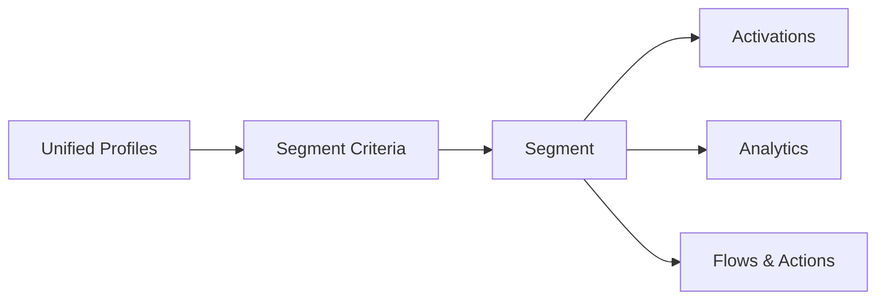
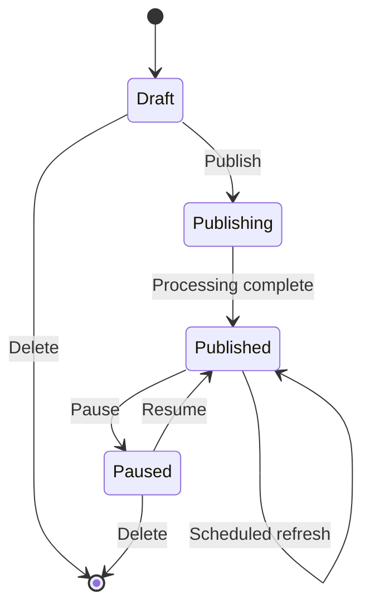

# Segmentation

<Snippet file="/snippets/note-rebranding.mdx" />

Segments are groups of individuals or accounts that share common characteristics. They're the foundation for targeted marketing, personalized experiences, and audience activation in Data 360.

## How Segmentation Works

Segments operate on **unified profiles** — the consolidated customer records created by identity resolution. You define criteria based on profile attributes, engagement data, calculated insights, or other segment membership, and Data 360 evaluates which profiles qualify.

## Segment Types

| Type | Creation Method | Key Feature | Best For |
|---|---|---|---|
| **Standard** | Visual rule builder | Attribute-based filtering with AND/OR logic | Most segmentation use cases |
| **Einstein** | Natural language prompt | AI-generated criteria from plain English descriptions | Non-technical users, rapid exploration |
| **Waterfall** | Priority-ordered groups | Mutually exclusive — each profile lands in the first group they qualify for | Tiered campaigns (VIP → Standard → New) |
| **Nested** | References other segments | Reuses existing segment criteria as building blocks | Complex multi-condition audiences |
| **Rapid** | Same as standard, with accelerated refresh | Near real-time membership updates | Time-sensitive campaigns, triggered experiences |

### Standard Segments

The most common segment type. Use the visual builder to define criteria with drag-and-drop attribute selection and AND/OR logic.

**Example:** Customers who made a purchase in the last 90 days AND have a lifetime value above $500 AND are subscribed to email communications.

### Einstein Segments

Describe your target audience in plain English, and Einstein generates the segment criteria automatically.

**Example prompt:** *"Customers who bought running shoes in the last 6 months but haven't purchased anything in the last 30 days"*

Einstein translates this into the equivalent attribute-based criteria and creates a standard segment you can review, edit, and publish.

### Waterfall Segments

Waterfall segments divide your audience into **mutually exclusive, priority-ordered groups**. Each profile is evaluated against criteria in order and placed into the first group they match.

**Example:**
1. **VIP** — Lifetime value > $5,000 → placed here first
2. **High Value** — Lifetime value > $1,000 → only if not VIP
3. **Standard** — All remaining customers → catch-all group

This prevents double-counting and is ideal for campaigns where each customer should receive only one treatment.

### Nested Segments

Nested segments reference other published segments as part of their criteria. This enables reuse of complex logic across multiple segments.

**Example:** Create a base segment "Active Email Subscribers" and reference it inside other segments like "Active Email Subscribers in California" or "Active Email Subscribers with High LTV."

### Rapid Segments

Rapid segments use the same criteria as standard segments but with an **accelerated refresh schedule** for near real-time membership updates. Use these when segment membership needs to reflect data changes within minutes rather than on the standard refresh schedule.

## Creating a Standard Segment

<Steps>
  <Step title="Navigate to Segments">
    In Data 360, go to the **Segments** tab and click **New Segment**.
  </Step>
  <Step title="Choose Segment Type">
    Select **Standard Segment** (or another type). Provide a name and description.
  </Step>
  <Step title="Define Criteria">
    Use the visual builder to add conditions:
    - Select an **attribute** from any DMO (e.g., `Individual.Age`, `Sales Order.GrandTotalAmount`)
    - Choose an **operator** (equals, greater than, contains, between, is not blank, etc.)
    - Set the **value** to filter on
    - Combine conditions with **AND** (all must be true) or **OR** (any can be true)
  </Step>
  <Step title="Add Related Attributes (Optional)">
    Filter on attributes from related DMOs. For example, segment individuals based on their most recent order total, email engagement in the last 30 days, or calculated insight values.
  </Step>
  <Step title="Preview & Publish">
    Preview the estimated segment size. When satisfied, click **Publish** to activate the segment. Data 360 evaluates all unified profiles and populates the segment membership.
  </Step>
</Steps>

## Segment Criteria

### Attribute Sources

Segment criteria can reference attributes from:

| Source | Examples | Notes |
|---|---|---|
| **Profile DMOs** | Individual name, email, location, age | Direct attributes of the unified profile |
| **Engagement DMOs** | Website visits, email opens, purchase history | Time-windowed (e.g., "in the last 30 days") |
| **Calculated Insights** | Lifetime value, engagement score, churn risk | Pre-computed metrics on profiles |
| **Other Segments** | "Members of Segment X" | Nested segment references |

### Operators

| Category | Operators |
|---|---|
| **Comparison** | Equals, Not Equals, Greater Than, Less Than, Between |
| **String** | Contains, Starts With, Ends With, Is Blank, Is Not Blank |
| **Date** | Before, After, Between, In Last N Days, In Next N Days |
| **Set** | In, Not In |
| **Existence** | Has Related (e.g., has at least one order), Does Not Have Related |

## Segment Lifecycle

| Status | Description |
|---|---|
| **Draft** | Segment is created but not yet published. No membership is calculated. |
| **Publishing** | Data 360 is evaluating all profiles against the criteria. May take minutes to hours depending on data volume. |
| **Published** | Segment is active. Membership is calculated and refreshes on schedule. Available for activation. |
| **Paused** | Segment exists but is not refreshing. Membership is frozen at the last refresh. |

## Segment Refresh

Published segments refresh on a schedule to incorporate new data, updated profiles, and changed attribute values.

| Refresh Type | Frequency | Use Case |
|---|---|---|
| **Standard** | Every 12–24 hours (configurable) | Most segments |
| **Rapid** | Every few minutes | Time-sensitive campaigns, real-time personalization |
| **On-demand** | Manual trigger | Ad-hoc analysis, pre-campaign validation |

## Best Practices

- **Name segments descriptively** — Use names that describe the audience, not the campaign (e.g., "High-Value West Coast Shoppers" not "Spring Campaign Segment 3")
- **Start simple, then refine** — Begin with 1–2 criteria and check the estimated size. Add criteria incrementally to narrow the audience.
- **Use calculated insights for behavioral criteria** — Rather than building complex engagement logic in segment criteria, create calculated insights (e.g., purchase frequency, last activity date) and segment on those
- **Leverage nested segments** — Extract reusable criteria into base segments. This reduces duplication and makes updates easier across multiple campaigns.
- **Monitor segment sizes** — Very large segments (>80% of your population) or very small segments (<100 members) may indicate overly broad or narrow criteria
- **Pause unused segments** — Paused segments don't consume refresh resources. Pause segments that aren't actively used in activations or campaigns.
- **Test with Einstein first** — Use Einstein Segment Creation to quickly explore audience ideas before building detailed standard segments

## Related Resources

- [Segments API](/apis/connect-api/segments) — Create and manage segments programmatically
- [SQL Segment Rules](/apis/connect-api/sql-segment-rules) — Define segment criteria using SQL
- [Segment Metadata](/apis/metadata-types/segments) — Deploy segment configurations via metadata
- [Activations & Data Sharing](/developer-guide/activations-guide) — Send segments to external platforms
- [Calculated Insights API](/apis/query-api/calculated-insights-api) — Create metrics for segmentation
- Salesforce Help: [Create Segments](https://help.salesforce.com/s/articleView?id=data.c360_a_segments.htm&type=5)
- Salesforce Help: [Segment Types and Statuses](https://help.salesforce.com/s/articleView?id=data.c360_a_segment_types_statuses.htm&type=5)
- Salesforce Help: [Einstein Segments](https://help.salesforce.com/s/articleView?id=data.c360_a_create_segment_einstein.htm&type=5)
