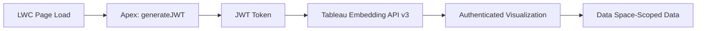

# Tableau & Analytics Integration

<Note>
As of October 14, 2025, Data Cloud has been rebranded to **Data 360**. During this transition, you may see references to Data Cloud in our application and documentation.
</Note>

Data 360 integrates with Tableau and other analytics tools to visualize unified customer data, build dashboards, and share insights across your organization.

## Connection Methods

| Method | Tool | Access Type | Best For |
|--------|------|-------------|----------|
| **Data Cloud Tableau Connector** | Tableau Desktop / Server | Native connector | Direct access to DMOs, segments, insights |
| **JDBC Connector** | Any JDBC-compatible tool | Standard JDBC | Power BI, DBeaver, custom Java apps |
| **Python SDK** | Jupyter, custom scripts | Python library | Data science workflows, Pandas DataFrames |
| **Tableau Hyper API** | Tableau extracts | SQL-based | Offline extracts, high-performance queries |
| **Tableau Embedding API v3** | Salesforce Experience Cloud | JWT-embedded | Embedded dashboards in Salesforce pages |

## Setting Up the Tableau Connector

<Steps>
  <Step title="Enable the Connector">
    In Data 360 Setup, enable the **Tableau Connector** under data sharing settings.
  </Step>
  <Step title="Create a Connected App">
    Set up a Salesforce connected app with OAuth 2.0 for Tableau access. Include the `cdp_query_api` scope.
  </Step>
  <Step title="Connect from Tableau">
    In Tableau Desktop, select **Salesforce Data Cloud** as the connector. Authenticate with your Salesforce credentials.
  </Step>
  <Step title="Select Data Objects">
    Browse available DMOs, calculated insights, and segments. Drag tables to the canvas to build your data model.
  </Step>
</Steps>

### Query Modes

| Mode | Description | When to Use |
|------|-------------|-------------|
| **Live** | Queries Data 360 in real-time for every dashboard interaction | Fresh data is critical, data volumes are manageable |
| **Extract** | Creates a local compressed snapshot loaded into memory | Large datasets, offline access, faster performance |

## Embedding Tableau in Salesforce

Use the Tableau Embedding API v3 with JWT authentication to embed dashboards in Lightning Web Components and Experience Cloud pages.

### Architecture



### JWT Configuration

The JWT token controls user identity and data access:

| Claim | Purpose | Example |
|-------|---------|---------|
| `sub` | Authenticated user email | `user@company.com` |
| `scp` | Permission scopes | `tableau:views:embed`, `tableau:insights:embed` |
| `UAF` | User Attribute Functions for row-level security | `{"Region": ["EMEA", "APAC"]}` |

### LWC Embedding Example

```javascript
import { LightningElement, wire } from 'lwc';
import generateJWT from '@salesforce/apex/TableauController.generateJWT';

export default class TableauDashboard extends LightningElement {
    tableauUrl = 'https://your-tableau-server/views/Dashboard/Overview';

    @wire(generateJWT)
    wiredToken({ data, error }) {
        if (data) {
            this.initViz(data);
        }
    }

    initViz(jwt) {
        const viz = this.template.querySelector('tableau-viz');
        viz.src = this.tableauUrl;
        viz.token = jwt;
    }
}
```

```java
// Apex JWT Generator
public class TableauController {
    @AuraEnabled(cacheable=true)
    public static String generateJWT() {
        // Build JWT with connected app credentials
        // MUST be server-side — never expose secrets client-side
        Map<String, Object> header = new Map<String, Object>{
            'alg' => 'RS256',
            'typ' => 'JWT',
            'kid' => CONNECTED_APP_SECRET_ID
        };

        Map<String, Object> payload = new Map<String, Object>{
            'iss' => CONNECTED_APP_CLIENT_ID,
            'sub' => UserInfo.getUserEmail(),
            'aud' => 'tableau',
            'exp' => DateTime.now().addMinutes(5).getTime() / 1000,
            'scp' => new List<String>{'tableau:views:embed'}
        };

        return signJWT(header, payload);
    }
}
```

## Tableau Accelerators

Salesforce provides pre-built Tableau accelerators for common Data 360 use cases:

| Accelerator | Use Case | Key Visualizations |
|-------------|----------|-------------------|
| **Customer 360 Overview** | Unified customer view | Profile summary, engagement timeline, LTV distribution |
| **Segment Analysis** | Segment performance | Segment size trends, overlap analysis, activation metrics |
| **Identity Resolution** | Match quality monitoring | Match rates, reconciliation stats, source coverage |
| **Engagement Analytics** | Customer interaction analysis | Channel performance, journey funnels, engagement scores |

## Data 360 SQL with Tableau Hyper API

The Tableau Hyper API can execute Data 360 SQL directly, enabling:

- Building Tableau extracts from Data 360 queries
- Combining Data 360 data with other sources in Hyper format
- Scheduled extract refreshes with custom SQL

```sql
-- Example: Data 360 SQL query for Tableau Hyper API
SELECT
    ui.ssot__FirstName__c || ' ' || ui.ssot__LastName__c AS FullName,
    ui.ssot__Email__c AS Email,
    ci.LifetimeValue AS LTV,
    ci.TotalOrders AS Orders,
    ci.AvgOrderValue AS AOV,
    s.SegmentName AS PrimarySegment
FROM
    UnifiedIndividual__dlm ui
LEFT JOIN
    CustomerLifetimeValue__cio ci ON ui.ssot__Id__c = ci.IndividualId
LEFT JOIN
    SegmentMembership__dlm s ON ui.ssot__Id__c = s.IndividualId
WHERE
    ci.LifetimeValue > 0
ORDER BY
    ci.LifetimeValue DESC
```

## Power BI Integration

Connect Power BI to Data 360 using the JDBC connector:

<Steps>
  <Step title="Install the JDBC Driver">
    Download and install the Data 360 JDBC driver. See [JDBC Connector](/sdks/jdbc/index).
  </Step>
  <Step title="Configure Connection in Power BI">
    In Power BI Desktop, select **Get Data > ODBC/JDBC** and provide the JDBC connection string.
  </Step>
  <Step title="Authenticate">
    Use JWT Bearer, Username-Password, or Refresh Token authentication.
  </Step>
  <Step title="Build Reports">
    Select DMOs and build Power BI visualizations against live Data 360 data.
  </Step>
</Steps>

## Data Space Awareness

Tableau connections respect Data 360 data space boundaries:

- The OAuth login determines which data space the user can access
- Visualizations only show data from authorized data spaces
- UAF claims in JWT tokens provide additional row-level filtering
- No additional configuration needed — access controls are inherited automatically

## Best Practices

<AccordionGroup>
  <Accordion title="Performance">
    - Use Tableau extracts for dashboards with large datasets or complex calculations
    - Apply filters in the Data 360 query (server-side) rather than in Tableau (client-side)
    - Limit the number of DMOs joined in a single data source
    - Schedule extract refreshes during off-peak hours
  </Accordion>

  <Accordion title="Security">
    - Generate JWTs server-side (Apex) — never expose connected app secrets in client code
    - Use UAF claims for row-level security instead of separate Tableau user filters
    - Assign appropriate Data 360 permission sets to Tableau users
    - Review connected app access periodically
  </Accordion>

  <Accordion title="Embedding">
    - Use Tableau Embedding API v3 (not the legacy JavaScript API)
    - Set short JWT expiration times (5–10 minutes)
    - Cache JWTs appropriately to reduce Apex callouts
    - Test embedded visualizations across screen sizes
  </Accordion>
</AccordionGroup>

## Related Resources

- [JDBC Connector](/sdks/jdbc/index) — JDBC setup for analytics tools
- [Python SDK](/sdks/python-sdk/index) — Python-based data access
- [SQL Reference](/apis/query-api/sql-reference) — Data 360 SQL syntax
- Salesforce Help: [Connect Tableau in Data 360](https://help.salesforce.com/s/articleView?id=data.c360_a_set_up_tableau_connected_app.htm&type=5)
- Salesforce Help: [Use Data Cloud Data in Tableau](https://help.salesforce.com/s/articleView?id=sf.c360_a_using_customer_360_aud_data_in_tableau.htm&type=5)
- Salesforce Help: [Tableau Accelerators](https://help.salesforce.com/s/articleView?id=sf.c360_a_tableau_accelerators.htm&type=5)
