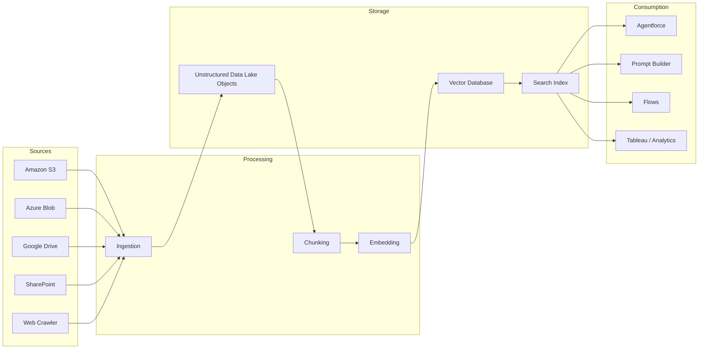

# Unstructured Data & RAG

<Snippet file="/snippets/note-rebranding.mdx" />

Data 360 can ingest unstructured data — free-form text, PDFs, chat transcripts, emails, knowledge articles — break it into meaningful chunks, convert those chunks into vector embeddings, and store them in a built-in vector database. This enables retrieval augmented generation (RAG) for Agentforce agents, Prompt Builder, automation flows, and analytics.

## Architecture



## Key Concepts

| Concept | Description |
|---------|-------------|
| **Unstructured Data Lake Object (UDLO)** | Storage container for raw unstructured data in Data 360's data lake |
| **Chunking** | Breaking documents into smaller, semantically meaningful segments |
| **Embedding** | Converting text chunks into high-dimensional vector representations |
| **Vector Database** | Built-in database that stores and indexes vector embeddings for similarity search |
| **Search Index** | An indexed collection of embedded chunks optimized for retrieval |
| **RAG** | Retrieval Augmented Generation — grounding LLM responses in your enterprise data |

## Supported Data Sources

Data 360 provides connectors for ingesting unstructured data from:

| Source | Supported Formats | Connection Type |
|--------|------------------|-----------------|
| **Amazon S3** | PDF, TXT, DOC, DOCX, HTML, CSV | AWS IAM credentials |
| **Azure Blob Storage** | PDF, TXT, DOC, DOCX, HTML, CSV | Azure service principal |
| **Google Drive** | PDF, TXT, DOC, DOCX, Sheets | Google service account |
| **Microsoft SharePoint** | PDF, TXT, DOC, DOCX, PPTX | Microsoft OAuth |
| **Web Content (Crawler)** | HTML pages from your website | URL configuration |
| **Salesforce CRM** | Knowledge articles, case comments, email messages | Native connection |

## Setting Up Unstructured Data Ingestion

<Steps>
  <Step title="Create a Data Source Connector">
    In Data 360 Setup, navigate to **Data Sources** and create a new connector for your unstructured data source (e.g., Amazon S3, SharePoint).
  </Step>
  <Step title="Configure the Data Stream">
    Create a data stream that points to the specific bucket, folder, or site containing your documents.
  </Step>
  <Step title="Create a UDLO">
    Map the ingested data to an Unstructured Data Lake Object. The UDLO stores the raw document content and metadata.
  </Step>
  <Step title="Configure Chunking">
    Set chunking parameters:
    - **Chunk size** — Number of tokens per chunk (typical: 256–1024)
    - **Overlap** — Token overlap between adjacent chunks for context continuity
    - **Strategy** — Fixed-size, sentence-boundary, or paragraph-boundary chunking
  </Step>
  <Step title="Create a Search Index">
    Create a search index from the UDLO. This triggers the embedding process and builds the vector index.
    - **Vector Search** — Pure semantic similarity search
    - **Hybrid Search** — Combines vector similarity with keyword matching for better precision
  </Step>
</Steps>

## Search Index Types

| Type | How It Works | Best For |
|------|-------------|----------|
| **Vector Search** | Converts queries to embeddings and finds nearest neighbors in vector space | Semantic queries, conceptual searches, questions in natural language |
| **Hybrid Search** | Combines vector similarity scoring with BM25 keyword matching | Queries that need both semantic understanding and exact term matching |

## Using Unstructured Data

### In Agentforce

Agentforce agents can retrieve relevant chunks from search indexes to ground their responses in your enterprise knowledge:

1. **Configure a retriever** — Point the agent's RAG retriever to your search index
2. **Set retrieval parameters** — Number of chunks to retrieve, similarity threshold
3. **Agent uses context** — Retrieved chunks are injected into the agent's prompt as grounding context

### In Prompt Builder

Prompt Builder templates can include a **Data Cloud Search** resource that retrieves relevant chunks based on the prompt's input:

```
You are a customer support agent. Use the following knowledge base context
to answer the customer's question.

{!DataCloudSearch:KnowledgeBaseIndex}

Customer Question: {!Input:CustomerQuestion}
```

### In Flows

Use the **Data Cloud Search** action in flows to retrieve relevant content programmatically:

1. Add a **Data Cloud Search** action element to your flow
2. Configure the search index and query parameters
3. Use the retrieved chunks in subsequent flow actions (email templates, case notes, etc.)

### Via Query API

```bash
curl -X POST "https://{instance}.salesforce.com/services/data/v64.0/ssot/vector-search" \
  -H "Authorization: Bearer {access_token}" \
  -H "Content-Type: application/json" \
  -d '{
    "indexName": "KnowledgeBaseIndex",
    "query": "How do I reset my account password?",
    "topK": 5,
    "threshold": 0.7,
    "searchType": "HYBRID"
  }'
```

**Response:**

```json
{
  "results": [
    {
      "chunkId": "CHK_001",
      "content": "To reset your password, navigate to Settings > Security > Change Password. Enter your current password and your new password twice...",
      "score": 0.92,
      "metadata": {
        "source": "Knowledge Article",
        "articleId": "KA-001234",
        "title": "Account Password Reset Guide",
        "lastModified": "2024-06-01T00:00:00Z"
      }
    },
    {
      "chunkId": "CHK_002",
      "content": "If you've forgotten your password and can't log in, click 'Forgot Password' on the login page. A reset link will be sent to your registered email...",
      "score": 0.88,
      "metadata": {
        "source": "Knowledge Article",
        "articleId": "KA-001235",
        "title": "Forgotten Password Recovery"
      }
    }
  ]
}
```

## RAG Best Practices

<AccordionGroup>
  <Accordion title="Chunking Strategy">
    - Start with 512-token chunks with 50-token overlap as a baseline
    - Use sentence-boundary chunking for narrative content (knowledge articles, manuals)
    - Use paragraph-boundary chunking for structured content (FAQs, policies)
    - Smaller chunks improve precision but may lose context; larger chunks preserve context but reduce retrieval specificity
  </Accordion>

  <Accordion title="Search Index Optimization">
    - Use **Hybrid Search** for most use cases — it combines the best of semantic and keyword matching
    - Use **Vector Search** when queries are natural-language questions with no specific keywords
    - Set an appropriate similarity threshold (0.7–0.8) to filter low-relevance results
    - Retrieve 3–5 chunks per query as a starting point; tune based on response quality
  </Accordion>

  <Accordion title="Data Quality">
    - Clean documents before ingestion — remove headers, footers, navigation elements, boilerplate
    - Include metadata (title, date, category) with documents for filtering and attribution
    - Keep source documents up to date — stale knowledge leads to incorrect RAG responses
    - Monitor retrieval quality by reviewing which chunks are being returned for common queries
  </Accordion>

  <Accordion title="Security & Governance">
    - Unstructured data inherits Data 360's security model — permission sets and data spaces apply
    - Be mindful of what content is indexed — exclude sensitive internal documents if agents are customer-facing
    - Audit search index access regularly
    - Consider separate indexes for different audiences (internal vs. external)
  </Accordion>
</AccordionGroup>

## Related Resources

- [Data 360 Architecture](/getting-started/architecture) — How unstructured data fits into the platform
- [Third-Party Connectors](/integrations/third-party-connectors) — Connector setup for S3, Azure, etc.
- Salesforce Help: [Unstructured Data in Data Cloud](https://help.salesforce.com/s/articleView?id=sf.c360_a_unstructured_data_about.htm&type=5)
- Salesforce Help: [Retrieval Augmented Generation](https://help.salesforce.com/s/articleView?id=sf.c360_a_rag_overview.htm&type=5)
