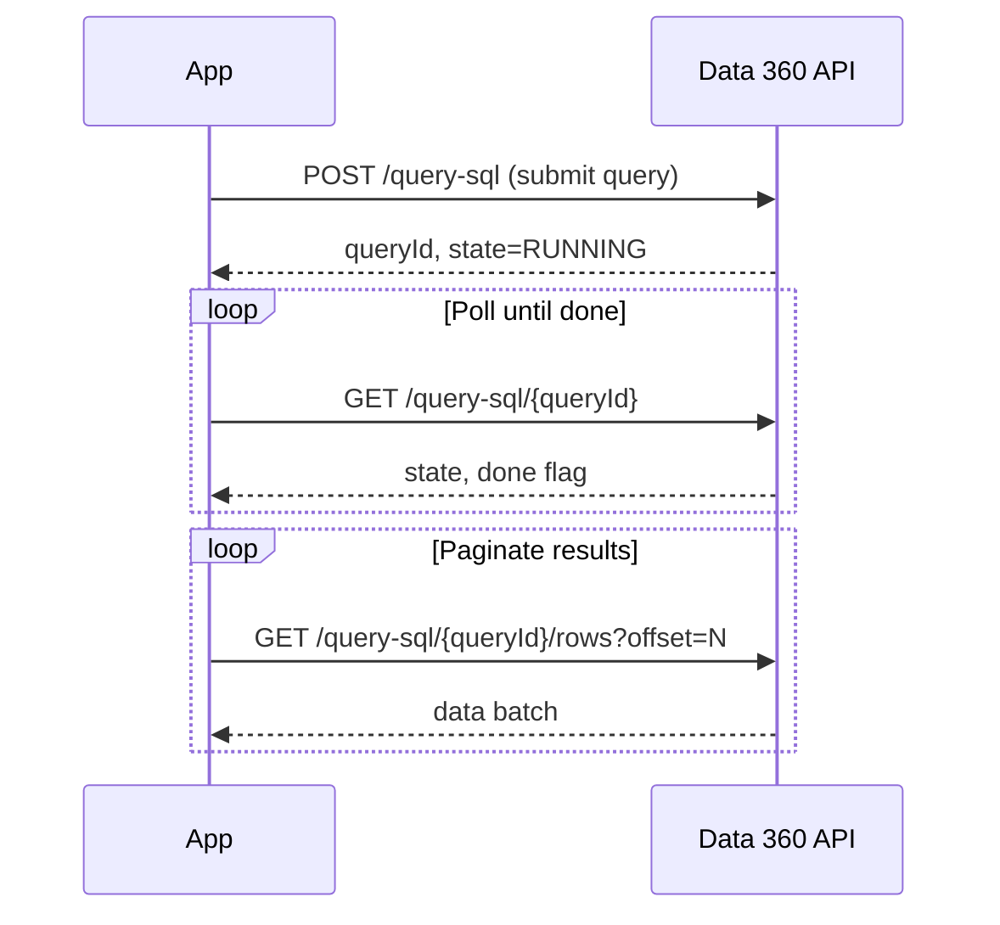

# Connect REST API Use Cases

This guide demonstrates common integration patterns and use cases for building solutions with the Data 360 Connect REST API.

## Use Case 1: Map External Subscriber Data with DMO API

Use the Data Model Object (DMO) API to programmatically define, update, and manage the mapping of source data to your unified data model.

### Scenario

You need to ingest subscriber data from an external marketing platform and map it to your unified customer profile.

### Implementation

<Steps>
  <Step title="Define the Data Stream">
    Create a data stream to receive the external data:

    ```bash icon=terminal lines {1-3}
    curl -X POST "https://{instance}.salesforce.com/services/data/v64.0/ssot/data-streams" \
      -H "Authorization: Bearer {access_token}" \
      -H "Content-Type: application/json" \
      -d '{
        "name": "MarketingSubscribers_Stream",
        "displayName": "Marketing Platform Subscribers",
        "category": "Profile",
        "schema": {
          "fields": [
            {"name": "SubscriberId__c", "type": "STRING", "required": true},
            {"name": "Email__c", "type": "STRING", "required": true},
            {"name": "FirstName__c", "type": "STRING"},
            {"name": "LastName__c", "type": "STRING"},
            {"name": "SubscriptionDate__c", "type": "DATETIME"}
          ]
        }
      }'
    ```
  </Step>

  <Step title="Configure Field Mappings">
    Map source fields to the unified data model:

    ```json field_mapping.json {3-8}
    {
      "sourceObject": "MarketingSubscribers_Stream",
      "targetDMO": "UnifiedIndividual__dlm",
      "fieldMappings": [
        {"source": "SubscriberId__c", "target": "ExternalId__c"},
        {"source": "Email__c", "target": "Email__c"},
        {"source": "FirstName__c", "target": "FirstName__c"},
        {"source": "LastName__c", "target": "LastName__c"}
      ]
    }
    ```
  </Step>

  <Step title="Ingest Data">
    Stream subscriber data into Data 360:

    ```python ingest_subscribers.py icon=python lines {3,5-12,14-15}
    import requests

    url = f"https://{instance}.salesforce.com/services/data/v64.0/ssot/streaming/MarketingSubscribers_Stream"

    subscribers = [
        {
            "SubscriberId__c": "SUB_001",
            "Email__c": "john@example.com",
            "FirstName__c": "John",
            "LastName__c": "Doe",
            "SubscriptionDate__c": "2024-01-15T10:00:00Z"
        }
    ]

    response = requests.post(url, headers=headers, json={"data": subscribers})
    print(f"Ingested: {response.json()['accepted']} records")
    ```
  </Step>

  <Step title="Verify Mapping">
    Query to confirm data is unified:

    ```sql verify_mapping.sql {1-3}
    SELECT Id__c, ExternalId__c, Email__c, FirstName__c
    FROM UnifiedIndividual__dlm
    WHERE ExternalId__c = 'SUB_001'
    ```
  </Step>
</Steps>

### Key Considerations

- Define clear field mapping rules before ingestion
- Use unique identifiers for record matching
- Monitor ingestion statistics for data quality

---

## Use Case 2: Retrieve Campaign Engagement Records

Use the Query API to perform comprehensive audits and retrieve large volumes of campaign engagement data efficiently using asynchronous patterns.

### Scenario

You need to extract all campaign engagement records for the past quarter for analysis, potentially millions of records.

### Implementation Pattern

<Steps>
  <Step title="Submit Async Query">
    For large datasets, queries execute asynchronously:

    ```python submit_query.py icon=python lines {5-6,8-17,19-22}
    import requests
    import time

    query_url = f"https://{instance}.salesforce.com/services/data/v64.0/ssot/query-sql"

    query = {
        "sql": """
            SELECT
                Id__c,
                CampaignId__c,
                ContactId__c,
                EngagementType__c,
                EngagementDate__c,
                Channel__c
            FROM CampaignEngagement__dlm
            WHERE EngagementDate__c >= '2024-01-01'
            AND EngagementDate__c < '2024-04-01'
        """
    }

    response = requests.post(query_url, headers=headers, json=query)
    result = response.json()
    query_id = result['queryId']
    print(f"Query submitted: {query_id}")
    ```
  </Step>

  <Step title="Poll for Completion">
    Check query status until completion:

    ```python poll_status.py icon=python lines expandable {1-4,8-12,14-15,20-21}
    def poll_query_status(query_id, max_wait=300):
        """Poll query status with exponential backoff."""
        status_url = f"{base_url}/services/data/v64.0/ssot/query-sql/{query_id}"
        wait_time = 1
        elapsed = 0

        while elapsed < max_wait:
            response = requests.get(status_url, headers=headers)
            status = response.json()

            if status['done']:
                print(f"Query complete. Rows: {status.get('rowCount', 0)}")
                return status

            if status['state'] == 'FAILED':
                raise Exception(f"Query failed: {status.get('error')}")

            print(f"Status: {status['state']}. Waiting {wait_time}s...")
            time.sleep(wait_time)
            elapsed += wait_time
            wait_time = min(wait_time * 2, 30)  # Max 30s between polls

        raise TimeoutError("Query did not complete in time")

    status = poll_query_status(query_id)
    ```
  </Step>

  <Step title="Retrieve Results with Pagination">
    Fetch results in batches:

    ```python fetch_results.py icon=python lines expandable {1-5,9-11,13-14,16-17,23-24}
    def fetch_all_results(query_id, page_size=10000):
        """Fetch all results using pagination."""
        results_url = f"{base_url}/services/data/v64.0/ssot/query-sql/{query_id}/rows"
        all_data = []
        offset = 0

        while True:
            params = {"offset": offset, "rowLimit": page_size}
            response = requests.get(results_url, headers=headers, params=params)
            batch = response.json()

            rows = batch.get('data', [])
            all_data.extend(rows)

            print(f"Fetched {len(rows)} rows (total: {len(all_data)})")

            if len(rows) < page_size:
                break  # Last page

            offset += page_size

        return all_data

    engagement_records = fetch_all_results(query_id)
    print(f"Total records retrieved: {len(engagement_records)}")
    ```
  </Step>

  <Step title="Process Results">
    Transform and analyze the data:

    ```python process_results.py icon=python lines {3-5,7-11,15}
    import pandas as pd

    # Convert to DataFrame
    columns = ['Id', 'CampaignId', 'ContactId', 'EngagementType', 'Date', 'Channel']
    df = pd.DataFrame(engagement_records, columns=columns)

    # Analyze engagement by campaign
    campaign_summary = df.groupby('CampaignId').agg({
        'Id': 'count',
        'EngagementType': lambda x: x.value_counts().to_dict()
    }).rename(columns={'Id': 'TotalEngagements'})

    print(campaign_summary)

    # Export for reporting
    df.to_csv('campaign_engagements_q1_2024.csv', index=False)
    ```
  </Step>
</Steps>

### Async Query Pattern Summary



### Best Practices

<AccordionGroup>
  <Accordion title="Query Optimization">
    - Add date filters to limit data scanned
    - Select only required columns
    - Use indexes on filter columns
    - Consider partitioning large queries by date range
  </Accordion>

  <Accordion title="Polling Strategy">
    - Use exponential backoff to reduce API calls
    - Set reasonable timeout limits
    - Handle FAILED state gracefully
    - Log query IDs for debugging
  </Accordion>

  <Accordion title="Pagination Handling">
    - Use consistent page sizes (5,000-10,000 rows)
    - Process batches as they arrive for memory efficiency
    - Implement retry logic for failed batch fetches
    - Results are cached for 24 hours
  </Accordion>

  <Accordion title="Error Handling">
    - Check for query syntax errors before submission
    - Handle rate limiting (429) with backoff
    - Validate data types in results
    - Log errors with query context
  </Accordion>
</AccordionGroup>

---

## Use Case 3: Real-time Customer Profile Lookup

Look up unified customer profiles in real-time for personalization or customer service applications.

### Implementation

<CodeGroup>
```python realtime_lookup.py icon=python lines {3-4,6-19,21-30,33-36}
import requests

def lookup_customer(email: str) -> dict:
    """Look up customer profile by email."""

    # Query for unified profile
    query = {
        "sql": f"""
            SELECT
                ui.Id__c,
                ui.FirstName__c,
                ui.LastName__c,
                ui.LifetimeValue__c,
                cpe.Email__c
            FROM UnifiedIndividual__dlm ui
            JOIN UnifiedContactPointEmail__dlm cpe
                ON ui.Id__c = cpe.PartyId__c
            WHERE cpe.Email__c = '{email}'
            LIMIT 1
        """
    }

    response = requests.post(query_url, headers=headers, json=query)
    result = response.json()

    if result.get('data'):
        row = result['data'][0]
        return {
            'id': row[0],
            'firstName': row[1],
            'lastName': row[2],
            'ltv': row[3],
            'email': row[4]
        }
    return None

# Usage
customer = lookup_customer("john.smith@example.com")
if customer:
    print(f"Welcome back, {customer['firstName']}!")
    print(f"Your lifetime value: ${customer['ltv']:,.2f}")
```

```java CustomerLookup.java icon=java lines {5-17,19-26}
import java.sql.*;

public class CustomerLookup {
    public Map<String, Object> lookupCustomer(String email) throws SQLException {
        String sql = """
            SELECT
                ui.Id__c,
                ui.FirstName__c,
                ui.LastName__c,
                ui.LifetimeValue__c,
                cpe.Email__c
            FROM UnifiedIndividual__dlm ui
            JOIN UnifiedContactPointEmail__dlm cpe
                ON ui.Id__c = cpe.PartyId__c
            WHERE cpe.Email__c = ?
            LIMIT 1
            """;

        try (PreparedStatement stmt = conn.prepareStatement(sql)) {
            stmt.setString(1, email);
            ResultSet rs = stmt.executeQuery();

            if (rs.next()) {
                Map<String, Object> customer = new HashMap<>();
                customer.put("id", rs.getString("Id__c"));
                customer.put("firstName", rs.getString("FirstName__c"));
                customer.put("lastName", rs.getString("LastName__c"));
                customer.put("ltv", rs.getDouble("LifetimeValue__c"));
                return customer;
            }
        }
        return null;
    }
}
```
</CodeGroup>

---

## Use Case 4: Segment Activation Monitoring

Monitor segment activation status and sync health across destinations.

### Implementation

```python monitor_activations.py icon=python lines expandable {5-10,12-14,17-24,26-32,35-40}
import requests
from datetime import datetime, timedelta

def check_activation_health():
    """Monitor all active activations for issues."""

    # Get all activations
    response = requests.get(
        f"{base_url}/services/data/v64.0/ssot/activations",
        headers=headers,
        params={"status": "ACTIVE"}
    )

    activations = response.json()['activations']
    issues = []

    for activation in activations:
        activation_id = activation['id']

        # Get sync history
        history_response = requests.get(
            f"{base_url}/services/data/v64.0/ssot/activations/{activation_id}/history",
            headers=headers,
            params={"limit": 5}
        )

        history = history_response.json()['history']

        # Check for failures
        recent_failures = [h for h in history if h['status'] == 'FAILED']
        if recent_failures:
            issues.append({
                'activation': activation['id'],
                'segment': activation['segmentName'],
                'target': activation['targetName'],
                'failures': len(recent_failures),
                'lastFailure': recent_failures[0]['startTime']
            })

        # Check for stale syncs
        if history:
            last_sync = datetime.fromisoformat(history[0]['startTime'].replace('Z', '+00:00'))
            if datetime.now(last_sync.tzinfo) - last_sync > timedelta(hours=48):
                issues.append({
                    'activation': activation['id'],
                    'issue': 'STALE_SYNC',
                    'lastSync': history[0]['startTime']
                })

    return issues

# Run health check
issues = check_activation_health()
for issue in issues:
    print(f"Alert: {issue}")
```

## Related Resources

- [Data Ingestion API](/apis/connect-api/data-ingestion) - Ingest data into streams
- [Query API](/apis/query-api/query-services) - Execute SQL queries
- [Segments API](/apis/connect-api/segments) - Create and manage segments
- [Activations API](/apis/connect-api/activations) - Configure activations
- [Postman Collection](/developer-guide/postman-collection) - Interactive API testing
