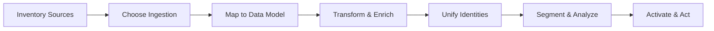

# Plan Your Data Strategy

<Snippet file="/snippets/note-rebranding.mdx" />

A successful Data 360 implementation starts with a clear data strategy. Before configuring connectors or writing API calls, take time to inventory your data sources, plan your data model mappings, and define your implementation phases.

## The Data 360 Pipeline

Every Data 360 implementation follows this pipeline. Your strategy should address each stage:

## Step 1: Inventory Your Data Sources

Start by cataloging every data source you plan to bring into Data 360. Group them by type:

| Source Category | Examples | Typical Data |
|---|---|---|
| **Salesforce CRM** | Sales Cloud, Service Cloud, Marketing Cloud | Contacts, accounts, cases, campaigns, opportunities |
| **Commerce** | Commerce Cloud, Shopify, custom ecommerce | Orders, cart events, product catalog, browsing behavior |
| **Web & Mobile** | Websites, mobile apps | Page views, clicks, form submissions, app events |
| **Marketing Platforms** | Google Ads, Meta, LinkedIn, email tools | Ad impressions, clicks, conversions, email engagement |
| **External Systems** | ERP, data warehouses, CDPs, loyalty platforms | Transactions, loyalty data, product usage, support tickets |
| **Unstructured Data** | S3, Azure Blob, Google Drive, SharePoint | PDFs, documents, knowledge articles, audio, video |

### Key Questions

- What data do you need to answer your most critical business questions?
- Which sources contain customer identity information (email, phone, IDs)?
- How frequently does each source need to sync?
- What is the expected data volume per source?

## Step 2: Choose Your Ingestion Methods

Data 360 offers six ingestion methods — from built-in Salesforce CRM connectors to the Ingestion API, Web/Mobile SDKs, 270+ third-party connectors, zero-copy federation, and MuleSoft. The right choice depends on your source type, latency needs, and data volume.

As a general rule:
- **Salesforce data** → CRM Connector (built-in, fastest setup)
- **SaaS platforms** → Third-party connectors (270+ available)
- **Custom/external systems** → Ingestion API (streaming or batch)
- **Web & mobile events** → Web/Mobile SDK (real-time)
- **Data warehouses** → Zero-copy federation (no data movement)

See [Connect & Ingest Data](/developer-guide/data-ingestion-guide) for the full comparison table, decision guide, and setup instructions.

## Step 3: Plan Your Data Model

Data 360 uses the **Customer 360 Data Model** — a standard schema with over 300 industry-agnostic objects. Planning how your source data maps to this model is the most critical step in your strategy.

### Key Decisions

Data flows through four object types: **DLOs** (raw ingested data) → **DMOs** (harmonized to the C360 model) → **Unified DMOs** (after identity resolution) → **CIOs** (derived metrics like LTV). Your planning should focus on:

- **Which standard DMOs will your sources map to?** People → Individual, email → Contact Point Email, purchases → Sales Order, etc.
- **Do you need custom DMOs?** Only create custom objects when no standard DMO fits. Standard DMOs have better feature support.
- **How will you handle naming and field mapping?** Document your mapping decisions before implementation.

See [Data Modeling & Harmonization](/developer-guide/data-modeling) for the full object model diagram, DMO categories, mapping workflow, and starter data bundles.

## Step 4: Design Your Identity Strategy

Decide how you want to match and merge records across sources:

| Decision | Options | Recommendation |
|---|---|---|
| **Unification entity** | Individuals, Accounts, or both | Start with Individuals for B2C, Accounts for B2B |
| **Match approach** | Start strict, then loosen | Begin with exact email/phone match, add fuzzy later |
| **Match fields** | Email, phone, name, custom IDs | Use at least 2 match fields for accuracy |
| **Reconciliation** | Most recent, most frequent, source priority | Choose source priority for fields where a single source is authoritative |

See the [Identity Resolution Guide](/developer-guide/identity-resolution-guide) for detailed match rule configuration.

## Step 5: Phase Your Implementation

Don't try to ingest everything at once. A phased approach reduces risk and delivers value faster.

### Recommended Phases

| Phase | Focus | Typical Duration |
|---|---|---|
| **Phase 1: Foundation** | Connect 1–2 Salesforce sources, set up identity resolution, create first segment | 2–4 weeks |
| **Phase 2: Expand Sources** | Add external data (web events, commerce, marketing platforms) | 4–6 weeks |
| **Phase 3: Enrich & Activate** | Add transforms, calculated insights, build activation targets | 2–4 weeks |
| **Phase 4: Scale** | Add remaining sources, optimize performance, expand to additional business units | Ongoing |

### Phase 1 Checklist

- [ ] Data 360 enabled and users configured ([Set Up Guide](/getting-started/setup))
- [ ] Salesforce CRM connector configured with starter data bundle
- [ ] Source data mapped to Individual, Contact Point Email, and at least one engagement DMO
- [ ] Identity resolution ruleset created with exact email match
- [ ] First segment created and published
- [ ] One activation target configured (e.g., Marketing Cloud or test webhook)

## Cross-Cloud Architecture

For organizations with multiple Salesforce orgs, Data 360 supports multi-org architectures:

- **Data Cloud One** — Connect multiple CRM orgs to a central Data 360 home org via companion connections. Companion orgs access shared metadata and collaborate without copying data.
- **Data Shares** — Share derived data, segments, and activations to external systems without copying.
- **Companion Connections** — You can select which data spaces to share with companion orgs, maintaining control over data access.

## Related Resources

- [Set Up Data 360](/getting-started/setup) — Configure your org, users, and permissions
- [Architecture Overview](/getting-started/architecture) — Full platform architecture diagram
- [Connect & Ingest Data](/developer-guide/data-ingestion-guide) — Detailed guide to all ingestion methods
- [Data Modeling & Harmonization](/developer-guide/data-modeling) — DLO-to-DMO mapping workflow
- Salesforce Help: [Plan Your Data Strategy](https://help.salesforce.com/s/articleView?id=data.c360_a_plan_data_strategy.htm&type=5)
- Salesforce Help: [Architecture Strategy](https://help.salesforce.com/s/articleView?id=data.c360_a_data_cloud_architecture_strategy.htm&type=5)
- Salesforce Help: [Cross-Cloud Implementation Guides](https://help.salesforce.com/s/articleView?id=data.c360_a_imp_guides.htm&type=5)
