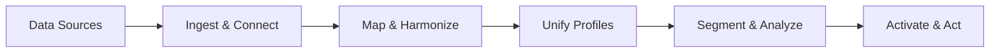

# Introduction to Data 360

Data 360 (formerly Data Cloud) is Salesforce's customer data platform built on a lakehouse architecture. It consolidates data from any source — CRM, web, mobile, commerce, external databases — into unified customer profiles that power segmentation, AI, automation, and analytics.

## What You Can Build

| Use Case | How | Start Here |
|----------|-----|------------|
| **Unified customer profiles** | Ingest data from multiple sources, map to DMOs, run identity resolution | [Set Up Data 360](/getting-started/setup) |
| **Audience segments** | Create segments based on attributes, behaviors, and AI predictions | [Segmentation](/developer-guide/segmentation) |
| **Real-time automations** | Trigger flows and data actions when customer data changes | [Flows & Automation](/developer-guide/flows-automation) |
| **AI predictions** | Build or import ML models, score customers, ground agents with RAG | [AI & ML](/developer-guide/ai-ml-integration) |
| **Cross-channel analytics** | Query unified data with SQL, build reports and dashboards | [Analytics & Reporting](/developer-guide/analytics-reporting) |
| **API integrations** | Query, ingest, and manage data programmatically via REST APIs | [Connect REST API](/apis/connect-api/index) |

## How Data 360 Works

1. **Ingest** — Connect Salesforce CRM, external databases, web/mobile SDKs, and APIs
2. **Model** — Map raw data to standardized Data Model Objects (DMOs)
3. **Unify** — Identity resolution matches records across sources into single profiles
4. **Segment** — Group customers by attributes, behaviors, and computed insights
5. **Act** — Activate to ad platforms, trigger flows, send data actions, power AI agents

## Navigate These Docs

<CardGroup cols={2}>
  <Card title="Quick Start" icon="bolt" href="/getting-started/quickstart">
    Authenticate and make your first API call in minutes
  </Card>
  <Card title="Set Up Data 360" icon="gear" href="/getting-started/setup">
    Enable, provision, and configure your org
  </Card>
  <Card title="Architecture" icon="sitemap" href="/getting-started/architecture">
    Understand the platform components and data flow
  </Card>
  <Card title="Plan Your Data Strategy" icon="map" href="/getting-started/data-strategy">
    Design your implementation and phased rollout
  </Card>
</CardGroup>

<CardGroup cols={3}>
  <Card title="Platform Guides" icon="book" href="/developer-guide/data-ingestion-guide">
    Step-by-step guides for every Data 360 capability
  </Card>
  <Card title="API Reference" icon="code" href="/apis/connect-api/index">
    Connect REST API, Query API, Metadata Types
  </Card>
  <Card title="SDKs" icon="puzzle-piece" href="/sdks/web-sdk/index">
    Web, Mobile, Python, and JDBC client libraries
  </Card>
</CardGroup>

## Key Concepts

| Concept | Description |
|---------|-------------|
| **Data Lake Object (DLO)** | Raw ingested data in its original schema |
| **Data Model Object (DMO)** | Standardized object in the Customer 360 Data Model (`__dlm` suffix) |
| **Unified Individual** | Golden record profile created by identity resolution |
| **Calculated Insight** | Pre-computed metric or aggregation stored as a CIO (`__cio` suffix) |
| **Segment** | A group of unified profiles sharing common criteria |
| **Activation** | Sending segment data to an external platform (ads, marketing, storage) |
| **Data Space** | Logical partition for multi-tenant data access control |

## Edition Requirements

Data 360 requires **Enterprise**, **Performance**, or **Unlimited Edition**. APIs require version **55.0 or later**. See [Limits & Guidelines](/reference/limits) for quotas and credit costs.
