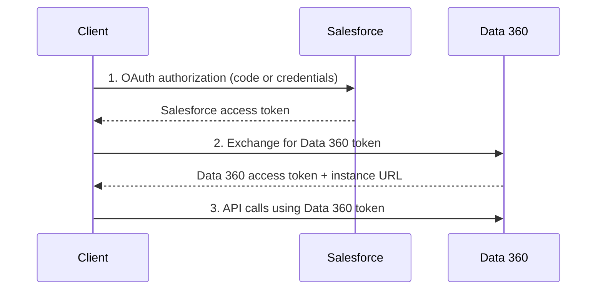

# Set Up Data 360

<Snippet file="/snippets/note-rebranding.mdx" />

Before you can ingest data, build segments, or activate audiences, your org needs to be configured with the right licenses, users, and permissions. This guide walks through the full setup process from enabling Data 360 to making your first API call.

## Prerequisites

Before starting setup, ensure you have:

| Requirement | Details |
|---|---|
| **Edition** | Enterprise, Performance, or Unlimited Edition |
| **License** | Data 360 license provisioned to your org |
| **Admin Access** | System Administrator profile or equivalent permissions |
| **Salesforce Version** | API version 55.0 or later |

## Step 1: Enable Data 360

<Steps>
  <Step title="Navigate to Setup">
    In Salesforce Setup, search for **Data 360** in the Quick Find box.
  </Step>
  <Step title="Enable Data 360">
    Click **Data Cloud Setup** and toggle the feature on. Accept the terms of service when prompted.
  </Step>
  <Step title="Wait for Provisioning">
    Data 360 provisioning takes a few minutes. You'll see the Data 360 app appear in the App Launcher once provisioning is complete.
  </Step>
</Steps>

## Step 2: Create Users & Assign Permission Sets

Every user who needs access to Data 360 must be assigned one or more permission sets. Data 360 provides standard permission sets that grant access to different capabilities.

### Standard Permission Sets

| Permission Set | Access Level | Typical Role |
|---|---|---|
| **Data Cloud Admin** | Full configuration and management | Administrators |
| **Data Cloud Data Aware Specialist** | View data, run queries, manage segments | Data analysts |
| **Data Cloud Marketing Admin** | Segmentation and activation management | Marketing ops |
| **Data Cloud Marketing Specialist** | Create and manage segments and activations | Marketers |
| **Data Cloud Integration Specialist** | Manage connectors and data streams | Integration developers |
| **Data Cloud Metadata User** | Read-only access to metadata and schemas | Developers, read-only users |

### Assigning Permission Sets

<Steps>
  <Step title="Navigate to Users">
    Go to **Setup > Users > Users** and select the user to configure.
  </Step>
  <Step title="Assign Permission Set">
    In the **Permission Set Assignments** section, click **Edit Assignments**. Select one or more Data 360 permission sets and save.
  </Step>
  <Step title="Verify Access">
    Have the user log in and confirm they can see the **Data 360** app in the App Launcher.
  </Step>
</Steps>

<Warning>
Users with the **Minimum Access - API Only Integrations** profile can access Data 360 APIs but cannot access the Data 360 UI. Use this profile for service accounts and integrations.
</Warning>

## Step 3: Configure Data Spaces

Data spaces are logical partitions that organize your data for profile unification, insights, and marketing. Each data space can have its own data streams, segments, and activation targets.

### Default Data Space

When Data 360 is enabled, a **default data space** is created automatically. For most implementations, the default data space is sufficient to get started.

### Creating Additional Data Spaces

Use additional data spaces when you need to:

- Separate data by business unit or brand
- Maintain independent identity resolution rulesets
- Restrict data access for different teams
- Support multi-region or multi-brand architectures

<Steps>
  <Step title="Navigate to Data Spaces">
    In Data 360 Setup, go to **Data Spaces**.
  </Step>
  <Step title="Create a New Data Space">
    Click **New Data Space**, provide a name and description, and select the data model objects to include.
  </Step>
  <Step title="Assign Data Space Permission Sets">
    Create or assign data space-specific permission sets to control who can access data in each space.
  </Step>
</Steps>

## Step 4: Set Up a Connected App for API Access

To access Data 360 APIs programmatically, you need a connected app configured with OAuth 2.0.

### Creating the Connected App

<Steps>
  <Step title="Create an External Client App">
    In Setup, navigate to **App Manager** and click **New Connected App** (or use the newer **External Client App** flow). Provide a name and contact email.
  </Step>
  <Step title="Enable OAuth Settings">
    Under **API (Enable OAuth Settings)**, check **Enable OAuth Settings**. Set a callback URL (use `https://localhost:3000` for development).
  </Step>
  <Step title="Select OAuth Scopes">
    Add the required scopes for your use case:

| Scope | Purpose |
|---|---|
| `cdp_query_api` | Execute ANSI SQL queries against Data 360 data |
| `cdp_profile_api` | Manage profile records and unified profiles |
| `cdp_ingest_api` | Push data via the Ingestion API |
| `api` | Access the logged-in user's account via APIs |
| `refresh_token` | Obtain a refresh token for long-lived sessions |

  </Step>
  <Step title="Save & Retrieve Credentials">
    Save the connected app. Navigate to **Settings > Consumer Key and Secret** and copy both values. You'll need these for authentication.
  </Step>
</Steps>

### Authentication Flow

Data 360 API authentication is a two-step process:

**Step 1 — Authenticate with Salesforce:** Use the OAuth 2.0 Web Server Flow or Client Credentials Flow to obtain a Salesforce access token.

**Step 2 — Exchange for Data 360 Token:** Use the Salesforce access token to request a Data 360-specific access token. The response includes a `DATA_CLOUD_ACCESS_TOKEN` and a `DATA_CLOUD_INSTANCE_URL` (the tenant-specific endpoint for all API calls).

**Step 3 — Make API Calls:** Use the Data 360 access token and instance URL for all subsequent API requests.

## Step 5: Verify Your Setup

Run through this checklist to confirm everything is configured correctly:

<AccordionGroup>
  <Accordion title="Verify User Access">
    - [ ] Users can see the Data 360 app in the App Launcher
    - [ ] Users can navigate to Data 360 Home and see the dashboard
    - [ ] Permission set assignments match user roles
  </Accordion>

  <Accordion title="Verify Data Space Configuration">
    - [ ] Default data space is active
    - [ ] Additional data spaces (if needed) are created and have correct DMO assignments
    - [ ] Data space permission sets are assigned to appropriate users
  </Accordion>

  <Accordion title="Verify API Access">
    - [ ] Connected app is created with correct OAuth scopes
    - [ ] OAuth flow returns a valid Salesforce access token
    - [ ] Token exchange returns a valid Data 360 access token and instance URL
    - [ ] Test API call (e.g., retrieve tenant metadata) returns a successful response
  </Accordion>
</AccordionGroup>

## Related Resources

- [Security & Permissions](/developer-guide/security-permissions) — Deep dive into permission sets, data spaces, and access controls
- [Quick Start](/getting-started/quickstart) — Build your first integration with Data 360
- [Architecture Overview](/getting-started/architecture) — Understand the full Data 360 platform architecture
- Salesforce Help: [Create Data 360 Users and Assign Permissions](https://help.salesforce.com/s/articleView?id=data.c360_a_setup_walkthrough.htm&type=5)
- Salesforce Help: [Data 360 Standard Permission Sets](https://help.salesforce.com/s/articleView?id=data.c360_a_userpermissions.htm&type=5)
- Salesforce Help: [Manage Access with Permission Sets](https://help.salesforce.com/s/articleView?id=sf.c360_a_setup_permission_sets.htm&type=5)
