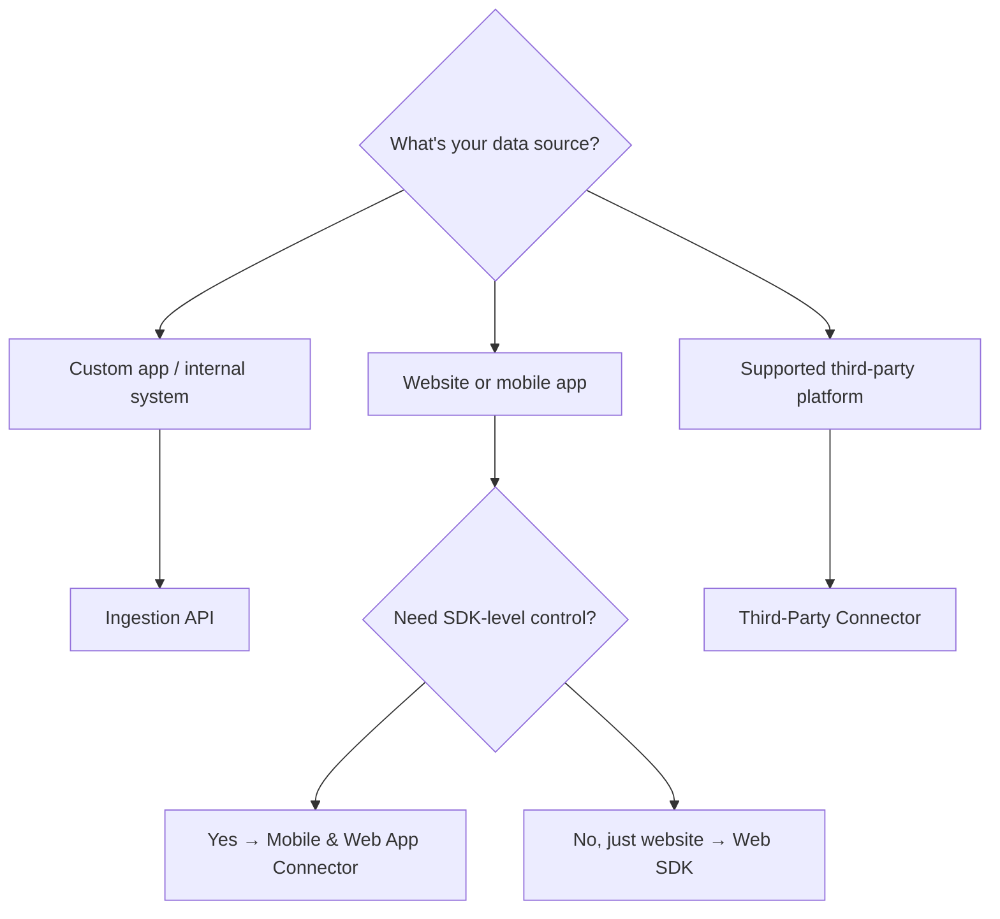

# Connector Services

Connector services are the pathways for bringing data into Data 360. Each connector type is optimized for a specific data source pattern.

<CardGroup cols={2}>
  <Card title="Ingestion API" icon="code" href="/integrations/ingestion-api-guide">
    Stream or batch-load data from any external system using REST endpoints
  </Card>
  <Card title="Mobile & Web App" icon="mobile" href="/integrations/mobile-web-connector">
    Capture behavioral events from websites and mobile apps via SDKs
  </Card>
  <Card title="Third-Party Connectors" icon="plug" href="/integrations/third-party-connectors">
    Pre-built connectors for databases, SaaS platforms, and data warehouses
  </Card>
  <Card title="Web SDK" icon="globe" href="/integrations/web-sdk-setup">
    Deploy the Salesforce Interactions SDK for website event tracking
  </Card>
</CardGroup>

## When to Use Each

| Connector | Best For | Data Direction | Setup Effort |
|-----------|----------|----------------|--------------|
| **Ingestion API** | Custom integrations, ETL pipelines, server-to-server data | Inbound | Medium — requires schema + auth setup |
| **Mobile & Web App** | Behavioral tracking from apps and websites | Inbound | Medium — requires SDK deployment |
| **Third-Party** | Pre-built sources (SQL Server, Snowflake, BigQuery) | Varies | Low — guided UI configuration |
| **Web SDK** | Website interaction tracking (clicks, page views) | Inbound | Low — CDN script + sitemap |

## Choosing the Right Connector

## Related Resources

- [Integrations Overview](/integrations/index) — Architecture and data flow
- [Data Ingestion API](/apis/connect-api/data-ingestion) — REST endpoint reference
- [Data Streams API](/apis/connect-api/data-streams) — Manage data streams programmatically
