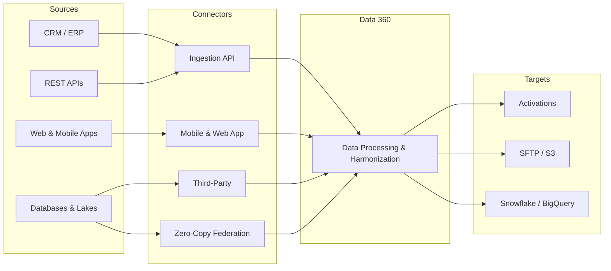

# Data 360 Integrations

<Note>
As of October 14, 2025, Data Cloud has been rebranded to **Data 360**. During this transition, you may see references to Data Cloud in our application and documentation.
</Note>

Data sources connect into Data 360 via connectors that ingest data, or through zero-copy data federation which syncs data from external sources. After data is harmonized and segmented, it can be sent to targets or shared with integration partners.

## Data Flow

## Connector Types

| Type | Direction | Example | Guide |
|------|-----------|---------|-------|
| **Ingestion API** | Inbound | REST streaming / batch from custom apps | [Ingestion API Guide](/integrations/ingestion-api-guide) |
| **Mobile & Web App** | Inbound | SDK-based behavioral events | [Mobile & Web Connector](/integrations/mobile-web-connector) |
| **Third-Party** | Varies | SQL Server, OData, Snowflake, BigQuery | [Third-Party Connectors](/integrations/third-party-connectors) |
| **Zero-Copy Federation** | Inbound (sync) | External lake access without data movement | [Salesforce Help](https://help.salesforce.com/s/articleView?id=data.c360_a_data_ingestion.htm&type=5) |

## Explore Integrations

<CardGroup cols={2}>
  <Card title="Connector Services" icon="plug" href="/integrations/connector-services">
    Compare all connector types and choose the right one
  </Card>
  <Card title="Ingestion API Guide" icon="code" href="/integrations/ingestion-api-guide">
    End-to-end workflow for REST-based data ingestion
  </Card>
  <Card title="Schema Requirements" icon="file-code" href="/integrations/schema-requirements">
    OpenAPI YAML format, naming rules, and data types
  </Card>
  <Card title="Mobile & Web Connector" icon="mobile" href="/integrations/mobile-web-connector">
    Capture events from websites and mobile apps
  </Card>
  <Card title="Third-Party Connectors" icon="puzzle-piece" href="/integrations/third-party-connectors">
    Pre-built connectors and MuleSoft integration
  </Card>
  <Card title="Web SDK Setup" icon="globe" href="/integrations/web-sdk-setup">
    Deploy the Salesforce Interactions SDK
  </Card>
</CardGroup>

## External Resources

- Salesforce Help: [Connect Data](https://help.salesforce.com/s/articleView?id=data.c360_a_data_ingestion.htm&type=5)
- Salesforce Help: [Data 360 Standard Permission Sets](https://help.salesforce.com/s/articleView?id=data.c360_a_userpermissions.htm&type=5)
- Trailhead: [Data 360 Connectors and Integrations](https://trailhead.salesforce.com/content/learn/modules/data-cloud-connectors-and-integrations)
- Salesforce Help: [Data 360 Glossary](https://help.salesforce.com/s/articleView?id=data.c360_a_glossary_guide.htm&type=5)
