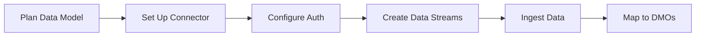

# Ingestion API Guide

The Ingestion API is a REST-based interface for streaming or batch-loading data from external systems into Data 360. This guide walks through the complete workflow from planning to production.

## Overview



## Streaming vs Bulk

Choose the ingestion pattern that fits your use case:

| | Streaming | Bulk / Batch |
|---|-----------|-------------|
| **Latency** | Near real-time | Minutes to hours |
| **Payload size** | Up to 200 KB | Up to 150 MB |
| **Use case** | Events, user interactions | Scheduled data loads, migrations |
| **Endpoint** | `/ssot/streaming/{stream}` | `/ssot/streaming-batch/{stream}` |
| **Partial updates** | Supported (Partial refresh mode) | Not supported (missing fields = null) |

See [Data Ingestion API](/apis/connect-api/data-ingestion) for full endpoint reference and [rate limits](/apis/connect-api/data-ingestion#rate-limits).

## Workflow

<Steps>
  <Step title="Plan Your Data Model">
    Map your source system fields to Data 360 objects. Define primary keys and decide on categories (Profile, Engagement, Other).

    | Source Field | Data 360 Field | Type | Category |
    |-------------|---------------|------|----------|
    | `customer_id` | `CustomerId` | string | Profile |
    | `email` | `Email` | string | Profile |
    | `event_id` | `EventId` | string | Engagement |
    | `event_time` | `EventTimestamp` | date-time | Engagement |
  </Step>

  <Step title="Set Up the Connector">
    Create an Ingestion API connector in Data Cloud Setup and upload your OpenAPI YAML schema.

    See [Ingestion API Setup](/integrations/ingestion-api-setup) for the full step-by-step procedure.
  </Step>

  <Step title="Configure Authentication">
    Set up an External Client App with the required OAuth scopes. See [Quick Start](/getting-started/quickstart#oauth-scopes) for the scopes table.

    <Warning>
    For server-to-server ingestion using JWT Bearer flow, you **must uncheck** "Issue JWT-based access tokens for named users" in the connected app settings.
    </Warning>

    Required scopes: `cdp_ingest_api`, `api`, `refresh_token`
  </Step>

  <Step title="Create Data Streams">
    For each schema object, create a data stream that defines the primary key, category, and refresh mode.

    See [Create a Data Stream](/integrations/ingestion-data-stream) for the UI-based setup procedure.
  </Step>

  <Step title="Ingest Data">
    Send data to the streaming or batch endpoint. Here's a quick example:

    ```bash streaming_example.sh icon=terminal
    curl -X POST \
      "https://{instance}.salesforce.com/services/data/v64.0/ssot/streaming/{streamName}" \
      -H "Authorization: Bearer {data360_access_token}" \
      -H "Content-Type: application/json" \
      -d '{
        "data": [
          {
            "CustomerId": "CUST_001",
            "Email": "jane@example.com",
            "FirstName": "Jane",
            "LastName": "Doe"
          }
        ]
      }'
    ```

    See [Data Ingestion API](/apis/connect-api/data-ingestion) for complete code examples in Python, Java, and Apex.
  </Step>

  <Step title="Map to Data Model Objects">
    After data flows into your streams, map the ingested objects to Data Model Objects (DMOs) for identity resolution, segmentation, and activation.

    See [Data Models](/data-models/index) for mapping instructions.
  </Step>
</Steps>

## Share with Your Dev Team

When handing off to developers, provide these details:

| Detail | Format | Example |
|--------|--------|---------|
| Streaming endpoint | `https://{instance}/services/data/v64.0/ssot/streaming/{streamName}` | `https://acme.salesforce.com/services/data/v64.0/ssot/streaming/Customer_Stream` |
| Batch endpoint | `https://{instance}/services/data/v64.0/ssot/streaming-batch/{streamName}` | `https://acme.salesforce.com/services/data/v64.0/ssot/streaming-batch/Order_Batch` |
| Stream names | Exact API name from Data Stream setup | `Customer_Stream`, `OrderEvent_Stream` |
| Auth method | OAuth 2.0 (JWT Bearer or Authorization Code) | See [Quick Start](/getting-started/quickstart#authentication-flow) |
| Schema reference | Link to your uploaded YAML file | Shared drive or repo |

<Note>
Developers need the **Data 360 instance URL** (not the Salesforce org URL) for API calls. This is returned during the [token exchange](/getting-started/quickstart#step-2-get-data-360-access-token).
</Note>

## Related Resources

- [Ingestion API Setup](/integrations/ingestion-api-setup) — Connector creation and schema upload
- [Schema Requirements](/integrations/schema-requirements) — OpenAPI YAML format reference
- [Create a Data Stream](/integrations/ingestion-data-stream) — Data stream configuration
- [Data Ingestion API](/apis/connect-api/data-ingestion) — REST endpoint reference
- [Quick Start](/getting-started/quickstart) — Authentication and first API call
