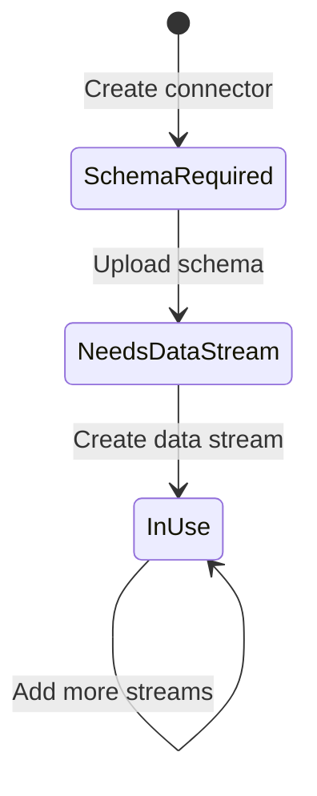

# Ingestion API Setup

Create and configure an Ingestion API connector to ingest data from external systems into Data 360. This is an admin-focused setup performed in the Data 360 UI.

## Prerequisites

| Requirement | Details |
|-------------|---------|
| Permission | System Admin or Data Cloud Admin permission set |
| Schema file | OpenAPI YAML file ready — see [Schema Requirements](/integrations/schema-requirements) |
| Connected app | External Client App configured — see [Quick Start](/getting-started/quickstart) |

## Create the Connector

<Steps>
  <Step title="Open Data Cloud Setup">
    In Salesforce Setup, navigate to **Data Cloud** → **Ingestion API** → **New**.
  </Step>

  <Step title="Name Your Connector">
    Enter a descriptive name (e.g., `ECommerce_Ingest`). This becomes the connector's API identifier used in endpoint URLs.
  </Step>

  <Step title="Select Source Category">
    Choose the primary category for your data source. This helps Data 360 optimize processing pipelines.
  </Step>

  <Step title="Upload Schema">
    Click **Upload Schema** and select your OpenAPI YAML file.

    <Note>
    Your schema defines every object and field available for data streams. Review [Schema Requirements](/integrations/schema-requirements) before uploading — objects cannot be deleted and fields cannot be removed after creation.
    </Note>
  </Step>

  <Step title="Review Schema Objects">
    Verify that all objects and fields parsed correctly. Check data types match your expectations, especially `date-time` fields for Engagement objects.
  </Step>

  <Step title="Save and Deploy">
    Click **Save**. The connector enters **Schema Required** or **Needs Data Stream** status depending on whether you've already uploaded a schema.
  </Step>
</Steps>

## Connector Status Lifecycle

After creation, your connector progresses through these statuses:

| Status | Meaning | Next Action |
|--------|---------|-------------|
| **Schema Required** | Connector created, no schema uploaded | Upload an OpenAPI YAML schema |
| **Needs Data Stream** | Schema uploaded, no data streams created | [Create data streams](/integrations/ingestion-data-stream) |
| **In Use** | At least one data stream is active and receiving data | Monitor and manage |

<Note>
A connector can remain in any status indefinitely. You can upload or update a schema at any time, but you can only **add** new objects and fields — never remove them.
</Note>

## Update an Existing Schema

To add new objects or fields to a deployed connector:

1. Navigate to **Data Cloud** → **Ingestion API** → select your connector
2. Click **Update Schema**
3. Upload the new YAML file (must include all existing objects and fields plus additions)
4. Review changes and click **Save**

<Warning>
The updated schema **must be a superset** of the existing schema. Any missing objects or fields will cause the upload to fail.
</Warning>

## Next Steps

<CardGroup cols={2}>
  <Card title="Create Data Streams" icon="stream" href="/integrations/ingestion-data-stream">
    Define how schema objects map to Data 360 data streams
  </Card>
  <Card title="Ingestion API Guide" icon="book" href="/integrations/ingestion-api-guide">
    Full end-to-end workflow for the Ingestion API
  </Card>
</CardGroup>
