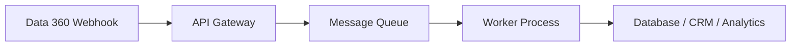

# Webhook Data Action Targets

<Note>
As of October 14, 2025, Data Cloud has been rebranded to **Data 360**. During this transition, you may see references to Data Cloud in our application and documentation.
</Note>

Webhook data action targets send HTTP POST requests with JSON payloads to external endpoints when data changes occur in Data 360. Each payload is cryptographically signed for message integrity verification.

## Setup

<Steps>
  <Step title="Create the Webhook Target">
    In Data 360, navigate to **Data Action Targets** and click **New**. Select **Webhook** as the Action Target Type.
  </Step>
  <Step title="Configure the Endpoint">
    Enter the **HTTPS URL** where payloads should be delivered.
  </Step>
  <Step title="Generate the Secret Key">
    Click **Generate Key** to create the HMAC signing key. **Copy the key immediately** — it is only shown once and is required for payload signature verification on your endpoint.
  </Step>
  <Step title="Save and Test">
    Save the target. Trigger a test data change to verify payload delivery.
  </Step>
</Steps>

<Warning>
If no secret key is generated, payloads will **not** be delivered. Calls are marked "Signing Key Not Found." Always generate and store the key before activating data actions.
</Warning>

## Payload Format

Webhooks deliver a `DataObjectDataChgEvent` as a JSON payload via HTTP POST:

```json
{
  "ActionName": "HighValueCustomerAlert",
  "ActionAPIName": "HighValueCustomerAlert",
  "ActionId": "0Ym5g000000TNmBCAW",
  "Objects": [
    {
      "objectName": "UnifiedIndividual__dlm",
      "recordId": "001abc123def",
      "changeType": "UPDATE",
      "changedFields": {
        "LifetimeValue__c": {
          "oldValue": 4500.00,
          "newValue": 10200.00
        }
      }
    }
  ],
  "ReplayId": "evt-20240615-143000-001",
  "CreatedDate": "2024-06-15T14:30:00.000Z"
}
```

### Payload Fields

| Field | Type | Description |
|-------|------|-------------|
| `ActionName` | string | Display name of the data action |
| `ActionAPIName` | string | API name of the data action |
| `ActionId` | string | Unique identifier of the data action |
| `Objects` | array | Changed records with field-level details |
| `ReplayId` | string | Unique event identifier (for idempotency and replay) |
| `CreatedDate` | datetime | ISO 8601 timestamp of the event |

## Payload Signature Verification

Each webhook request includes an `x-signature` HTTP header containing a **Base64-encoded HMAC-SHA256** hash of the payload body, computed using your secret key.

### Verification Process

1. Extract the `x-signature` header value
2. Read the raw request body (do **not** parse or modify before verification)
3. Compute HMAC-SHA256 using your secret key and the raw body
4. Base64-encode the computed hash
5. Compare using **constant-time comparison** to prevent timing attacks

### Node.js

```javascript
const crypto = require('crypto');

function verifySignature(rawBody, signature, secretKey) {
  const hmac = crypto.createHmac('sha256', secretKey);
  hmac.update(rawBody);
  const computed = hmac.digest('base64');
  return crypto.timingSafeEqual(
    Buffer.from(signature),
    Buffer.from(computed)
  );
}

// Express.js handler
app.post('/webhook/data-action', express.raw({ type: '*/*' }), (req, res) => {
  const signature = req.headers['x-signature'];
  const rawBody = req.body;

  if (!verifySignature(rawBody, signature, process.env.DC_SECRET_KEY)) {
    return res.status(401).send('Invalid signature');
  }

  // Return 200 immediately, process async
  res.status(200).send('OK');

  const payload = JSON.parse(rawBody);
  processEvent(payload);
});
```

### Python

```python
import hmac
import hashlib
import base64
from flask import Flask, request

app = Flask(__name__)

def verify_signature(raw_body, signature, secret_key):
    computed = hmac.new(
        secret_key.encode('utf-8'),
        raw_body,
        hashlib.sha256
    ).digest()
    computed_b64 = base64.b64encode(computed).decode('utf-8')
    return hmac.compare_digest(computed_b64, signature)

@app.route('/webhook/data-action', methods=['POST'])
def handle_webhook():
    raw_body = request.get_data()
    signature = request.headers.get('x-signature')

    if not verify_signature(raw_body, signature, SECRET_KEY):
        return 'Unauthorized', 401

    # Return 200 immediately
    payload = request.get_json()
    process_event_async(payload)
    return 'OK', 200
```

### Java

```java
import javax.crypto.Mac;
import javax.crypto.spec.SecretKeySpec;
import java.util.Base64;

public class WebhookVerifier {
    public static boolean verify(byte[] payload, String signature, String secretKey)
            throws Exception {
        Mac mac = Mac.getInstance("HmacSHA256");
        mac.init(new SecretKeySpec(secretKey.getBytes("UTF-8"), "HmacSHA256"));
        byte[] computed = mac.doFinal(payload);
        String computedB64 = Base64.getEncoder().encodeToString(computed);
        return computedB64.equals(signature);
    }
}
```

## Secret Key Management

| Guideline | Details |
|-----------|---------|
| **Rotation** | Regenerate secret keys at least every 12 months |
| **Propagation delay** | New keys take up to 15 minutes to become effective |
| **Storage** | Store keys in a secrets manager (AWS Secrets Manager, HashiCorp Vault, etc.) |
| **Transition** | During key rotation, validate against both old and new keys for the propagation window |

## Scalable Architecture

For production workloads, use an asynchronous processing pattern:



**Example AWS architecture:**
1. **API Gateway** — Receives webhook, validates signature, returns 200
2. **SQS Queue** — Buffers events for reliable processing
3. **Lambda Function** — Processes events, transforms data, writes to downstream systems
4. **S3 / Redshift** — Final data storage and analytics

## Best Practices

<AccordionGroup>
  <Accordion title="Reliability">
    - Always return HTTP 200 within a few seconds — process events asynchronously
    - Implement **idempotency** using `ReplayId` to handle duplicate deliveries
    - Store the last processed `ReplayId` for recovery and deduplication
    - Use a message queue to buffer events during processing spikes
  </Accordion>

  <Accordion title="Security">
    - Always verify payload signatures before processing
    - Use a raw body parser — verify **before** JSON parsing
    - Never expose secret keys in client-side code or logs
    - Restrict webhook endpoint access to Salesforce IP ranges where possible
  </Accordion>

  <Accordion title="Monitoring">
    - Log all received events with timestamps and `ReplayId` values
    - Set up alerting for signature verification failures
    - Monitor endpoint response times — slow responses risk timeouts
    - Track event processing success/failure rates
  </Accordion>
</AccordionGroup>

## Related Resources

- [Data Actions](/developer-guide/data-actions) — Configure data action rules and targets
- [Platform Events](/developer-guide/platform-events) — Platform event integration alternative
- [Flows & Automation](/developer-guide/flows-automation) — Flow-based automation
- Salesforce Docs: [Webhook Data Action Targets Reference](https://developer.salesforce.com/docs/data/data-cloud-int/references/webhook-data-action-targets)
- Salesforce Blog: [Power of Data Actions Using Webhook Targets](https://developer.salesforce.com/blogs/2024/01/unleashing-the-power-of-data-actions-using-a-webhook-as-a-target)
