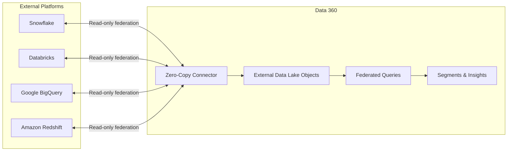
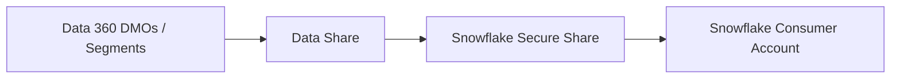

# Zero-Copy Data Federation

<Snippet file="/snippets/note-rebranding.mdx" />

Zero-copy data federation enables Data 360 to access data stored in external platforms — Snowflake, Databricks, Google BigQuery, and Amazon Redshift — without physically copying or moving the data. This preserves your existing data investments while making external data available for segmentation, insights, and activation within Data 360.

## How Zero-Copy Works



### Key Benefits

- **No data movement** — Access external data in place without ETL
- **Near real-time access** — Query current external data, not stale copies
- **Reduced storage costs** — No duplicate data storage in Data 360
- **Preserve investments** — Continue using your existing data warehouse and BI tools
- **Bidirectional** — Share data from Data 360 back to external platforms

## Supported Platforms

| Platform | Federation Type | Authentication | Features |
|----------|----------------|---------------|----------|
| **Snowflake** | Bidirectional | OAuth 2.0, Key Pair | Read federation + Data Shares out |
| **Databricks** | Bidirectional | OAuth 2.0, Personal Access Token | Read federation + Unity Catalog |
| **Google BigQuery** | Bidirectional | Google Cloud Service Account | Read federation + Data Shares out |
| **Amazon Redshift** | Inbound | AWS IAM | Read-only federation |

## Setting Up Zero-Copy Federation

### Snowflake Connector

<Steps>
  <Step title="Configure Snowflake">
    In Snowflake, create a dedicated user and role with read access to the tables you want to federate. Set up OAuth or key pair authentication.
  </Step>
  <Step title="Create the Connector in Data 360">
    Navigate to **Setup > Data 360 > Connectors** and create a new **Snowflake** connector. Provide:
    - Snowflake account identifier
    - Warehouse name
    - Database and schema
    - Authentication credentials
  </Step>
  <Step title="Select Tables">
    Browse available Snowflake tables and select which ones to federate into Data 360 as External Data Lake Objects.
  </Step>
  <Step title="Map to DMOs">
    Optionally map federated tables to Data 360 data model objects for unification with other data sources.
  </Step>
</Steps>

### Databricks Connector

<Steps>
  <Step title="Configure Databricks">
    Set up a Databricks workspace with Unity Catalog enabled. Create a service principal or personal access token for Data 360 access.
  </Step>
  <Step title="Create the Connector">
    In Data 360 Setup, create a new **Databricks** connector with:
    - Databricks workspace URL
    - SQL warehouse or cluster endpoint
    - Catalog and schema
    - Authentication token
  </Step>
  <Step title="Select Tables">
    Choose Unity Catalog tables to federate. Data 360 reads table metadata and makes them available as External Data Lake Objects.
  </Step>
  <Step title="Configure Refresh">
    Set metadata refresh frequency to keep schema information in sync.
  </Step>
</Steps>

### Google BigQuery Connector

<Steps>
  <Step title="Configure Google Cloud">
    Create a Google Cloud service account with BigQuery Data Viewer role on the target dataset.
  </Step>
  <Step title="Create the Connector">
    In Data 360 Setup, create a new **Google BigQuery** connector with:
    - Google Cloud project ID
    - BigQuery dataset
    - Service account JSON key
  </Step>
  <Step title="Select Tables">
    Browse BigQuery tables and views. External tables are also supported.
  </Step>
</Steps>

## Data Shares (Outbound)

Data shares let you share Data 360 data — DMOs, DLOs, calculated insights, and segment data — with external platforms without copying it.

### Sharing to Snowflake



<Steps>
  <Step title="Create a Data Share">
    In Data 360 Setup, navigate to **Data Shares** and click **New**.
  </Step>
  <Step title="Select Objects">
    Choose which DMOs, calculated insights, or segment results to include in the share.
  </Step>
  <Step title="Configure Target">
    Select Snowflake as the target and provide the consumer account details.
  </Step>
  <Step title="Activate">
    Enable the data share. The target platform can now query the shared data.
  </Step>
</Steps>

### Shareable Object Types

| Object Type | Description | Typical Use Case |
|------------|-------------|------------------|
| **Data Lake Objects (DLOs)** | Raw ingested data | Share raw data for external analytics |
| **Data Model Objects (DMOs)** | Harmonized data | Share unified customer data |
| **Calculated Insight Objects (CIOs)** | Derived metrics | Share aggregated insights |
| **Segment Results** | Segment membership | Share audience lists for external activation |

## Querying Federated Data

Once configured, federated tables appear as External Data Lake Objects in Data 360 and can be queried using the same SQL syntax as native DMOs:

```sql
-- Query federated Snowflake data alongside native Data 360 data
SELECT
    ui.ssot__Id__c AS UnifiedProfileId,
    ui.ssot__FirstName__c,
    ui.ssot__Email__c,
    ext.purchase_amount,
    ext.purchase_date
FROM
    UnifiedIndividual__dlm ui
JOIN
    SnowflakePurchases__x ext
    ON ui.ssot__Email__c = ext.customer_email
WHERE
    ext.purchase_date > DATE '2024-01-01'
ORDER BY
    ext.purchase_amount DESC
LIMIT 100
```

## Federated Authentication

Zero-copy connectors support federated authentication for enhanced security:

| Method | Platform | Description |
|--------|----------|-------------|
| **OAuth 2.0** | Snowflake, Databricks | Token-based authentication with refresh |
| **Key Pair** | Snowflake | RSA key pair authentication |
| **Service Account** | BigQuery | Google Cloud service account JSON |
| **IAM Role** | Redshift | AWS IAM role-based access |

## Performance Considerations

| Factor | Guidance |
|--------|----------|
| **Query latency** | Federated queries add network round-trip time. Use for analytical workloads, not real-time user-facing queries |
| **Data freshness** | Queries return current external data. No caching delay |
| **Join performance** | Joining federated data with native DMOs can be slower than native-to-native joins |
| **Filter pushdown** | Data 360 pushes WHERE filters to the external platform when possible for efficiency |
| **Result caching** | Enable query result caching on the external platform for frequently run queries |

## Best Practices

<AccordionGroup>
  <Accordion title="Architecture">
    - Use zero-copy for large reference datasets that are already maintained externally
    - Use standard ingestion for data that needs identity resolution or frequent joining
    - Consider the query pattern — zero-copy is best for ad-hoc analytics, not high-frequency API queries
    - Plan for network latency in federated query response times
  </Accordion>

  <Accordion title="Security">
    - Use dedicated service accounts with minimal privileges (read-only where possible)
    - Rotate authentication credentials on a regular schedule
    - Restrict access to specific schemas and tables, not entire databases
    - Monitor query logs on both Data 360 and the external platform
  </Accordion>

  <Accordion title="Data Shares">
    - Share derived data (calculated insights, segments) rather than raw data when possible
    - Monitor data share consumption and access patterns
    - Review shared objects periodically — remove shares no longer needed
    - Document which external teams consume each data share
  </Accordion>
</AccordionGroup>

## Related Resources

- [Third-Party Connectors](/integrations/third-party-connectors) — Standard data ingestion connectors
- [Data 360 Architecture](/getting-started/architecture) — How federation fits into the overall platform
- [Query API](/apis/query-api/index) — Query federated and native data
- Salesforce Help: [Zero Copy Data Federation](https://help.salesforce.com/s/articleView?id=data.c360_a_byol_data_federation.htm&type=5)
- Salesforce Blog: [Zero Copy Data Federation with Snowflake](https://developer.salesforce.com/blogs/2024/08/zero-copy-data-federation-with-snowflake-and-salesforce-data-cloud)
- Salesforce Blog: [Bring Your Google BigQuery Data Lake to Data Cloud](https://developer.salesforce.com/blogs/2024/10/bring-your-google-bigquery-data-lake-to-data-cloud-part-1-data-in)
