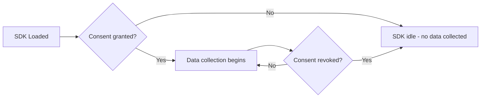

# Consent Management

The Salesforce Interactions SDK is built with privacy-first design. It **does not store or transmit any data** until explicit consent is granted. If your site has a consent management platform (CMP), integrate it with the SDK to signal consent status.

## How Consent Works



## Providing Consent at Initialization

The recommended approach is to provide a `Promise` for the `consent` option in `init()`. The SDK waits for the promise to resolve before collecting data:

```javascript icon=js
function getConsentPromise() {
  return new Promise((resolve) => {
    // Integrate with your CMP (e.g., OneTrust, Cookiebot)
    yourCMP.onConsentReady((status) => {
      resolve([
        {
          provider: 'yourCMP',
          purpose: 'Analytics',
          status: status.analytics ? 'OptIn' : 'OptOut'
        },
        {
          provider: 'yourCMP',
          purpose: 'Marketing',
          status: status.marketing ? 'OptIn' : 'OptOut'
        }
      ]);
    });
  });
}

SalesforceInteractions.init({
  consent: getConsentPromise()
});
```

### Consent Object Structure

| Property | Type | Required | Description |
|----------|------|----------|-------------|
| `provider` | string | Yes | Name of the consent management provider |
| `purpose` | string | Yes | Consent purpose category (e.g., "Analytics", "Marketing") |
| `status` | string | Yes | `"OptIn"` or `"OptOut"` |

## Updating Consent at Runtime

When a user changes their consent preferences mid-session:

```javascript icon=js
// Update a single consent
SalesforceInteractions.updateConsents({
  provider: 'yourCMP',
  purpose: 'Marketing',
  status: 'OptOut'
});

// Update multiple consents
SalesforceInteractions.updateConsents([
  { provider: 'yourCMP', purpose: 'Analytics', status: 'OptIn' },
  { provider: 'yourCMP', purpose: 'Marketing', status: 'OptOut' }
]);
```

When consent is revoked (`OptOut`), the SDK **immediately stops** collecting and transmitting events.

## Reading Current Consent State

```javascript icon=js
const consents = SalesforceInteractions.getConsents();
// Returns: ConsentWithMetadata[]

consents.forEach((c) => {
  console.log(`${c.purpose}: ${c.status}`);
  console.log(`  Last updated: ${c.lastUpdated}`);
  console.log(`  Last sent: ${c.lastSentInEvent}`);
});
```

### ConsentWithMetadata Properties

| Property | Type | Description |
|----------|------|-------------|
| `provider` | string | CMP name |
| `purpose` | string | Consent purpose |
| `status` | string | Current status (`OptIn` / `OptOut`) |
| `lastUpdated` | datetime | When the status was last changed |
| `lastSentInEvent` | datetime | When this status was last included in a transmitted event |

## Consent API Methods

| Method | Signature | Description |
|--------|-----------|-------------|
| `init({ consent })` | `consent: Promise<Consent[]>` | Provide initial consent at SDK startup |
| `updateConsents()` | `(consents: Consent \| Consent[]): void` | Update consent status at any time |
| `getConsents()` | `(): ConsentWithMetadata[]` | Read current consent state |

## CMP Integration Patterns

### OneTrust

```javascript icon=js
SalesforceInteractions.init({
  consent: new Promise((resolve) => {
    window.OneTrust?.OnConsentChanged(() => {
      const groups = window.OnetrustActiveGroups || '';
      resolve([
        { provider: 'OneTrust', purpose: 'Analytics', status: groups.includes('C0002') ? 'OptIn' : 'OptOut' },
        { provider: 'OneTrust', purpose: 'Marketing', status: groups.includes('C0004') ? 'OptIn' : 'OptOut' }
      ]);
    });
  })
});
```

### Cookiebot

```javascript icon=js
SalesforceInteractions.init({
  consent: new Promise((resolve) => {
    window.addEventListener('CookiebotOnAccept', () => {
      resolve([
        { provider: 'Cookiebot', purpose: 'Analytics', status: Cookiebot.consent.statistics ? 'OptIn' : 'OptOut' },
        { provider: 'Cookiebot', purpose: 'Marketing', status: Cookiebot.consent.marketing ? 'OptIn' : 'OptOut' }
      ]);
    });
  })
});
```

## GDPR / CCPA Compliance

- The SDK collects **no data** before consent — fully GDPR-compliant by default
- Consent revocation is **immediate** — no delay in stopping data collection
- Consent events are sent to Data 360 and map to the **Contact Point Consent** DMO
- Use [Consent & Governance](/developer-guide/consent-governance) for platform-wide consent management

## Related Resources

- [Web SDK Overview](/sdks/web-sdk/index) — SDK architecture and setup
- [Identity Management](/sdks/web-sdk/identity) — Identity depends on consent
- [Consent & Governance](/developer-guide/consent-governance) — Platform-wide consent framework
- Salesforce Docs: [Consent](https://developer.salesforce.com/docs/data/salesforce-interactions-sdk/guide/c360a-api-consent.html)
- Salesforce Docs: [Consent Data](https://developer.salesforce.com/docs/data/salesforce-interactions-sdk/guide/c360a-api-consent-data.html)
