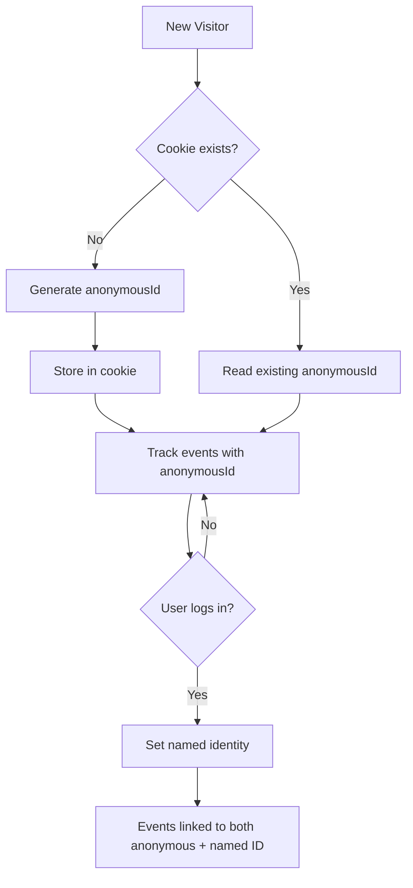

# Identity Management

The Salesforce Interactions SDK manages user tracking using a first-party cookie to assign and maintain identity, whether the user is logged in or anonymous.

## How Identity Works

The SDK creates a first-party cookie named `__sfid_${domainHash}_` where `domainHash` is generated from your website's domain. This cookie stores a unique `anonymousId`.



| State | Identifier | Persistence |
|-------|-----------|-------------|
| **Anonymous** | Auto-generated `anonymousId` in first-party cookie | Cross-session (cookie lifetime) |
| **Named** | Explicit identity set via `setIdentity()` or `user.identities` | Until `clearIdentity()` or cookie reset |

## Cookie Configuration

### Cross-Domain Tracking

To share identity across subdomains (e.g., `shop.example.com` and `blog.example.com`), set the cookie domain:

```javascript icon=js
// Option 1: During initialization
SalesforceInteractions.init({
  cookieDomain: 'example.com',
  consent: getConsentPromise()
});

// Option 2: Before initialization
SalesforceInteractions.setCookieDomain('example.com');
```

<Warning>
`setCookieDomain()` has no effect after the SDK is initialized. Call it before `init()` or call `SalesforceInteractions.reinit()` to apply changes.
</Warning>

### Cookie Methods

| Method | Returns | Description |
|--------|---------|-------------|
| `getCookieDomain()` | string | Returns the current cookie domain |
| `setCookieDomain(domain)` | void | Sets the cookie domain (call before init) |
| `getAnonymousId()` | string | Returns the `anonymousId` from the cookie |
| `setAnonymousId(id)` | void | Manually sets the `anonymousId` |
| `resetAnonymousId()` | void | Deletes the cookie and generates a new `anonymousId` |

## Setting Named Identity

When a user logs in or identifies themselves, link their session to a known identity:

```javascript icon=js
// Via sendEvent with user data
SalesforceInteractions.sendEvent({
  user: {
    identities: {
      emailAddress: 'jane@example.com',
      customerId: 'CUST-001'
    },
    attributes: {
      firstName: 'Jane',
      lastName: 'Doe'
    }
  }
});
```

### Identity Fields

| Field | Description | Maps To |
|-------|-------------|---------|
| `emailAddress` | Email address | Contact Point Email DMO |
| `phoneNumber` | Phone number | Contact Point Phone DMO |
| `customerId` | Your system's customer ID | Party Identification DMO |
| Custom fields | Any additional identifiers | Custom DMO mappings |

## Clearing Identity

On logout, clear the named identity to prevent cross-user data contamination:

```javascript icon=js
// Clear named identity (keeps anonymousId)
SalesforceInteractions.clearIdentity();

// Full reset (new anonymousId + clear identity)
SalesforceInteractions.resetAnonymousId();
```

## Identity Resolution

Named identities sent via the Web SDK participate in Data 360's identity resolution process. When the same email or phone appears across multiple sources (Web SDK, CRM, mobile app), identity resolution merges them into a single unified profile.

## Related Resources

- [Web SDK Overview](/sdks/web-sdk/index) — SDK architecture and setup
- [Consent API](/sdks/web-sdk/consent) — Consent must be granted before identity tracking
- [Identity Resolution Best Practices](/developer-guide/identity-resolution-best-practices) — Match rule configuration
- Salesforce Docs: [Identity](https://developer.salesforce.com/docs/data/salesforce-interactions-sdk/guide/c360a-api-identity.html)
