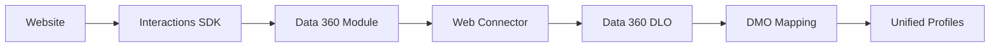

# Salesforce Interactions Web SDK

The Data 360 module of the Salesforce Interactions SDK captures user activity and profile data from your website and sends it to Data 360 for identity resolution, segmentation, and activation.

## Architecture



The SDK consists of a **base SDK** (event capture, identity, consent) and **product-specific modules** (Data 360 and Marketing Cloud Personalization). The Data 360 module converts SDK events into the format required by Data 360's ingestion pipelines and delivers them via HTTP to your Web Connector.

## Installation

Add the SDK script to the `<head>` of your web pages. The script URL is provided when you configure a Web Connector in Data 360 Setup:

```html
<head>
  <script src="https://cdn.c360a.salesforce.com/beacon/YOUR_TENANT_ID/YOUR_CONNECTOR_ID/scripts/sfInteractions.js"></script>
</head>
```

## Initialization

Initialize the SDK with your configuration before sending any events:

```javascript
SalesforceInteractions.init({
  cookieDomain: 'yourdomain.com',
  consent: getConsentPromise(), // Promise that resolves with consent status
}).then(() => {
  console.log('SDK initialized');
});
```

### Configuration Options

| Option | Type | Required | Description |
|--------|------|----------|-------------|
| `cookieDomain` | string | No | Domain for the first-party cookie. Set to share cookies across subdomains. |
| `consent` | Promise | Yes | Must resolve with an array of `Consent` objects before data collection begins. |

## Sending Events

After initialization and consent, send engagement and profile events:

```javascript
// Track a page view
SalesforceInteractions.sendEvent({
  interaction: {
    name: 'Page Viewed',
    eventType: 'pageView'
  }
});

// Track a product view (catalog interaction)
SalesforceInteractions.sendEvent({
  interaction: {
    name: 'Product Viewed',
    catalogObject: {
      type: 'Product',
      id: 'SKU-12345',
      attributes: {
        name: 'Running Shoes',
        price: 129.99,
        category: 'Footwear'
      }
    }
  }
});
```

## Web Connector Schema

Use the [recommended web connector schema](https://cdn.c360a.salesforce.com/cdp/schemas/254/web-connector-schema.json) to ensure events map correctly to DMOs. It includes standard mappings for:

**Engagement Events:**
- Cart Interaction → Cart / Cart Product DMOs
- Catalog Interaction → Website Engagement DMO
- Order Interaction → Sales Order / Sales Order Product DMOs
- Consent Event → Contact Point Consent DMO

**Profile Events:**
- Contact Point Email → Contact Point Email DMO
- Contact Point Phone → Contact Point Phone DMO
- Identity → Individual DMO
- Party Identification → Party Identification DMO

## Next Steps

<CardGroup cols={2}>
  <Card title="Event Specifications" icon="list" href="/sdks/web-sdk/events">
    All event types and their payload schemas
  </Card>
  <Card title="Identity Management" icon="user" href="/sdks/web-sdk/identity">
    Anonymous and named identity tracking
  </Card>
  <Card title="Consent API" icon="shield-check" href="/sdks/web-sdk/consent">
    Privacy-first consent management
  </Card>
  <Card title="API Reference" icon="code" href="/sdks/web-sdk/api-reference">
    Complete method reference and debugging
  </Card>
</CardGroup>

## Related Resources

- [Web SDK Setup](/integrations/web-sdk-setup) — Connector configuration in Data 360
- [Mobile SDK](/sdks/mobile-sdk/index) — Native mobile app equivalent
- Salesforce Docs: [Salesforce Interactions SDK](https://developer.salesforce.com/docs/data/salesforce-interactions-sdk/guide/c360a-api-salesforce-interactions-web-sdk.html)
- Salesforce Docs: [Event to Schema Translation](https://developer.salesforce.com/docs/data/salesforce-interactions-sdk/guide/c360a-api-translating-sdk-events-to-web-connector-schemas.html)
- Salesforce Docs: [Custom Events](https://developer.salesforce.com/docs/atlas.en-us.c360a_api.meta/c360a_api/c360a_api_custom_events.htm)
